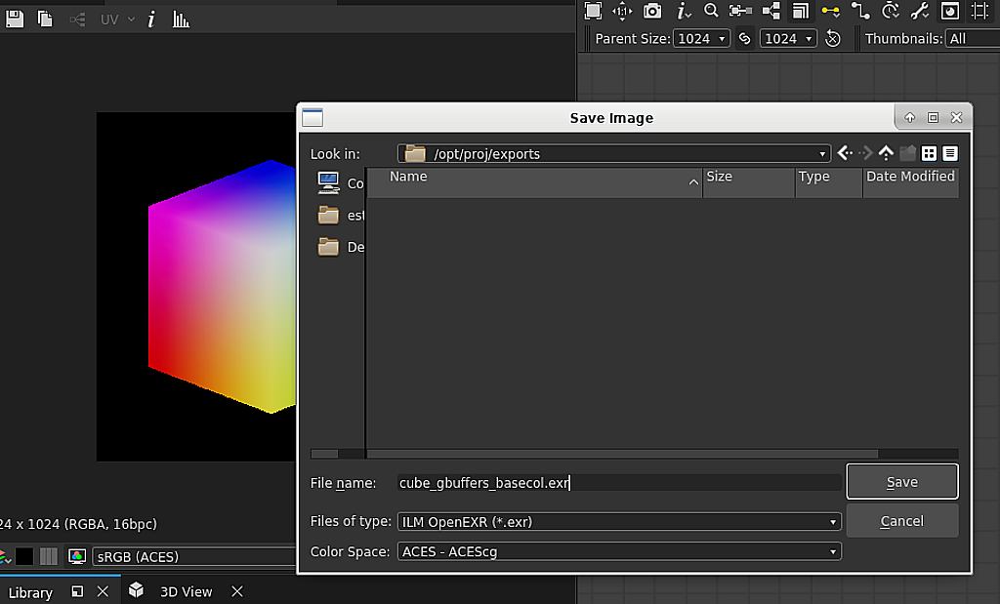

# カラーマネジメント

ここでは、Substance 3D Designerのカラーマネジメント機能と設定について説明します。

Substance 3D Designerでは、カラーマネジメントに[OpenColorIO](https://opencolorio.org/) (OCIO)またはAdobe Color Engine (ACE)を使用するように設定できます。 これにより、複数のアプリケーション間で&#x200B;*一貫*&#x200B;した色変換と画像表示を行うことができます。

このモードでは、Designerは&#x200B;**線形RGB**&#x200B;色で内部的に動作します。 通常、8 ビット深度ではリニアな色を表現できないため、[グラフ](../compositing-graphs/substance-compositing-graphs.md)のカラーテクスチャには&#x200B;*少なくとも* **16ビット**&#x200B;の深度を使用することをお勧めします。

>[!WARNING]
>
> 効果的なカラーマネジメントのワークフローを行うには、正しく&#x200B;*調整*&#x200B;されたディスプレイを使用する必要があります。サードパーティ製のソリューションを使用すると、専用のハードウェアを使用して、使用している作業環境に合わせてモニターを正しく調整できます。
> 
> OpenColorIOユーザーは、モニターに一致するOpenColorIOカラースペースを使用する必要があります。\
> Adobe ACEユーザーは、OS *で選択した* ICCプロファイルが&#x200B;*自分の*&#x200B;モニターと一致していることを確認する必要があります。

## 構成

カラーマネジメントの設定は、[環境設定](../interface/preferences-window/preferences-window.md)ダイアログの[プロジェクト](../interface/preferences-window/project-settings/project-settings.md)タブで構成できます。 次の設定を行うことができます。

### カラーマネジメントモード

|  |  |
| --- | --- |
| <b>カラーマネジメント</b> | この設定を使用すると、Substance 3D Designerのカラーマネジメントで[従来](../color-management/color-management.md)、[OpenColorIO](#opencolorio)または[Adobe ACE](#adobe-ace)のモードを選択できます。 *既定：レガシ* |

## OpenColorIO

### OpenColorIO 構成

カラーマネジメントにOpenColorIOモードを使用する場合、Designerは、<b>設定ファイル</b> (*\*.config*)に保存されている情報を使用して、色変換、カラースペースの特定、およびデフォルトの設定を行います。

Substance 3D Designerには次の設定が用意されています。

* Substance：共通のカラースペースを含むシンプルな構成
* [ACES 1.0.3](https://github.com/hpd/OpenColorIO-Configs/tree/master/aces_1.0.3):カラーマネジメントワークフローの業界標準であるフル機能の[Academy Color Encoding System](https://www.oscars.org/science-technology/sci-tech-projects/aces) (ACES)構成

これらの設定ファイルは、Designerのインストールファイルの<b>resources > ocio</b>フォルダーにあります。

|  |  |
| --- | --- |
| <b>OpenColorIO構成</b> | この設定では、Designer全体で使用するOpenColorIOコンフィギュレーションファイルを選択できます。 または、OCIO環境変数を使用してOpenColorIO設定ファイルを設定することもできます。  構成ファイルが存在する場合、Designerの構成ファイルは&#x200B;*ロック*&#x200B;されます。 デフォルトのカラースペースを変更して、変形を表示することはできます（以下の設定を参照）。  **警告：**&#x200B;環境変数を追加した後、Designerを閉じ、OSのユーザーセッションから&#x200B;*ログアウト*&#x200B;してから、再度ログインすることをお勧めします。 これにより、Designerの起動時に環境変数が有効になります。 また、コマンドラインを使用して一時的な環境変数を作成し、*同じ*&#x200B;コマンドラインからDesignerを開始することもできます。  *既定： Substance* |
| **カスタム構成ファイル** | **Custom**&#x200B;オプションが&#x200B;**OpenColorIO構成**&#x200B;で設定されている場合、このフィールドで構成ファイルとして使用する&#x200B;*特定の\*.configファイル&#x200B;*を選択できます。*&#x200B;既定： OpenColorIO構成ファイルまたはOCIO環境変数で設定* |

### ビットマップカラースペースのデフォルト

|  |  |
| --- | --- |
| <b>8ビット画像</b> | 8ビットビットマップの既定のカラースペースを設定します。 *既定： OpenColorIO構成ファイルで設定* |
| <b>16ビット画像</b> | 16ビットビットマップのデフォルトのカラースペースを設定します。 *既定： OpenColorIO構成ファイルで設定* |
| <b>浮動小数点の画像</b> | *\*.exr *または*\*.hdr*&#x200B;形式の*HDR*画像などの浮動小数点精度ビットマップの既定のカラースペースを設定します。 *既定： OpenColorIO構成ファイルで設定* |
| <b>ファイル名を使用してカラースペースを検出</b> | ビットマップファイル名&#x200B;*の*&#x200B;サフィックス&#x200B;*が現在のOpenColorIO*&#x200B;設定&#x200B;*に含まれているカラースペースの小文字の名前と完全に*&#x200B;一致する場合、Designerはカラースペースを自動で割り当てます。 例：ビットマップリソース&#x200B;*mybitmap\_aces\_acescg.png*&#x200B;は自動的に&#x200B;*ACES - ACEScg*&#x200B;色空間に設定され、適切な変換が作業用色空間に適用されます。 *既定：確認済み* |

### 2Dおよび3Dビューの既定の表示

|  |  |
| --- | --- |
| <b>2Dおよび3Dビューの既定の表示</b> | [2Dビュー](../interface/2d-view/2d-view.md)および[3Dビュー](../interface/3d-view/3d-view.md)ビューポートの既定の&#x200B;*ディスプレイ*&#x200B;カラースペースを設定します。 *既定： OpenColor IO構成ファイルで設定* |
| <b>サムネールのカラー管理</b> | Designerがグラフのノード&#x200B;*サムネール*&#x200B;を&#x200B;*作業中*&#x200B;のカラースペースに自動変換します。 *既定：確認済み* |

## Adobe ACE

### カラー設定

Substance 3D Designerは、カラーマネジメントにAdobe ACEモードを使用する場合、<b>ICCプロファイル</b> (*\*.icc / \*.icm*)に保存されている情報を使用して、色変換を行い、カラースペースを特定します。

Designerには、多くのICCプロファイルが同梱されています。 これらのプロファイルのファイルは、Designerのインストールファイルの`resources > icc`フォルダーにあります。\
現在のシステムユーザーの&#x200B;*Documents*&#x200B;フォルダーの`Adobe/Adobe Substance 3D Designer/icc`場所にこれらのファイルを配置することで、*独自の* ICCプロファイルを追加できます。

|  |  |
| --- | --- |
| <b>作業用スペース</b> | この設定では、作業用カラースペースを選択して、Substance 3D Designer全体で&#x200B;*カラー操作を実行*&#x200B;できます。 *既定： sRGB IEC61966-2.1* |
| <b>マッチング方法</b> | このオプションを使用すると、*作業用*&#x200B;カラースペースの&#x200B;*色域の外側*&#x200B;にあるカラーをどのように変換するかを制御できます。 *既定：相対的な色域を維持* |

### ビットマップカラースペースのデフォルト

|  |  |
| --- | --- |
| <b>8ビット画像</b> | 8ビットビットマップに使用するデフォルトのICCプロファイルを設定します。 *既定：* sRGB IEC61966-2.1 ** |
| <b>16ビット画像</b> | デフォルトのICCプロファイルを16ビットビットマップを使用するように設定します。 **既定： *sRGB IEC61966-2.1*** |
| <b>浮動小数点の画像</b> | *\*.exr *または*\*.hdr*&#x200B;形式の*HDR*画像などの浮動小数点精度ビットマップに使用する既定のICCプロファイルを設定します。 *既定： Raw （プロファイルが適用されていない）* |
| <b>埋め込みICCプロファイルを使用（使用可能な場合）</b> | Designerが、ビットマップに埋め込まれたICCプロファイルを、上記のデフォルトの代わりに使用できるようにします。 *既定：確認済み* |

### 2Dおよび3Dビューの既定のスペースの表示

|  |  |
| --- | --- |
| <b>2Dおよび3Dビューの既定の表示</b> | [2Dビュー](../interface/2d-view/2d-view.md)および[3Dビュー](../interface/3d-view/3d-view.md)ビューポートの既定の&#x200B;*ディスプレイ*&#x200B;カラースペースを設定します。 *既定：*** OSから取得したメイン画面用のICCプロファイル&#x200B;**&#x200B;** |

### グラフ表示

|  |  |
| --- | --- |
| <b>サムネールのカラー管理</b> | *チェック*&#x200B;すると、Designerは&#x200B;*ノードサムネール*&#x200B;を現在の&#x200B;*作業用カラースペース*&#x200B;に変換します。 *既定：***&#x200B;未確認&#x200B;**&#x200B;** |

## レガシーモード

Designerで<b>従来</b>モードを使用している場合、カラーマネジメントは&#x200B;*無効*&#x200B;です – 

このモードでは、グラフと画像は以前のバージョンとまったく同じように動作します。 これは、この設定を&#x200B;*変更しない*&#x200B;場合、以前のバージョンのワークフローは&#x200B;*完全に影響を受けない*&#x200B;ことを意味します。 ただし、いくつかの便利な追加があります。

<b>ACES sRGB</b>を使用するように選択できます *[アンリアルエンジン](https://docs.unrealengine.com/en-US/Engine/Rendering/PostProcessEffects/ColorGrading/index.html)*&#x200B;など、他のソフトウェアの出力と一致するように、<b>3Dビュー</b>で&#x200B;*tonemapping*&#x200B;します。

このページの「[出力の書き出し](#exporting-outputs)」セクションの説明に従って、*書き出されたビットマップ*&#x200B;のカラースペースを設定できます。 使用可能なカラースペースは次のとおりです。

* sRGB
* 線形
* Raw

従来のモードでは、Designerは、ほとんどのディスプレイで再生可能な<b>sRGB作業用カラースペース</b>を使用します。

「Raw」オプションを考慮すると、グラフの作業用カラースペースを使用して、画像データ&#x200B;*をそのまま*&#x200B;書き込みます。つまり、<b>Raw</b>および<b>sRGB</b>オプションにより、*同じ色出力*&#x200B;が得られます。

既定では、&#39;sRGB&#39;オプションは、*色情報*&#x200B;を含む出力（基本色、放射性など）に対して設定され、&#39;Raw&#39;オプションは、*純粋なデータ*&#x200B;を保持する出力（粗さ、メタリック、Height、法線など）に対して設定されます。 上記で説明したように、これらのデフォルトは実質的に同じ色になり、出力の&#x200B;*最終使用法の区別*&#x200B;にのみ設定されます。

<b>リニア</b>オプションは、*色変換*&#x200B;が画像に適用される&#x200B;*唯一*&#x200B;のオプションであり、リニアカラースペースで一般的に&#x200B;*浮動小数点ハイダイナミックレンジ* （ビット深度度16Fまたは32F）を使用する<b>精度</b> (HDR)画像にのみ使用できます。 これにより、これらの画像を様々なカラースペースやプロダクション環境で使用できます。

>[!NOTE]
>
> 画像の書き出しについて詳しくは、ドキュメントの[ビットマップの書き出し](../compositing-graphs/exporting-bitmaps/exporting-bitmaps.md)を参照してください。

## ビットマップの読み込み

読み込まれたビットマップおよびリンクされたビットマップには、<b>カラースペース</b> (OCIO)または<b>ICCプロファイル</b> (Adobe ACE)を割り当てることができます。

ビットマップを読み込むかリンクする場合、カラースペースまたはICCプロファイルは、[プロジェクト設定](../interface/preferences-window/project-settings/project-settings.md)の[<b>カラーマネジメント</b>]タブの[<b>ビットマップカラースペースの既定</b>]セクションで設定されたオプションを使用して、ビットマップリソースに&#x200B;*既定*&#x200B;で設定されます。

ビットマップのカラースペースはいつでも変更できます。オプションはビットマップリソースの<b>プロパティ</b>にあります。

>[!NOTE]
>
> **OpenColorIOのみ**
> 
> 特に、**ファイル名**&#x200B;を使用して、適切なカラースペース&#x200B;*自動*&#x200B;を設定できます。 ファイル名のカラースペース名は、OpenColorIO構成ファイルの名前&#x200B;*と*&#x200B;一致している必要があります（例： *myImage\_utility - linear -srgb.png*&#x200B;は、*Utility - Linear - sRGB*&#x200B;カラースペースに設定されます）。

## 出力のエクスポート

<b>出力の書き出し</b>ダイアログを使用する場合、*各*&#x200B;出力に対して、<b>カラースペース</b> (OCIO)を割り当てるか、<b>ICCプロファイル</b> (Adobe ACE)を添付することができます。\
Designerは、画像ファイルを保存する前に、画像を&#x200B;*指定されたカラースペースに*&#x200B;変換します。

{width="512px"}

[2Dビュー](https://helpx.adobe.com/substance-3d/unlisted/documentation/sddoc/2d-view-deprecated-129368155.html)から&#x200B;*保存*&#x200B;された画像には、カラースペース(OCIO)を割り当てたり、ICCプロファイル(Adobe ACE)を添付したりすることもできます。

## 2Dおよび3Dビュー

### ツールバーを表示

表示ツールバーのドロップダウンメニューを使用して、いつでも&#x200B;*カラーマネジメントのオン/オフを切り替えたり、表示の*&#x200B;表示変換&#x200B;*を変更したりできます。*

{width="512px"}

### ライブラリHDRI環境

Designerに付属のHDRI環境は、<b>リニアsRGB</b>カラースペースです。\
[ACES](https://acescentral.com/t/getting-started-with-aces/1372)構成など、シーンのリニアカラースペースが&#x200B;*ではなく*&#x200B;リニアsRGBであるOpenColorIO構成を使用すると、環境に&#x200B;*正しくない色*&#x200B;が表示されます。

その場合、ライブラリHDRI環境のカラースペースは、3Dビューパネル<b>環境</b>メニューで使用可能な環境プロパティで&#x200B;*手動*&#x200B;で設定する必要があります。

{width="512px"}

## カラー変換ノード

[ライブラリ](../interface/the-library/the-library.md)には、ACEScgカラースペースとの間で<b>変換</b>を実行するための次のノードが含まれています：

<table>
<tr style="border: 0;">
<td style="border: 0;" valign="top">

[Substance グラフ](../compositing-graphs/substance-compositing-graphs.md)

* ACEScgからリニアsRGB
* リニアsRGBからACEScg
* ACEScgからsRGB
* sRGBからACEScg

</td>
<td style="border: 0;" valign="top">

[Substance 関数グラフ](../function-graphs/function-graphs.md)

* ACEScgからリニアsRGB
* リニアsRGBからACEScg

</td>
</tr>
</table>

これらは、*カラーマネジメント*&#x200B;なしで作成されたグラフや、[Substance 3Dアセット](https://helpx.adobe.com/substance-3d/unlisted/assets.html)ライブラリから作成されたマテリアルを操作する場合に便利です。

{width="512px"}

## 既知の制限

現在、Substance 3D Designerに実装されているカラーマネジメントには、次のような制限があります。

* カラーマネジメントは現在、[Python API](../scripting/scripting.md)で&#x200B;*公開されていません*。
* [OpenColorIO](https://opencolorio.org/) *外観*&#x200B;は&#x200B;*サポートされていません*。
