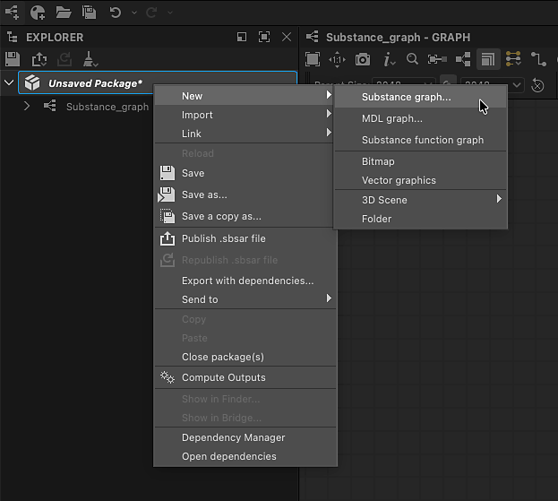

# Substance グラフの作成

Designerでのテクスチャのオーサリングは、最初に作成済みのSubstanceまたは空のグラフからテンプレートグラフを作成します。

## グラフの作成

新しい[Substanceグラフ](../../compositing-graphs/substance-compositing-graphs.md)を作成するには、次のいずれかの方法を使用します。

* &#x200B;
  <table>
  <tr style="border: 0;">
  <td style="border: 0;" valign="top">

  ホーム画面で、<b>新規グラフ</b>ボタンをクリックします。

  </td>
  <td style="border: 0;" valign="top">

  {zoomable="yes"}

  </td>
  </tr>
  </table>

* &#x200B;
  <table>
  <tr style="border: 0;">
  <td style="border: 0;" valign="top">

  [エクスプローラー](../../interface/the-explorer-window/the-explorer-window.md)の&#x200B;*既存*&#x200B;のパッケージ項目で、<b>RMB</b>をクリックし、コンテキストメニューの<b>新規/Substanceグラフ</b>に移動します。

  </td>
  <td style="border: 0;" valign="top">

  {zoomable="yes"}

  </td>
  </tr>
  </table>

* &#x200B;
  <table>
  <tr style="border: 0;">
  <td style="border: 0;" valign="top">

  メインツールバーで、 <b>新規Substanceグラフ</b>をクリックします。

  </td>
  <td style="border: 0;" valign="top">

  {zoomable="yes"}

  </td>
  </tr>
  </table>

* &#x200B;
  <table>
  <tr style="border: 0;">
  <td style="border: 0;" valign="top">

  メインメニューで、<b>ファイル/新規/Substanceグラフ…</b>に移動します

  </td>
  <td style="border: 0;" valign="top">

  

  </td>
  </tr>
  </table>

* <b>Ctrl + N</b> (Windows) / <b>Cmd + N</b> (macOS)キーを押します。

<b>新しいSubstanceグラフ</b>ダイアログが表示されます。

## グラフテンプレート

新しいSubstanceグラフの作成方法に関係なく、常に<b>新しいSubstanceグラフ</b>ダイアログが表示され、新しいグラフを構成できます。

{zoomable="yes"}

### テンプレート

Designerにはノードが事前設定されたグラフテンプレートが含まれており、作業をすばやく開始できます。 [Output](../../compositing-graphs/nodes-reference-for-com/atomic-nodes/output/output.md)ノード、これらの出力に値を渡すための単純なノード（[均一な色](../../compositing-graphs/nodes-reference-for-com/atomic-nodes/uniform-color/uniform-color.md)など）および[Input](../../compositing-graphs/nodes-reference-for-com/atomic-nodes/input/input.md)ノードを含めることができます。

一覧のテンプレートをダブルクリックするか、テンプレートを選択して[<b>作成</b>]ボタンをクリックし、そのテンプレートを使って新しいSubstanceグラフを作成します。 デフォルトでは、新しいグラフは保存されていない新しいパッケージに配置されます。

>[!TIP]
>
> ゼロから作成
> 
> 完全に空のグラフから開始するには、&#39;空&#39;カテゴリで<b>空</b>テンプレートを選択します。

>[!NOTE]
>
> テンプレートの切り替え
> 
> 間違ったテンプレートを選択すると、グラフの作成後に&#x200B;*別のテンプレートに切り替えることはできません*。
> 
> 既存のグラフを別のテンプレートに移植するには、適切なテンプレートを使用して新しいグラフを作成し、グラフを新しいグラフにコピー&amp;ペーストします。 ノードを適切に再接続し、特にノードを出力します。

<table>
<tr style="border: 0;">
<td width="100.00%" style="border: 0;" valign="top">

各テンプレートは、ラベルとサブタイトルごとに表示されます。

字幕は、テンプレートの&#x200B;*ユースケース*&#x200B;に関する詳細なコンテキストを提供します。テンプレートの基になるマテリアルモデル、テンプレートと組み合わせることを目的とするソフトウェアなどです。

<b>サムネール</b>モードでは、サブタイトルは暗く小さいテキストのラベルの下に配置されます。

<b>リスト</b>、<b>パッケージ</b>および<b>ディレクトリ</b>表示モードでは、サブタイトルがラベルに完全に追加されます： *ラベル – サブタイトル*。

</td>
<td width="25.00%" style="border: 0;" valign="top">

</td>
</tr>
</table>

### マテリアルサンプル

<b>マテリアルサンプル</b>のカテゴリには、[厳選されたグラフの選択](../../compositing-graphs/creating-compositing-gra/material-samples/material-samples.md)が含まれており、そこから学習して試すことができます。

<b>[サンプルに移動]</b>ボタンを使用して、ホーム画面から直接サンプルにアクセスすることもできます。

すべてのサンプルは[マテリアルモデル](../../interface/3d-view/material-properties/material-properties.md#openpbr)に基づいています。

{zoomable="yes"}

<table>
<tr style="border: 0;">
<td style="border: 0;" valign="top">

### 情報ツールチップ

各テンプレート項目の情報アイコンにカーソルを合わせると、テンプレートに関する追加情報を含むツールチップが表示されます。

<b>種類：</b>テンプレートが生成するアセットの種類です。 これは、[グラフプロパティ](../../compositing-graphs/graph-parameters/graph-parameters.md)で編集できます。

<b>説明：</b>統合するワークフロー、使用目的、使用に関する推奨事項など、テンプレートに関する詳細。

<b>出力：</b>テンプレートの[出力](../../compositing-graphs/nodes-reference-for-com/atomic-nodes/output/output.md)ノードがある場合。

</td>
<td style="border: 0;" valign="top">

{zoomable="yes"}

</td>
</tr>
</table>

<table>
<tr style="border: 0;">
<td width="100.00%" style="border: 0;" valign="top">

### 表示モード

テンプレートの一覧は、<b>表示モード</b>ボタンを使用して、さまざまなモードで表示できます。

選択したカテゴリとプロジェクトファイルによって実行されたフィルタは、すべてのビューに適用されます。

</td>
<td width="33.33%" style="border: 0;" valign="top">

{zoomable="yes"}

</td>
</tr>
</table>

+++表示モード
{zoomable="yes"}

<b>サムネイル</b>

サムネール付きのカードは、テンプレートタイプのプレビューまたはアイコンを提供します。

{zoomable="yes"}

<b>リスト</b>

テンプレートは、ラベル別にのみ表示されます。

{zoomable="yes"}

<b>パッケージ</b>

テンプレートは、属するパッケージファイルの子として、ラベル別に一覧表示されます。

パッケージファイル項目にカーソルを合わせると、フルパスのツールヒントが表示されます。

{zoomable="yes"}

<b>ディレクトリ</b>

テンプレートは、属するパッケージファイルをホストしているディレクトリの子として、ラベル別に一覧表示されます。

ディレクトリ項目にカーソルを合わせると、フルパスのツールヒントが表示されます。

+++

### プロパティ

テンプレートを選択した後、新しいグラフに関する基本的な情報を設定できます。 グラフ作成後にいつでも変更できます。

<b>グラフ名</b>:グラフの識別子です。 これは、指定されたパッケージに対して一意である必要があり、スペースや一部の特殊文字を含めることはできません。

<b>サイズ</b>：ほとんどのノードの出力解像度を制御するグラフの親解像度。詳細については、[出力サイズ](../../compositing-graphs/output-size/output-size.md)ページを参照してください。 デフォルトでは、幅とHeightがリンクされています。幅とHeightのコンボボックスの間にある「リンク」ボタンをクリックすると、リンクを解除できます。

<b></b>でグラフを作成する：このコンボボックスを使って新しいグラフ用の&#x200B;*新しい*&#x200B;パッケージを作成するか、既に[エクスプローラー](../../interface/the-explorer-window/the-explorer-window.md)パネルに読み込まれている&#x200B;*既存の*&#x200B;パッケージに新しいグラフを追加できます。

### ヘルプツールチップ

疑問符のアイコンにカーソルを合わせると、このページに直接リンクするボタンのツールチップが表示されます。このドキュメントは、必要に応じて参照できます。

{zoomable="yes"}

## テンプレートの管理

<table>
<tr style="border: 0;">
<td width="100.00%" style="border: 0;" valign="top">

### カテゴリ別のフィルタリング

カテゴリは、ユースケースまたはアセットタイプによって相互に関連するテンプレートをグループ化するために使用されます。

<b>カテゴリ</b>コンボボックスを使用して、テンプレートをフィルター処理するカテゴリを選択します。

</td>
<td width="41.67%" style="border: 0;" valign="top">

{zoomable="yes"}

</td>
</tr>
</table>

<table>
<tr style="border: 0;">
<td width="100.00%" style="border: 0;" valign="top">

テンプレートの<b>テンプレートデータ</b>には、テンプレートにカテゴリが設定されている場合があります [グラフ属性](../../compositing-graphs/graph-parameters/graph-parameters.md)。テンプレートのリストを絞り込むためのフィルターとして使用されます：

&lt;category>;&lt;subtitle>

カスタムカテゴリは、プロジェクトファイルが提供するテンプレートで設定できます（以下を参照）。 次に、これらのカテゴリがコンボボックスの一覧に追加されます。

</td>
<td width="50.00%" style="border: 0;" valign="top">

{zoomable="yes"}

</td>
</tr>
</table>

<table>
<tr style="border: 0;">
<td width="100.00%" style="border: 0;" valign="top">

### プロジェクトファイルによるフィルタリング

アクティブな[プロジェクトファイル](../../interface/preferences-window/project-settings/project-settings.md)のいずれかに1つ以上のテンプレートパスが指定されている場合、これらのパスで見つかったパッケージファイル内のグラフがテンプレートの一覧に追加されます。

次に、<b>プロジェクトファイルでフィルター</b>ボタンを使用して、テンプレートのリストを特定のプロジェクトファイルで提供されているリストに絞り込みます。

</td>
<td width="33.33%" style="border: 0;" valign="top">

{zoomable="yes"}

</td>
</tr>
</table>
