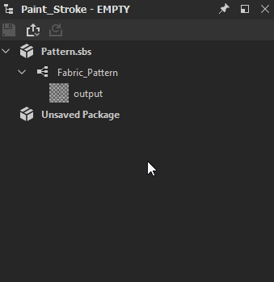

# ビットマップの書き出し

このページでは、Substance 3D Designerで様々なビットマップファイル形式に書き出す方法と、複数のUVタイルを一括して書き出す方法について説明します。[PSDファイルに書き出し](../exporting-psd-files/exporting-psd-files.md)する場合は、専用のページが別途用意されています。

## 概念のエクスポート

ビットマップを書き出すときは、次の点に注意してください。

* パッケージではなく、Graph</b>からエクスポートする<b>。 パッケージは画像コンテンツだけを生成するわけではありません。
* 書き出されるビットマップの数（および解像度）は、グラフの<b>出力</b>によって決まります。
* すべての出力/ビットマップに対してファイルタイプが設定されています。
* 書き出しは[公開](../publishing-asset-files/publishing-substance-3d-asset-files-sbsar.md)とは異なります。違いをよく理解してください。

## 書き出し方法

書き出しの準備ができたら、書き出しダイアログにアクセスする方法は2つあります。

<table>
<tr style="border: 0;">
<td style="border: 0;" valign="top">

[エクスプローラー](../../interface/the-explorer-window/the-explorer-window.md)ウィンドウで、書き出すグラフを右クリックし、**[出力をビットマップとして書き出し]**&#x200B;を選択します

</td>
<td style="border: 0;" valign="top">

[グラフビュー](../../interface/the-graph-view/the-graph-view.md)で、[ツール]ボタンをクリックし、**[出力のエクスポート…]**&#x200B;を選択します

</td>
</tr>
</table>

## 書き出しダイアログ

書き出しダイアログには、書き出しをカスタマイズするためのいくつかのオプションが表示されます。

右側に表示されているバージョンは標準ダイアログで、解像度の変更はグラフや出力で行うか、ダイアログを開く前に親解像度を設定することで行われます。

1. <b>保存先： </b>すべてのファイルを保存する場所。
1. <b>形式：</b>ファイルの種類は、エクスポートされたすべてのファイルで使用されます。
1. <b>パターン</b>:メタデータキーワードに基づいてファイルの種類を生成する一般的なメソッドです。 検証のために、最初の出力に基づくファイル名の例を以下に示します。\
   以下に、使用可能なすべてのオプションを示します。
   1. *$(graph)* – 現在のグラフの名前
   1. *$(識別子)* – 現在の出力の識別子
   1. *$(description)* – 現在の出力の説明
   1. *$(label)* – 現在の出力のラベル
   1. *$(user\_data)* – 現在の出力のカスタムユーザーデータ
   1. *$(group)* – 現在の出力の出力グループ
   1. *$（カラースペース）* – 現在の出力のカラースペース（*OCIO*&#x200B;および&#x200B;*Adobe ACE* [カラーマネジメント](../../color-management/color-management.md)モードでのみ使用可能）
1. <b>出力：</b> グラフの特定の出力および出力グループのオンとオフを切り替えます。 ボタンを使用して、すべてのオンとオフを切り替えることができます。 1つのビットマップのみが変更されている場合に便利です。
1. <b>自動書き出し：</b>切り替えボタンを使用すると、変更が行われるとすぐに、グラフ出力を自動的に再書き出しできます。 現在のグラフのみ。 設定によっては重い場合や遅い場合があります。
1. <b>エクスポートボタン：</b>現在の設定でエクスポートするか、ダイアログを閉じます。

## 書き出しダイアログ（バッチ/UVタイル）

DesignerでUVタイルメッシュを操作する場合は、書き出しダイアログを少し異なる方法で使用して、複数のUVタイルを一度にバッチ書き出しすることができます。 このワークフローを理解し、[グラフ](../../compositing-graphs/substance-compositing-graphs.md)を1つ以上のUVタイルに適切に割り当てていることを確認してください。\
「バッチ」タブを使用すると、作業中（親）の解像度とは異なる解像度でグラフをすばやく書き出すことができます。

エクスプローラー&#x200B;*の[UVタイルに割り当てられたグラフ]を右クリック*&#x200B;するか、[ツール]ボタンを使用してグラフビューの&#x200B;*UVタイルに割り当てられたグラフ*&#x200B;を開いて、上記と同じ方法でダイアログを開始します。

1. <b>[バッチ]タブ</b>：標準の<b>[グラフから] </b>メソッドの代わりにこのタブが選択されていることを確認してください。選択されていない場合、オプション2-3は使用できません。
1. <b>UV タイル:</b>出力と同様に、特定のUV タイルの書き出しのオンとオフを切り替えることができます。
1. <b>[出力サイズ](../../compositing-graphs/output-size/output-size.md): </b>書き出し解像度を無効にして、最大サイズで書き出しながら、より小さく、より効率的に作業できるようにします。

