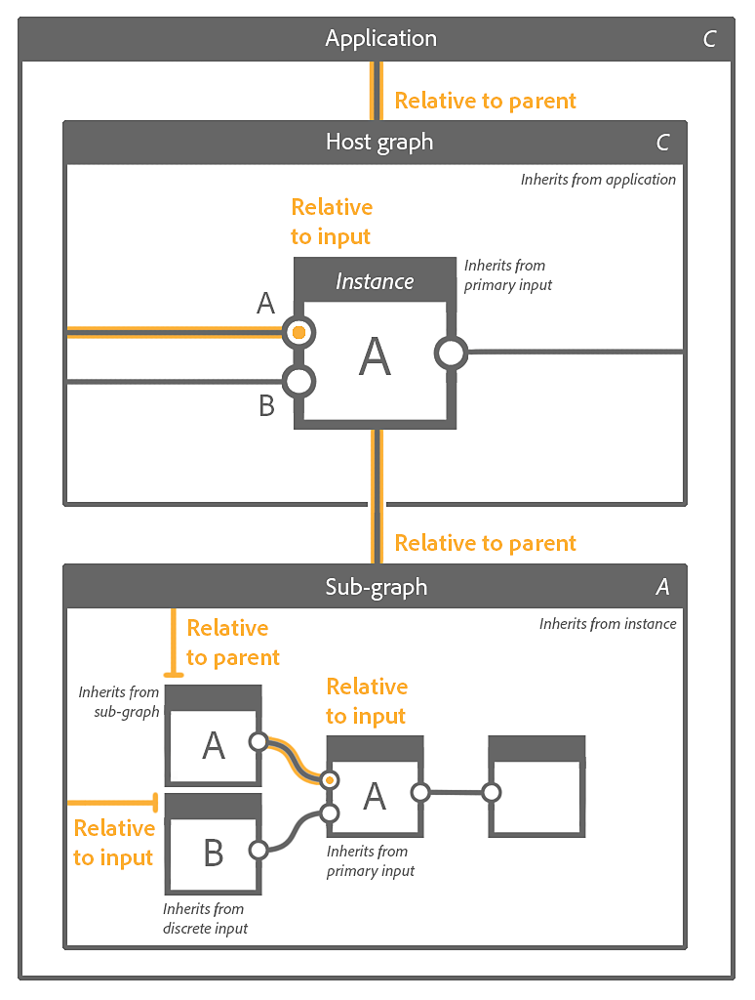
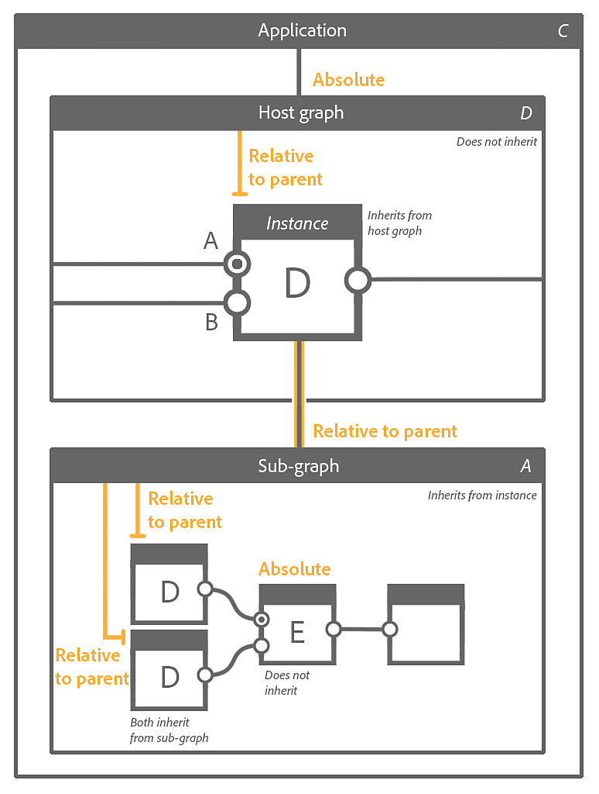

# Substance グラフの継承

[Substance 3D Designer](https://www.adobe.com/jp/products/substance3d-designer.html)内の[Substanceグラフ](../../compositing-graphs/substance-compositing-graphs.md)で継承がどのように適用され、グラフの出力に与える影響について説明します。

{width="1400px"}

## 概要

グラフ内のすべてのノードは、ソースから一部のパラメーターの値を&#x200B;*継承*&#x200B;できます。 継承とは、ソース内の値を変更すると、ソースを継承するすべてのノードで&#x200B;*その変更を実行*&#x200B;することを意味します。 これは、Substance 3D Designerがパラメトリックアセットを作成する際の基本的な土台となる概念の1つです。

>[!NOTE]
>
> 継承を説明する注釈付きのプロジェクトファイルは、このドキュメントの[サンプルSubstanceグラフ](../../compositing-graphs/sample-compositing-graphs/sample-substance-compositing-graphs.md)セクションにあります。

### 継承方式

<table>
<tr style="border: 0;">
<td style="border: 0;" valign="top">

{width="128px"}

<b>絶対</b>

継承がありません。値はパラメーターに&#x200B;*任意かつローカル*&#x200B;で定義されます

</td>
<td style="border: 0;" valign="top">

{width="128px"}

<b>入力に対する相対</b>

値は、ノードの&#x200B;*プライマリ入力*&#x200B;に接続されているデータから継承されます

</td>
<td style="border: 0;" valign="top">

{width="128px"}

<b>親に相対的</b>

値はノードまたはグラフの&#x200B;*親*&#x200B;から継承されます

</td>
</tr>
</table>

継承メソッドは、ノードの[基本パラメーター](../../compositing-graphs/graph-parameters/graph-parameters.md)に適用されます。これは、すべてのノードのビヘイビアーの&#x200B;*基本的な側面*&#x200B;を制御する共通パラメーターのセットです。 次のパラメーターがあります。

* **出力サイズ**
* **出力形式** （ビット深度）
* **ピクセルサイズ**
* **ピクセル比**
* **タイリングモード**
* **ランダムシード**

これにより、*one*&#x200B;ノードでの変更が、そのノードから&#x200B;*下流のすべてのノード*&#x200B;の解像度、精度、タイリング動作にどのように影響するかについて理解できます。

>[!WARNING]
>
> このページで説明する概念を理解するための重要なお知らせ： *インスタンスノード*&#x200B;は、別のグラフ[&#128279;](../../compositing-graphs/creating-compositing-gra/graph-instances-sub-gra/graph-instances-sub-graphs.md)のグラフを表すノードであり、その&#x200B;*独自の個別のパラメーター値*&#x200B;を持つため、*インスタンス*&#x200B;という用語が使用されます。\
> 例えば、同じグラフ内の2つの[Perlinノイズ](../../compositing-graphs/nodes-reference-for-com/node-library/texture-generators/noises/perlin-noise/perlin-noise.md)ノードは、両方とも&#x200B;*同じ*&#x200B;ソースグラフ（`noise_perlin_noise.sbs`の`perlin_noise`）を、*独自のパラメーター値のセット*&#x200B;で表現したものです。

>[!NOTE]
>
> **出力サイズ：** Heightの値&#x200B;*が幅の値*&#x200B;と一致するようにロックボタンを使用してください\
> **ランダムシード：** ボタンを使用して、新しいランダム値をランダムシードに割り当てます。

## 変更の実行

### 継承方法の変更

プロパティパネルでは、ノードのプロパティの[基本パラメーター](../../compositing-graphs/graph-parameters/graph-parameters.md)セクションに一覧表示されているすべてのパラメーターに、ラベルの反対側に（アイコン） <b>継承メソッドの設定</b>ドロップダウンボタンがあります。\
このボタンをクリックすると、パラメータに使用する継承方法を選択できます。

{width="512px"}

ほとんどの場合、*ノード*&#x200B;の基本パラメーターは&#x200B;*入力に対して相対的*&#x200B;に設定され、ノードをチェーン接続するという手続き型の動作を利用できます。また、*グラフ*&#x200B;の基本パラメーターは&#x200B;*親に対して相対的*&#x200B;に設定されているため、グローバルパラメーターをグラフが使用されるコンテキストに適応させることができます。

### 継承された値の微調整

[出力サイズ](../../compositing-graphs/output-size/output-size.md)、ピクセルサイズ、ランダムシードなどの一部の基本パラメーターは、継承された値&#x200B;*に対して*&#x200B;相対的に変更できます。

たとえば、出力サイズパラメーターで&#x200B;*相対…*&#x200B;継承メソッドが使用されている場合、値（または`(1, -1)`）は、Xの継承された値が&#x200B;*上*&#x200B;の2乗、Yの継承された値が&#x200B;*下*&#x200B;の2乗の2乗であることを意味します。次に例を示します。

* 継承された値： `(9, 9)` (`2^9, 2^9 = 512, 512`)
* 相対値： `(1, -1)` (`2^(9+1), 2^(9-1) = 256, 1024`)

>[!NOTE]
>
> [出力サイズ](../../compositing-graphs/output-size/output-size.md)ページは、この重要なBaseパラメーターの詳細を掘り下げており、ノードの最終解像度の計算方法を理解するために読むことをお勧めします。

関数がBaseパラメータに適用される場合、関数の結果もパラメータの継承メソッドを使用して解釈されます。\
出力サイズの例を念頭に置いて、継承された解像度をXとYの2倍に上げることを目的とした関数は、`(2, 2)`のInteger2値を出力する必要があります。

## ノードとグラフのペアレントビュー

「親に対して相対的」継承メソッドを使用する場合、特定のコンテキストで親が何であるかを正確に理解する必要があります。

ノードの親は、ノードが存在する&#x200B;*グラフ*&#x200B;です。

グラフの親は、次の場所に存在する&#x200B;*コンテキスト*&#x200B;です：

* そのグラフが&#x200B;*インスタンスノード*&#x200B;として別のホストグラフにインスタンス化されたサブグラフである場合、サブグラフの親は&#x200B;*インスタンスノード*&#x200B;です。 そのインスタンスノードの親は&#x200B;*ホストグラフ*&#x200B;です。
* グラフがルートグラフの場合、親は&#x200B;*アプリケーション自体*&#x200B;であり、アプリケーションが指定されたパラメーターに設定した値です。 たとえば、グラフは、[グラフビューのツールバー](../../interface/the-graph-view/the-graph-view.md)で設定された<b>親サイズ</b>パラメーターから継承されます。

>[!WARNING]
>
> パッケージをSubstance 3Dアセットファイル(SBSAR)に公開する際に、親が&#x200B;*そのまま*&#x200B;適用されます。 つまり、任意のパラメーターを&#x200B;*絶対*&#x200B;継承メソッドに設定すると、そのパラメーターは公開されたアセット内の現在の値に&#x200B;*ロック*&#x200B;されます。\
> これは[ビットマップ](../../compositing-graphs/nodes-reference-for-com/atomic-nodes/bitmap/bitmap.md)のノードまたは[最適化の目的](../../best-practices/performance-optimization/performance-optimization-guidelines.md)に適していますが、例えば&#x200B;*Substanceグラフで作業する場合は、その他の方法で*&#x200B;明確で意図的な目的&#x200B;*がない限り、*&#x200B;相対値…*の継承方式を使用することを*&#x200B;強くお勧めします。

### コンテキスト内編集

グラフインスタンスノードで[コンテキスト内編集](../../compositing-graphs/creating-compositing-gra/graph-instances-sub-gra/graph-instances-sub-graphs.md)を使用する場合、グラフの親は&#x200B;*インスタンスノード*&#x200B;です。 この場合、[グラフビューのツールバー](../../interface/the-graph-view/the-graph-view.md)の<b>親サイズ</b>設定は&#x200B;*無効*&#x200B;になります。これは、グラフがインスタンスノードから基本パラメーターを継承するためです。

このトレイトはコンテキスト編集の&#x200B;*ポイント*&#x200B;です。継承メソッドを設定し、ノードの基本パラメーターの現在の値を評価する場合は、*因数分解する*&#x200B;必要があります。

## 複数の入力による継承

グラフに複数の入力がある場合、各入力は、その継承方法に応じて、個別の入力データまたはグラフから継承されます。

<table>
<tr style="border: 0;">
<td style="border: 0;" valign="top">

{width="128px"}

<b>入力に対する相対</b>

入力は、グラフのベースパラメーターに関係なく、個別の入力データから継承されます。 これは、入力ごとのデータを制御する場合に非常に便利です。

</td>
<td style="border: 0;" valign="top">

{width="128px"}

<b>親に対する相対</b>

入力はグラフから継承され、それに応じて受け取るデータが適応されます。

</td>
<td style="border: 0;" valign="top">

</td>
</tr>
</table>

### プライマリ入力

<table>
<tr style="border: 0;">
<td style="border: 0;" valign="top">

<table>
<tr style="border: 0;">
<td style="border: 0;" valign="top">

{width="48px"}

</td>
<td style="border: 0;" valign="top">

{width="48px"}

</td>
<td style="border: 0;" valign="top">

{width="48px"}

</td>
</tr>
</table>

入力の1つをグラフの&#x200B;**プライマリ入力**&#x200B;として設定するには、[入力](../../compositing-graphs/nodes-reference-for-com/atomic-nodes/input/input.md)ノードで&#x200B;**RMB**&#x200B;をクリックし、コンテキストメニューの&#x200B;**プライマリ入力として設定**&#x200B;オプションを選択します。

</td>
<td style="border: 0;" valign="top">

</td>
</tr>
</table>

グラフがインスタンスノードとして別のグラフにインスタンス化される場合は、*入力を基準とする*&#x200B;に設定されているインスタンスノードのすべての基本パラメーターが、*その入力*&#x200B;に接続されているデータを継承します。 インスタンスノードのプライマリ入力は、コネクタの小さな暗い点で識別できます。

*親に対する相対*&#x200B;に設定されているその他の入力は、プライマリ入力から継承する&#x200B;*インスタンスノード\**から継承する*&#x200B;グラフ*から継承するため、同じ基本パラメーターの値を継承します。

\*：これは、グラフで*&#x200B;親に対する相対*継承メソッドを使用している場合に当てはまります。

## 例

以下に、様々な継承事例と、上位から順に次のアクターで設定された継承方法の相互運用を示します。

1. アプリケーション
1. ホストグラフ
1. ホストグラフのインスタンスノード
1. サブグラフ – インスタンスノードが参照するグラフ
1. サブグラフのノード

アクターに対して設定された&#x200B;*継承メソッド*&#x200B;は、その真上にオレンジ色で表示されます。 ソースに対する&#x200B;*継承のフロー*&#x200B;はオレンジ色の線で表示されます。

文字は、基本パラメーターの&#x200B;*個別のセット*&#x200B;を表し、どのアクターによってどのデータが継承されるかに従う必要があります。

<table>
<tr style="border: 0;">
<td style="border: 0;" valign="top">

**例A**

{zoomable="yes"}

</td>
<td style="border: 0;" valign="top">

**例B**

{zoomable="yes"}

</td>
</tr>
</table>

<table>
<tr style="border: 0;">
<td style="border: 0;" valign="top">

**C**&#x200B;の例

{zoomable="yes"}

</td>
<td style="border: 0;" valign="top">

**例D**

{zoomable="yes"}

</td>
</tr>
</table>

## 継承に関する問題のトラブルシューティング

グラフを構築して複雑さを増やすと、継承によって予期しない結果が生じることがあります。 ノードの出力の解像度または精度が正しくない場合（ビット深度など）、*継承チェーンを上げて*&#x200B;これらの値の出所を特定する必要があります。

最初に、ノードのすぐ下に表示されるデータを確認することをお勧めします。ノードの&#x200B;*最初の出力*&#x200B;による画像出力の解像度、色の形式、および精度です。 解決策の理解は簡単ですが、2番目のデータは詳しく説明する価値があります。

* *文字のプレフィックス*&#x200B;は、画像の色の形式を参照しています：
  * <b>L</b>：輝度（グレースケール）
  * <b>C</b>:カラー
* *数値*&#x200B;は、画像のビット深度を示します。精度は小さいものから大きいものまで様々です。
  * <b>8</b>: 8ビットの整数（0 ～ 1で256ステップ）
  * <b>16</b>: 16ビット整数（0 ～ 1で65 536ステップ）
  * <b>16F</b>: 16ビット浮動小数点（0 ～ 1を超える低精度値、負の値を含む）
  * <b>32F</b>: 32ビット浮動小数点数（0 ～ 1を超える高精度の値、負数を含む）

ノードに複数の出力がある場合は、次の2つの簡単な方法で解像度と精度を確認できます。

* *出力コネクタ*&#x200B;の<b>LMB</b>をダブルクリックして[2Dビュー](../../interface/2d-view/2d-view.md)に画像を表示し、2Dビューのビューポートの&#x200B;*左下隅*&#x200B;に表示されている画像情報を確認します
* [レベル](../../compositing-graphs/nodes-reference-for-com/atomic-nodes/levels/levels.md)または[変換2D](../../compositing-graphs/nodes-reference-for-com/atomic-nodes/transformation-2d/transformation-2d.md)ノードを作成し、その入力を確認する出力に接続します。 ノードは既定で&#x200B;*出力から継承*&#x200B;します。その後、ノードの下の値を確認できます。

これで、グラフのノードチェーンを上に移動して、予期しない値が表示される&#x200B;*最初のノード*&#x200B;を見つけることができます。 基本パラメーターの継承方法を確認してください。

何も問題がなく、そのノードがインスタンスノードである場合は、さらに深く進み、そのインスタンスノードによって参照されるグラフを開く必要があります。 グラフの出力ノードから上流に向かうプロセスを繰り返します。

### 一般的な例

特に、*プライマリ入力*&#x200B;の概念は簡単に&#x200B;*見落とされる*&#x200B;ため、継承の問題が発生する可能性があります。

[ブレンド](../../compositing-graphs/nodes-reference-for-com/atomic-nodes/blend/blend.md)ノードは非常に頻繁に使用されるため、この影響を受けやすくなります。 <b>Background</b>入力はプライマリ入力です。

{width="512px"}

2つの入力をブレンドする順序に注意する必要があります。グラフを下に向けて維持する解像度と精度の入力は、背景入力にコネクトする必要があります。必要なブレンドモードを使用すれば可能です。 そうでない場合は、ブレンドノードのベースパラメータとその継承方法を調整して補正する必要があります。
