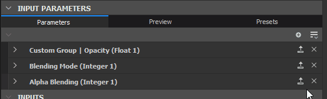
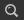

# パラメーターの表示

パラメーターの公開は、最も強力なツールの1つであり、Substance 3D Painter、Substance 3D Sampler、Mayaと3DS MaxのSubstance統合など、他のアプリケーションでグラフを開く際に重要です。

このページでは、公開を開始するために必要なすべての概念について説明します。 このページを続行する前に、まずGraphインスタンスの内容を学習する[ことをお勧めします](../../../compositing-graphs/creating-compositing-gra/graph-instances-sub-gra/graph-instances-sub-graphs.md)。 また、[Publishと書き出しの違い、および関連するファイルの種類](../../../getting-started/overview/overview.md)を把握しておくことも重要です。

*\*上の破線と透明な線は、接続の抽象表現です\
公開されたパラメーターからグラフパラメーターへ。*

## パラメーターと公開について

+++パラメーターとは何ですか？
*パラメーターは、グラフの動作を制御する、UI要素を持つ単純な値です。* 色を変える、描画モードを設定する、不透明度の値を選ぶなど、すべてのSubstanceソフトウェアで常に使用します。パラメーターがなければ、Substanceソフトウェアではどのようなカスタマイズも行えません。

パラメーターには、スライダー、ダイヤル、入力ボックス、ドロップダウンメニューなど、様々な形式があります。これらの値は、10進値、整数(integer)値、ブール値(true/false)、テキストスニペットなど、さまざまなタイプを表すことができます。

+++

+++「公開」とは何ですか？
***公開は、現在のグラフビューの外で使用できるパラメーターを作成するプロセスです。***  グラフを作成する場合、通常はノードを選択してプロパティのパラメーターを変更します。公開する場合は、*外部コントロールパネルからこのパラメーターへのアクセスを有効にします*。 この「外部コントロールパネル」は、コンテキストに応じて異なる意味を持つことがあります。Designer内でグラフインスタンスとして使用した場合、これは単に別のノードとして機能します。 Substance 3D Painter、Substance 3D Sampler、または統合で使用すると、これらの公開パラメーターは&#x200B;*グラフに対する唯一のコントロール*&#x200B;になります。

+++

+++公開が便利である理由
***パラメーターの公開は、Substance 3D Designerがシンプルなテクスチャエディターを超えて、カスタマイズ可能な動的なテクスチャ生成ツールを作り出せるようにするための機能です*** **。** Substanceマテリアルを公開しなければ、静的テクスチャとほとんど変わりません。つまり、出力を変更する方法がないからです。

+++

+++すべてのパラメーターを常に自動的に公開するのはなぜですか？
<b> [Substanceグラフ](../../../compositing-graphs/substance-compositing-graphs.md)は複雑になる可能性があり、一度に数百のパラメーターを含めることができます。 すべてのパラメーターを常にユーザーに表示することは意味がありません。特に、単純な目標を持つグラフを作成する場合は、多くのパラメーターを必要としません。</b> パラメーターを公開する際は、UIデザイナーまたはUXデザイナーとして作業します。つまり、コントロールの意味、必要な値、自分、オンラインの他のユーザー、または同僚が使いやすくする方法を考えます。

+++

+++公開するために数学を知る必要がありますか？ Substance関数のグラフを理解すべきですか？
***公開パラメーターを適切に使用するために数学的知識は必要ありません。また、関数も使用できません。***  初めて使用するユーザーの場合、[関数グラフ](../../../function-graphs/function-graphs.md)で数学的操作を行う必要はほとんどありません。 強くお勧めするのは、[Integer、Float、Booleanなどのさまざまなデータ型に関する適切な基本知識です。](../../../function-graphs/nodes-reference-for-fun/function-nodes-overview/function-nodes-overview.md)

+++

## 公開する方法

現在、パラメーターを公開する主な方法は2つあります。 1つの方法は1つのパラメータを迅速に公開するのに適しており、2番目の方法は1つのスイープで複数のパラメータを公開するのに適しています。

{width="512px"}

### 単一露光法

1. [プロパティ](../../../interface/properties/properties.md)パネルの[特定のパラメーター]タブで、表示するパラメーターを指定します
1. ドロップダウンオプションボタンをクリックします
1. 最初のオプションであるドロップダウンリストから <b>新しいグラフ入力として表示</b>を選択します。
1. <b>パラメーターを公開</b>ダイアログが表示されます。必要に応じてパラメーターのプロパティを設定します。

   <b>識別子</b>と<b>ラベル</b>を少なくとも変更することをお勧めします
1. <b>[OK]</b>を押して確定します
1. パラメーターの名前が&#x200B;*青*、およびに変わります\
   <b> [パラメーター関数の編集]</b>ボタンがドロップダウンオプションの横に表示され、パラメーターが表示されていることを確認します

>[!NOTE]
>
> ほとんどの数値フィールドは、入力として&#x200B;*基本的な数式*&#x200B;をサポートしています（例： `17+3.5`、`7/3`、`(4+2)*3`）。 *Enter*&#x200B;を押して式を検証すると、結果がフィールドに入力されます。 数式が無効な場合、フィールドは以前の値に戻ります。\
> [プロパティ](../../../interface/properties/properties.md)ドックなど、アプリケーションの他の部分の数値フィールドの一部も、この機能をサポートしています。

{width="512px"}

### バッチ公開方法

1つのパラメーターを公開する場合、このメソッドは前のメソッドよりも少し遅くなります。 複数のパラメーターを表示する場合は、処理が速くなります。

1. 1つのパラメーターを検索する代わりに、[<b>特定のパラメーター</b>]タブの右上にある[ <b>複数表示</b>]ボタンを見つけます
1. ドロップダウンメニューから[<b>パラメーターの一括表示...</b>]を選択します
1. <b>バッチ表示</b>ダイアログが表示され、ノードのすべての<b>固有パラメーター</b>の表示をカスタマイズできます
1. <b>すべて</b>、<b>なし</b>、または特定のチェックボックスを使用して、表示するパラメーターを指定します
1. 一覧の<b>パラメーター入力識別子</b>列の下にあるグラフー名をクリックして、パラメーター名を変更します。
1. 一覧の<b>グラフ入力グループ</b>列の下にある<b>グループ名</b>をクリックして、1つのパラメーターの（サブ）グループを追加します
1. 下部にある<b>グラフ入力識別子</b>と<b>グラフ入力グループ</b>の入力ボックスを使用して、プレフィックス、サフィックス、および入力グループをすべての表示されるパラメーターに一度に追加します。 これらの値はすべて、パラメーターごとの設定の上に適用されます。
1. 選択したすべてのパラメーターを確定して表示するには、<b>[OK]</b>をクリックします。 パラメーター名に&#x200B;*青*&#x200B;が表示され、パラメーターが表示されたことを確認できます。また、 <b> [関数の編集]</b>ボタンも表示されます。

## 制限

次の表に示すように、パラメーターの表示に関連するいくつかの制限があります。

| パラメーターの種類 | 理由 |
| --- | --- |
| [グラデーションランプ](../../../compositing-graphs/nodes-reference-for-com/atomic-nodes/gradient-map/gradient-map.md)、[カーブエディター](../../../compositing-graphs/nodes-reference-for-com/atomic-nodes/curve/curve.md)、[フォント](../../../compositing-graphs/nodes-reference-for-com/atomic-nodes/text/text.md)、[レベルヒストグラム](../../../compositing-graphs/nodes-reference-for-com/atomic-nodes/levels/levels.md) | ユーザーが作成したパラメーターでは使用できないウィジェットを要求します。 |

もう1つの重要な制限は、[静的パラメーター](../../../glossary/glossary.md)に関するものです。 これらは、[公開されたSubstance 3Dアセット(SBSAR)](../../publishing-asset-files/publishing-substance-3d-asset-files-sbsar.md)では変更できません。

グラフが&#x200B;*cooked*&#x200B;された後（つまり、アルゴリズムを迅速かつ効率的に実行するために処理された後）、静的パラメーター – 動的パラメーターとは対照的に – *オンザフライ編集*&#x200B;はできません。 グラフが&#x200B;*編集*&#x200B;または&#x200B;*公開*&#x200B;されるたびに、Designerで料理が行われます。

そのため、静的パラメーターはDesignerでは表示および編集できますが、公開されたSubstance 3Dアセットでは&#x200B;*非表示*&#x200B;になります。 プレビューモードを使用して、Substance 3Dアセットに公開する前にこれらの制限が有効であることを確認できます。以下の「パラメーターのプレビュー」を参照してください。

回避策として、[Switch](../../../compositing-graphs/nodes-reference-for-com/node-library/filters/blending/switch/switch.md)または[Multi Switch](../../../compositing-graphs/nodes-reference-for-com/node-library/filters/blending/multi-switch/multi-switch.md)ノードと複数のロジックセットを使用して、これらのパラメーターの異なる値/状態を切り替えることができます。

| ノード | パラメーター |
| --- | --- |
| すべてのノード | タイリングモードピクセル比 |
| [均一カラー](../../../compositing-graphs/nodes-reference-for-com/atomic-nodes/uniform-color/uniform-color.md) | カラーモード |
| [ピクセルプロセッサ](../../../compositing-graphs/nodes-reference-for-com/atomic-nodes/pixel-processor/pixel-processor.md) | カラーモード |
| [ブレンド](../../../compositing-graphs/nodes-reference-for-com/atomic-nodes/blend/blend.md) | 描画モードAlpha描画モードで切り抜く領域 |
| [FX-Map](../../../compositing-graphs/nodes-reference-for-com/atomic-nodes/fx-map/fx-map.md) | ブレンドモード |
| [象限](../../../function-graphs/fxmaps/the-quadrant-node/the-quadrant-node.md) | パターン入力画像アルファ入力画像フィルター |

## 公開されたパラメーターの変更

公開されると、以前のようにパラメーターにアクセスすることはできなくなります。 値の変更、名前の変更、UIでの配置、パラメーターの削除などはすべてグラフプロパティレベルで行われます。 このセクションでは、これを行う方法について説明します。

公開されているパラメーターのオプションを変更するには、次のいずれかの操作を行います。

1. 既に公開されているパラメーターの横にあるドロップダウンオプションボタンをクリックします
1. <b> [グラフ入力の編集]</b>を選択します。 これにより、グラフプロパティの関連するエントリに直接アクセスできます
1. グラフの空の領域をダブルクリックしてグラフーのプロパティを表示し、<b>パラメーター</b>の一覧で入力パラメーターーを見つけます
1. <b>エクスプローラー</b>でグラフーを1回クリックし、<b>パラメーター</b>の一覧で入力パラメーターーを見つけます

{width="512px"}

### 入力パラメーター

公開されているパラメーターはすべて、「入力パラメーター」タブに一覧表示されます。 次のプロパティは、デフォルトのエディタータイプを持つ浮動小数点や整数など、ほとんどの一般的なケースで使用できます。

1. <b>識別子</b>：このパラメーターの一意の識別子です。 スペースまたは特殊文字を含めることはできません。
1. <b>ラベル</b>: UIのみのラベル。 ラベルが定義されていない場合、識別子はUIに表示されます。 スペースと特殊文字を含めることができます
1. <b>グループ</b>:パラメーターの長いリストをクリーンで管理しやすくするために、パラメーターを折りたたみ可能なセクションにまとめます。 パラメーターは、*まったく同じ*&#x200B;グループ名を共有する場合、グループ化されます。 `/`文字を使用して&#x200B;*サブグループ*&#x200B;を作成します（例： `My Group/My Sub-group`）
1. <b>説明</b>：説明のテキストフィールド。ツールチップとして使用されます。
1. <b>型/エディター</b>:データ型およびUIエディターの型を設定します。 特定のエディターは、特定のデータ型でのみ使用できます（Integer型の場合のみドロップダウンリストなど）。 *エディターを変更すると、多くの場合、既定値が消去されます。注意してください。*
1. <b>既定</b>:パラメーターの開始時点の既定値です。 この値は、ノードのプレビュー時にグラフでも使用されます。 ここでは、極端な場合を避けるために、簡単で使いやすい値を使用してください。
1. <b>最小</b>：UI の最小値
1. <b>最大</b>：UI の最大値
1. <b>クランプ</b>: [最小]と[最大]がソフトリミットまたはハードリミットのどちらであるかを設定します（ユーザーがリミットを超えられるようにします）。
1. 値の精度または粒度を<b>ステップ</b>:Setします。
1. <b>ユーザーデータ</b>：任意の目的で使用できるカスタムユーザーデータ。
1. <b>次の場合に表示</b>：外部条件に基づいてパラメーターを表示または非表示にする特殊式システム。 [Visible if：入力、出力、およびパラメーターの表示を制御](../../../compositing-graphs/visible-control-vis/visible-if-control-visibility-of-inputs-outputs-and-parameters.md)を参照してください

{width="512px"}

#### ドロップダウンリスト

整数型の<b>ドロップダウンリスト</b>は特殊なケースです。 デフォルト、最小、最大は設定されず、項目のリストを定義できる単一の値のみが設定されます。

* すべての項目は、ドロップダウンリストの項目に対応します。
* アイテムの最初の値は、グラフで使用される実際の内部整数です。 たとえば、[マルチスイッチ](../../../compositing-graphs/nodes-reference-for-com/node-library/filters/blending/multi-switch/multi-switch.md)用に正しくセットアップしてください（0ではなく1から始まります）。
* 2番目の値は、ユーザーに表示されるUIラベルです。
* 3番目のチェックボックスを使用すると、1つの項目をデフォルトで選択された項目としてマークできます。
* Xがアイテムを削除し、+がアイテムを追加する

{width="512px"}

#### 再注文

パラメータの並べ替えは、リストの入力パラメータ名の左側にある暗いストライプのハンドルをドラッグ&amp;ドロップすることで簡単に行うことができます。 パラメータをグループ化すると順序に影響する場合があることに注意してください。

{width="512px"}

### パラメータのプレビュー

最終結果を確認せずにパラメーターを設定することは困難な場合があるため、<b>プレビューモード</b>を有効にして、パラメーターUIが外部でどのように表示され、動作するかを確認できます。 [入力パラメータ]ロールアウトの上部中央にある[<b>プレビュー</b>]タブをクリックします。

通常、<b>プレビューモード</b>で行われた変更はすべて&#x200B;*破棄*&#x200B;されます。 ただし、目のアイコンの横にある<b>適用ボタン</b>を使用して、<b>プレビューモード</b>の現在の値を&#x200B;*新しい既定値*&#x200B;として設定できます。

[プレビューモードでは、埋め込みプリセットを作成することもできます。](../../../compositing-graphs/manage-parameters/parameter-presets/parameter-presets.md)

>[!IMPORTANT]
>
> [コンテキスト内の編集](../../../interface/preferences-window/preferences-window.md)を使用すると、プレビューモードが無効になります。

>[!WARNING]
>
> プレビューモードは、[公開されたSubstance 3Dアセット(SBSAR)](../../publishing-asset-files/publishing-substance-3d-asset-files-sbsar.md)のエクスペリエンスをできるだけ正確に表現することを目的としています。 そのため、このページに記載されている制限は、このモードで適用されます（*静的パラメーターがリストに存在しない*&#x200B;など）。

{width="512px"}

### パラメータのコピー&amp;ペースト

パラメータは、グラフ間でコピー&amp;ペーストできます。

[コピー]ボタンを使用して、単一のパラメーターをコピーできます。 パラメーターメニューを使用して、複数のパラメーターをコピーできます。 「入力をコピー」を選択して、すべての入力をコピーします。

パラメーターメニューの[入力の貼り付け]を選択して、1つ以上のパラメーターを貼り付けます。

実際に公開されているパラメーター自体ではなく、値を転送する場合は、[パラメータープリセットについて参照してください。](../../../compositing-graphs/manage-parameters/parameter-presets/parameter-presets.md)

## 公開されたパラメーターの削除とクリーニング

パラメータの性質上、入力パラメータで複数のノードを制御できるようにしたり、入力パラメータがノードを制御せずに存在できるようにすると、パラメータの欠落や未使用によって問題が発生する可能性があります。 以下では、一般的な問題とその解決策について説明します。

{width="512px"}

### ノード上の壊れたパラメータのトラッキング

グラフビューの上部バーにあるノードファインダーツールを使用して、どのノードがどのパラメーターを使用しているかを追跡できます。 クリックすると、特定のパラメータを使用してノードを検索できます。

ノードに実際の問題がある場合は、ノードの左上隅に警告バッジが表示されます。 バッジの上にマウスポインターを置くと、詳細情報を示すツールヒントが表示されます。

問題をリセットして削除するには、修正またはリセットするパラメーターの[関数の編集]ボタンの横にあるドロップダウンボタンをクリックし、 <b>リセットを選択します。 </b>これにより、パラメーターが前の公開されていない状態に戻ります。これを反映して青い名前が再びグレーになります。

{width="512px"}

### 未使用の入力パラメーターをクリーンアップしています

入力パラメーターのトラックが不明で、使用されているパラメーターがわからない場合は、小さなツールを使用してクリーンアップできます。 入力パラメーターメニューボタンをクリックし、<b>入力を消去</b>を選択します。

新しいダイアログボックスが表示され、使用されていないすべてのパラメータが一覧表示されます。 削除または保持するパラメータをチェックまたはチェック解除し、「OK」をクリックします。 ダイアログが表示されない場合は、クリーンアップする未使用のパラメーターはありません。

{width="512px"}

### パラメータの削除

使用中のパラメータを実際に削除するには、2つの異なる手順が必要です。

1. パラメーターが表示されているノードで、青色の関数表示ボタンの右側にあるドロップダウン矢印をクリックします。 次に、「デフォルト値にリセット」を選択します。 これにより、この1つのノードでパラメータを使用する必要がなくなります。 同じパラメータを使用する他のノードに対して、この手順を繰り返します。 [既定値にリセット]をクリックすると、パラメーターウィジェットの範囲も&#x200B;*ソフト範囲*&#x200B;にリセットされます。
1. グラフの入力パラメーターリストで、パラメーターエントリの右側にあるXをクリックします。 これにより、パラメーターが完全に削除されます。 ノードがこのパラメータを使用しようとすると、警告バッジが表示されます（上記を参照）。
