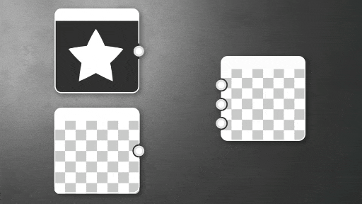

# ブレンド

<table>
<tr style="border: 0;">
<td width="33.33%" style="border: 0;" valign="top">

{width="100%"}

</td>
<td style="border: 0;" valign="top">

指定した描画モードとオプションのマスクを使用して 2 つの画像を合成します。

これは、すべてのアトミックノードの中で最も有用なノードです。[Substance 3D Designer](https://www.adobe.com/jp/products/substance3d-designer.html)で構築するほぼすべてのグラフで、このノードが使用されます。

</td>
</tr>
</table>

その機能は、一番上のレイヤーで設定した描画モードによってブレンドされる[Substance 3D Painter](https://www.adobe.com/products/substance3d-painter.html)または[Photoshop](https://www.adobe.com/ch_fr/products/photoshop/landpa.html)で、2つのレイヤーを重ねることと似ています。

>[!TIP]
>
> [この専用ページ](../../../../compositing-graphs/nodes-reference-for-com/atomic-nodes/blend/blending-modes-des/blending-modes-description.md)のブレンドノードで使用できる描画モードについて説明します。

## パラメーター

|  |  |
| --- | --- |
| <b>不透明度</b> *浮動小数* | 背景にブレンドされる前景レイヤーの不透明度。 このエフェクトは、不透明度の入力とは独立して機能し、追加のマルチプライヤとして機能します。 |
| <b>描画モード</b> *整数* [静的](../../../../glossary/glossary.md) | 使用するブレンド操作を設定します。   [描画モードに関する専用ページ](../../../../compositing-graphs/nodes-reference-for-com/atomic-nodes/blend/blending-modes-des/blending-modes-description.md)を参照してください。 |
| <b>アルファブレンディング</b> *整数* [静的](../../../../glossary/glossary.md) | カラー入力にアルファチャンネルがある場合のブレンド動作を指定します。<ul data-preserve-html="true"> <li data-preserve-html="true">ソースアルファを使用</li> <li data-preserve-html="true">アルファを無視</li> <li data-preserve-html="true">ストレートアルファブレンディング</li> <li data-preserve-html="true">合成アルファブレンディング</li> </ul> |
| <b>クロップエリア</b> *浮動小数4* [静的](../../../../glossary/glossary.md) | 追加の不透明度マスクのように動作するカスタムの切り抜き領域を設定できるようにします。 切り抜いた領域には、背景のみが表示されます。 |

## 入力コネクター

|  |  |
| --- | --- |
| <b>前景</b> *グレースケール/カラー* | ブレンド処理の最上位または前景レイヤー。 |
| <b>背景</b> *グレースケール/カラー*&#x200B;プライマリ | ブレンド操作の下レイヤーまたは背景レイヤー。 |
| <b>不透明度</b> *グレースケール* | オプションのAlphaマスク入力。 |

>[!IMPORTANT]
>
> ブレンドノードには、接続に応じてグレースケールとカラーを切り替える動的入力があります。<b> ブレンドノードは、同じ型</b>の2つの入力のみをブレンドできます。
> 
> カラーとグレースケールの入力を前景と背景に接続すると、赤い破線で接続され、計算エラーであることが示されます。
> 
> これは、新規ユーザーがカラーとグレースケールの接続で問題が発生する最大の理由です。両方の接続のタイプが同じであることを確認してください。

## 例

*近日公開。*
