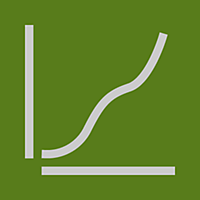
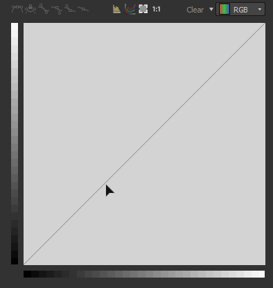
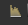
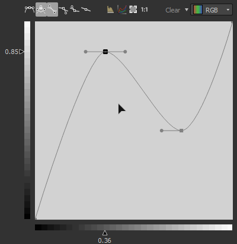

# カーブ

<table>
<tr style="border: 0;">
<td width="33.33%" style="border: 0;" valign="top">

{width="200px"}

</td>
<td width="100.00%" style="border: 0;" valign="top">

カスタムカーブを使用して、画像内の値を再マップします。

このノードは、他の2D画像編集アプリケーションと同様に、画像の色調の再マッピングのためのインターフェイスを提供します。 ユーザーはポイントを配置し、ベジェ曲線を調整して入力を再マップできます。このマップには、グレースケールとカラーがあります。この機能は、グラデーション効果と組み合わせて使用すると、特定のHeightプロファイルに再マップできるので特に便利です。これにより、ベベルプロファイルなどの非常に正確なモデリングが可能になります。

</td>
</tr>
</table>

他のほとんどのノードとは異なり、カーブノードには、スライダとパラメータを持つ標準的なインタフェースはありませんが、代わりに完全なカーブエディタが表示されます。 使用方法については、次の拡張可能なセクションを参照してください。

[ただし、これは、Curveノードのパラメーターをサブグラフに公開できないことを意味します](../../../../compositing-graphs/manage-parameters/exposing-a-parameter/exposing-a-parameter.md)。 ここでの唯一のオプションは、[Multi-Switch](../../../../compositing-graphs/nodes-reference-for-com/node-library/filters/blending/multi-switch/multi-switch.md)を使用して、異なる曲線プロファイル間を切り替えることです。

<table>
<tr style="border: 0;">
<td width="100.00%" style="border: 0;" valign="top">

</td>
<td width="83.33%" style="border: 0;" valign="top">

</td>
<td width="100.00%" style="border: 0;" valign="top">

</td>
</tr>
</table>

<table>
<tr style="border: 0;">
<td style="border: 0;" valign="top">

## パラメーター

### カーブエディタ

</td>
<td style="border: 0;" valign="top">

### 入力コネクタ

### 出力コネクタ

</td>
<td style="border: 0;" valign="top">

### 例

</td>
</tr>
</table>

## パラメーター

|  |  |
| --- | --- |
| <b>曲線を適用/表示</b> *ブール値* | ユーザー曲線を入力画像に適用する代わりに、出力にコピーできます |
| <b>曲線アドレス指定</b> *ブール値* | このパラメーターは、入力の[0, 1]範囲外のHDRピクセルの処理方法（[0, 1]までクランプまたは折りたたむ）を決定します。 |
| <b>曲線</b> *曲線キーの配列* | 入力グレースケール値のマッピングに使用するカスタムカーブ。   [曲線エディター](#curve-editor)を使用して編集できます。 |

## カーブエディタ

### ポイントの作成と移動

ポイントを作成するには、カーブビューの任意の場所をダブルクリックします。

### ポイントの影響を制御する

<table>
<tr style="border: 0;">
<td width="100.00%" style="border: 0;" valign="top">

正確な結果を得るために、曲線ノードには点ごとに異なるモードがあります。

</td>
<td width="33.33%" style="border: 0;" valign="top">

</td>
</tr>
</table>

ポイントモードを既定値にリセットします。

 2つのベジェハンドラーをロックまたはロック解除して、ユーザーがまとめて移動したり、個別に移動したりできるようにします。

ポイントの両側はベジェハンドラーによって制御されます。

ポイントの右側はベジェハンドラーによって制御され、左側は平らな状態のままです。

ポイントの左側はベジェハンドラーによって制御され、右側は平らな状態を維持します。

点の側面は平らなままです

### 入力ヒストグラムを表示

をクリックするだけで、入力のヒストグラムを表示/非表示にできます

### 各チャンネルを個別に制御する（カラー入力）

<table>
<tr style="border: 0;">
<td width="100.00%" style="border: 0;" valign="top">

カラーノードを入力すると、各チャンネルのカーブを調整できます。

右上にあるドロップダウンリストで、調整する曲線を選択します。

</td>
<td width="33.33%" style="border: 0;" valign="top">

</td>
</tr>
</table>

RGBカーブモードでは、を押すか押さないかで、個々のチャンネルカーブの表示と非表示を切り替えることができます。

### 位置合わせ、鏡像化、反転

<table>
<tr style="border: 0;">
<td width="100.00%" style="border: 0;" valign="top">

カーブビューを右クリックすると、さらにオプションが表示されます。

<b>上に揃える：</b>選択したポイントを水平方向に最も高いポイントに揃えます。

<b>中央揃え：</b>選択したポイントを選択範囲の平均Heightに対して水平方向に揃えます。

<b>下に揃える：</b>選択したポイントを最も低いポイントに水平に揃えます。

</td>
<td width="50.00%" style="border: 0;" valign="top">

</td>
</tr>
</table>

<b>水平方向/垂直方向に分布：</b>選択した軸にポイントを分布します

<b>水平方向/垂直方向に反転：</b>選択した軸に従って、選択した点を反転します。

<b>水平方向/垂直方向にミラー：</b>選択した軸に従って曲線全体をミラーします

### キーボードショートカット

<table>
<tr style="border: 0;">
<td style="border: 0;" valign="top">

<b>LMB +ドラッグ</b>

選択ボックスを描画します。

</td>
<td style="border: 0;" valign="top">

</td>
</tr>
</table>

<table>
<tr style="border: 0;">
<td style="border: 0;" valign="top">

<b>Shiftキーを押しながらドラッグ</b>

X軸またはY軸に沿って移動を制限します。

</td>
<td style="border: 0;" valign="top">

</td>
</tr>
</table>

<table>
<tr style="border: 0;">
<td style="border: 0;" valign="top">

<b>Alt + LMB +ドラッグ</b>

ハンドルを一時的に解除して、個別に移動します。

</td>
<td style="border: 0;" valign="top">

</td>
</tr>
</table>

### 曲線のフレーミングを調整する

ハンドラを微調整する際に、1つのハンドラがカーブビュー上を通過している場合があります。

その場合は、ボタンを使用してサイズをコンテンツに合わせることができます。

「」ボタンにより、ズームレベルが1にリセットされます

## 入力コネクタ

|  |  |
| --- | --- |
| <b>入力</b> *グレースケール/カラー*&#x200B;プライマリ | 処理する画像。 |

## 出力コネクタ

|  |  |
| --- | --- |
| <b>出力</b> *グレースケール/カラー* |  |

## 例

*近日公開。*
