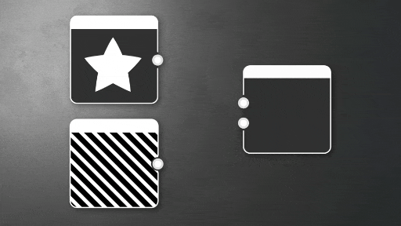

# 指向性ワープ

<table>
<tr style="border: 0;">
<td width="33.33%" style="border: 0;" valign="top">

{width="100%"}

</td>
<td style="border: 0;" valign="top">

強度マップに従ってピクセルを指定した方向に移動します。これにより、変形が発生する場合があります。

ユーザが設定した方向に入力をワープし、ユーザが設定した強度マップを掛けます。 これはワープと似ていますが、特定の方向に対してのみ機能します。

</td>
</tr>
</table>

ワープノードは、非常に単純ですが便利なノードで、他のより高度なエフェクトの良い基盤として機能します。 その他の関連するノードとして、[勾配ぼかし](../../../../compositing-graphs/nodes-reference-for-com/node-library/filters/blurs/slope-blur/slope-blur.md)および[ベクトルワープ](../../../../compositing-graphs/nodes-reference-for-com/node-library/filters/effects/vector-warp/vector-warp.md)など、より高度な代替手段があります。

## パラメーター

|  |  |
| --- | --- |
| <b>適用度</b> *浮動小数* | ワープの強さを設定します。 |
| <b>ワープ角度</b> *浮動小数* | ワープ効果の角度をターン数で設定します。 |
| <b>入力フィルターリングモード</b> *ブーリアン* | <b>入力</b>のサンプリングに最も近いフィルタリングを使用するか、バイリニアのデータを使用するかを制御します。 |
| <b>強度マップのオフセット</b> *浮動小数* | この値は、<b>強度入力</b>画像の値から差し引かれます。 |

## 入力コネクター

|  |  |
| --- | --- |
| <b>入力</b> *グレースケール/カラー*&#x200B;プライマリ | ワープ効果を適用するグレースケールまたはカラー入力画像です。 |
| <b>強度入力</b> *グレースケール* | <b>入力</b>画像に適用する必要のあるワープの量を定義するグレースケールイメージです。 |

## 例

<table>
<tr style="border: 0;">
<td style="border: 0;" valign="top">

{zoomable="yes"}

</td>
<td style="border: 0;" valign="top">

{zoomable="yes"}

</td>
<td style="border: 0;" valign="top">

{zoomable="yes"}

</td>
</tr>
</table>
