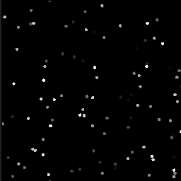

# 距離

<table>
<tr style="border: 0;">
<td width="33.33%" style="border: 0;" valign="top">

{width="200px"}

</td>
<td width="100.00%" style="border: 0;" valign="top">

マスク内の最も近い白ピクセルの位置を求め、その位置からグラデーションを出力するか、ソース画像内のその位置のカラーを出力します。

この節点は、0.5のグレースケール値を超える入力の最大の任意のピクセルから外向きの線形フェード（グラデーション）を作成します。

</td>
</tr>
</table>

外側に広がるフェードは、別のセルに出会うと同時に終了し、決して重なることはありません。 内部的には、距離ノードをクランプ/最大値に設定して、最も近いピクセル> 0.5までの距離を計算して表示します。

オプションのソースマップを使用すると、セルを二次入力マップのテクスチャと結合できます。

ディスタンスノードはマスターするのが簡単なノードではありませんが、主な使用例は、既存のマスクを確実に拡張し（ぼかしやコントラストを調整する場合と比較して）、ボロノイ型のノイズセルを生成し、シャープな線形プロファイルで既存のシェイプをベベルすることです（これは後で再マッピングできます）。

詳細については、以下の[例](#examples)を参照してください。

<table>
<tr style="border: 0;">
<td width="100.00%" style="border: 0;" valign="top">

</td>
<td width="83.33%" style="border: 0;" valign="top">

</td>
<td width="100.00%" style="border: 0;" valign="top">

</td>
</tr>
</table>

<table>
<tr style="border: 0;">
<td style="border: 0;" valign="top">

## 出力コネクター

</td>
<td style="border: 0;" valign="top">

### 例

</td>
</tr>
</table>

## パラメーター

|  |  |
| --- | --- |
| <b>カラーモード</b> *ブーリアン* | グレースケールとカラー出力画像を切り替えます。 また、「ソース入力」入力タイプも変更されます。 |
| <b>最大距離</b> *浮動小数* | マスクの最も近い境界線を検出するための最大距離をピクセル単位で調整します。 |
| <b>ソース/距離の結合</b> *ブーリアン* | オプションの「ソース入力」を最終セルと組み合わせる方法を指定します。<ul data-preserve-html="true"> <li data-preserve-html="true"><i>結合：</i> &#39;ソース入力&#39;値をフェードする線形マスクと結合します。 「ソース入力」入力が接続されている場合、その値は計算された距離と結合されます。</li> <li data-preserve-html="true"><i>ソースのみ：</i> &#39;ソース入力&#39;からのみ単色になります。</li> </ul> |
| <b>距離モード</b> *整数* | 抽出されたマスクの最も近い境界までの距離を計算する方法を選択します。<ul data-preserve-html="true"> <li data-preserve-html="true"><i>ユークリッド：</i>X/Y差の平方和。</li> <li data-preserve-html="true"><i>マンハッタン：</i> X/Y差の絶対値の合計。</li> <li data-preserve-html="true"><i>Chebyshev:</i> X/Y差の絶対値の最大値です。</li> </ul>  

 |

## 入力コネクタ

|  |  |
| --- | --- |
| <b>マスク入力</b> *グレースケール*&#x200B;プライマリ | グレースケールマスクは、境界線の距離の値を計算する必要があります。   0.5のしきい値を使用して画像からバイナリマスクが抽出されます。この値を超えるすべての値は白で、下回るすべての値は黒です。 |
| <b>ソース入力</b> *カラー/グレースケール* | オプションのグレースケール画像。この画像から、「マスク入力」の最も近い境界にあるピクセル値をコピーします。 |

## 出力コネクタ

|  |  |
| --- | --- |
| <b>出力</b> *カラー/グレースケール* |  |

## 例

<table>
<tr style="border: 0;">
<td style="border: 0;" valign="top">

{width="250px"}

</td>
<td style="border: 0;" valign="top">

{width="250px"}

</td>
<td style="border: 0;" valign="top">

{width="250px"}

</td>
</tr>
</table>
