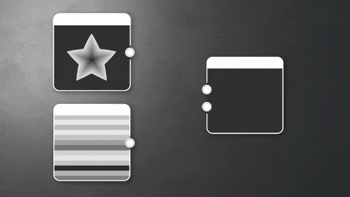

# グラデーション (ダイナミック)

<table>
<tr style="border: 0;">
<td style="border: 0; width:33.33%; vertical-align:top">

{width="100%"}

<b>In:</b>個のアトミックノード

</td>
<td style="border: 0;" valign="top">

別の画像のピクセルの行または列によって提供されたグラデーションを使用して、画像内のグレースケール値を再マップします。

これはグラデーションノードに代わるわずかな機能ですが、グラデーションノードとは異なり、グラデーションカラーキーは内部では定義されず、外部入力から取得されます。

</td>
</tr>
</table>

<table>
<tr style="border: 0">
<td style="border: 0; width: 15%"></td>
<td style="border: 0; text-align: center"></td>
<td style="border: 0; width: 15%"></td>
</tr>
</table>

これは主に、カラーのパラメータがノードの外部に移動するため、パラメータを公開できない問題を回避することができます。 これが「ダイナミック」な機能です。

Gradient (Dynamic)は単独で使用するのが難しいノードではありませんが、使用する方がやや高度です。ほとんどの標準の使用は、通常のGradientノードでカバーできます。

このノードは、グラデーションエディターのキーシステムによって制限しすぎて、カラーとランプの位置をグラフの他の入力、パラメーター、および部分によって制御したい場合に役立ちます。

また、グラデーション入力位置スライダーを使用して、単一のランプ入力内に保存された複数のグラデーションを交互に切り替えることもできます。

## パラメーター

|  |  |
| --- | --- |
| <b>グラデーションのアドレス指定</b> *ブール値* | グラデーションを繰り返す（タイル状にする）か、クランプするかを設定します。   このパラメーターは、グレースケール入力の[0, 1]の範囲のHDRピクセルのうち、[0, 1]までのクランプまたは折りたたみを処理する方法を指定します。 |
| <b>グラデーションの向き</b> *整数* | 「グラデーション入力」をサンプリングする軸を設定します。<ul data-preserve-html="true"> <li data-preserve-html="true"><i>水平方向：</i> X軸のピクセル列をサンプリングします。</li> <li data-preserve-html="true"><i>垂直方向：</i> Y軸のピクセル列をサンプリングします。</li> </ul> |
| <b>グラデーションの入力位置</b> *フロート* | 「グラデーション入力」でサンプリングされるピクセルの行または列の正規化された位置。 |

## 入力コネクタ

|  |  |
| --- | --- |
| <b>グレースケール入力</b> *グレースケール*&#x200B;プライマリ | 再マップするグレースケールイメージ。 |
| <b>グラデーション入力</b> *カラー/グレースケール* | グラデーションはこの画像からサンプリングされます |

## 例

*近日公開。*
