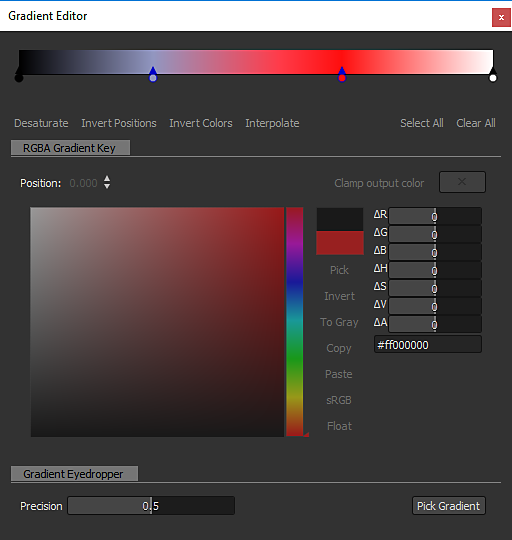

# グラデーションマップ

<table>
<tr style="border: 0;">
<td width="33.33%" style="border: 0;" valign="top">

{width="200px"}

</td>
<td width="100.00%" style="border: 0;" valign="top">

カスタムグラデーションを使用して、画像内のグレースケール値を再マップします。

このノードは二重の目的を果たします。単純に<b>として使用できます。 </b>グレースケールからカラーへの変換ノード、またはグレースケール入力をカスタムカラーランプにマッピングしてカラー化します。

</td>
</tr>
</table>

このノードは、複数のカラーを正確にマッピングするための、高度で機能豊富なグラデーションエディターを提供します。詳しくは、このページの[グラデーションエディター](#gradient-editor)セクションに移動してください。

<table>
<tr style="border: 0;">
<td width="100.00%" style="border: 0;" valign="top">

</td>
<td width="83.33%" style="border: 0;" valign="top">

</td>
<td width="100.00%" style="border: 0;" valign="top">

</td>
</tr>
</table>

## 例

## パラメーター

|  |  |
| --- | --- |
| <b>カラーモード</b> *ブール値* | 出力モードをカラーまたはグレースケールに設定します。 |
| <b>グラデーションの追加</b> *ブール値* | [0, 1]の範囲外の繰り返し（タイル）またはクランプ値にグラデーションを設定します。 |
| <b>グラデーション</b> *グラデーションキーの配列* | 入力グレースケール値のマップに使用するカスタムグラデーションランプ。   同じ場所で編集するか、[グラデーションエディター](#gradient-editor)を使用できます。 |

## グラデーションエディター

このウィンドウには、グラデーションマップノードがグレースケール値をカラーにマッピングするために使用する参照グラデーションを編集するためのコントロールが用意されています。

次の方法で、グラデーションマップノードの<b>プロパティ</b>から開くことができます。

* <b>グラデーションエディター</b>ボタンで「LMB」をクリックします。
* グラデーションバーのピンの「LMB」をダブルクリックします。 クリックしたピンは、グラデーションエディターで自動的に選択されるので、その値を直接編集できます。

### グラデーションピンの編集

グラデーションのカラーと位置は、グラデーションバーに配置されたピンで制御します。

各ピンは、グラデーション上の位置にカラーを設定します。

最初と最後のピンの前と後のグラデーションの部分は、それらのピンのカラーにそれぞれ設定されます。

ピンを編集するには、次のコントロールを使用できます。

<table>
<tr style="border: 0;">
<td style="border: 0;" valign="top">

<b>ピンの追加</b>

グラデーションバーのクリックした位置にピンを追加するには、グラデーションまたはその下の「LMB」をクリックします。

新しいピンは、その位置のグラデーションのカラーに設定されます。

</td>
<td style="border: 0;" valign="top">

</td>
</tr>
</table>

<table>
<tr style="border: 0;">
<td style="border: 0;" valign="top">

<b>ピンの移動</b>

LMBを押したまま、選択したピンをグラデーションバーに沿ってドラッグして移動します。

ピンを選択し、<b>位置</b>パラメーターを使用して、数値でピンの位置を設定することもできます。 位置は[0;1]の範囲の値です。0はグラデーションの開始で、1は終了です。

</td>
<td style="border: 0;" valign="top">

</td>
</tr>
</table>

複数のピンを選択した場合は、すべてのピンを&#x200B;*同時に*&#x200B;移動できます。 移動したときに1つ以上のピンがグラデーションに到達して終了すると、移動に使用したマウスボタンに応じて、次の2つのビヘイビアーが使用できます。

* <b>LMB:</b>ピンは最後に残ります。つまり、ピンが到達すると、その位置にスタックされ、相対的な位置が変更されます。
* <b>MMB:</b>ピンがグラデーションのもう一方の端までループし、相対位置が変わりません。

<table>
<tr style="border: 0;">
<td style="border: 0;" valign="top">

<b>ピンの削除</b>

ピンを選択してDeleteキーを押すか、グラデーションバーからピンをドラッグして削除します。

</td>
<td style="border: 0;" valign="top">

</td>
</tr>
</table>

<table>
<tr style="border: 0;">
<td style="border: 0;" valign="top">

<b>位置の反転</b>

選択したピンの位置をグラデーションで反転させます。

</td>
<td style="border: 0;" valign="top">

</td>
</tr>
</table>

<table>
<tr style="border: 0;">
<td style="border: 0;" valign="top">

<b>すべてクリア</b>

グラデーションバーからすべてのピンを削除します。

</td>
<td style="border: 0;" valign="top">

</td>
</tr>
</table>

<b>色の反転</b>

このボタンをクリックすると、選択したピンの色が負の色に切り替わります。

<b>彩度を下げる</b>

このボタンをクリックすると、選択したピンに設定されているカラーの彩度が下がります。

### 補間モード

ピンを設定した後は、使用可能な補間モードを使用して、あるピンから次のピンに色をどのようにトランジションするかを制御できます。

+++線形
デフォルトの補間モード：各ピンの間に単純な線形補間を適用して、グラデーションを均一に進行させます。

+++

+++フラット正接
グラデーション間のトランジションをベジェ曲線（ピンが曲線のポイントになる）と見なすとき、このモードを使用すると、これらのポイントに水平方向の接線が設定されます。

その結果、スムースステップ補間を想起させるトランジションが作成されます。

このモードを選択すると、<b>中点</b>パラメーターが有効になり、ポイント間の曲線の垂直中点の水平位置をオフセットできます。 これにより、「out」接線と「in」接線の間のスケールが効果的にヒントになります。

+++

+++スムーズ
各点間の補間曲線にスムージングを適用します。

このモードを選択すると、<b>Smoothness</b>パラメーターが有効になり、値0が<b>リニア</b>補間モードと等しい、スムージングの強さを調整できます。

+++

+++補間なし
カラーはピンの位置でのみ変化し、グラデーションバーに沿って次のピンが表示されるまで一定です。

これにより、カラー間のハードステップが発生し、ピンで設定されたカラーのみがグラデーションに存在することになります。

+++

### カラーピッカー

カラーピッカーを使用すると、いくつかの方法でカラーを設定できます。

* <b>グラデーションと色相バー</b>

  <table>
  <tr style="border: 0;">
  <td style="border: 0;" valign="top">

  グラデーションのギズモと色相バーのノッチの位置を微調整してカラーを設定します。

  </td>
  <td style="border: 0;" valign="top">

  

  </td>
  </tr>
  </table>

* <b>RGB、HSV、Alphaのスライダー</b>

  <table>
  <tr style="border: 0;">
  <td width="100.00%" style="border: 0;" valign="top">

  RGB、HSV、Alphaの各スライダーを使用すると、スライダーを微調整したり、数値を直接設定したりして、カラーを正確に設定できます。

  または、スライダーの下にある専用入力フィールドのhexcodeを使用します。

  </td>
  <td width="33.33%" style="border: 0;" valign="top">

  

  </td>
  </tr>
  </table>

* <b>画面で選択</b>

  <table>
  <tr style="border: 0;">
  <td style="border: 0;" valign="top">

  <b>選択</b>ボタンを使用し、画面内の任意の場所をクリックして、その場所で色をサンプリングします。

  </td>
  <td style="border: 0;" valign="top">

  

  </td>
  </tr>
  </table>

<table>
<tr style="border: 0;">
<td width="100.00%" style="border: 0;" valign="top">

選択したカラーがカラーサムネールの上半分にプレビューされます。\
下半分は以前使用したカラーを表示します。 「LMB」をダブルクリックして、微調整したカラーを元に戻します。

</td>
<td width="16.67%" style="border: 0;" valign="top">

</td>
</tr>
</table>

複数のピンを選択すると、RGB、HSV、Alphaの各スライダーがデルタ(Δ)スライダーに変わります。つまり、各ピンの値を同じ量だけオフセットするために使用されます。

<table>
<tr style="border: 0;">
<td width="100.00%" style="border: 0;" valign="top">

また、カラーサムネールの下には次の機能がボタンとして表示されます。

<b>反転：</b>色を負の値に切り替えます。

<b>グレー：</b>色の彩度を下げます。

<b>コピー&#x200B;</b>*:*&#x200B;現在選択されている色をクリップボードにコピーします。

<b>貼り付け：</b>現在クリップボードにある色に切り替えます。

<b>sRGB</b>: sRGBカラースペースを使用して色を表示します。 無効にすると、リニアカラースペースが使用されます。

<b>浮動小数点：</b>RGB、HSV、およびAlphaのスライダー値を浮動小数点で表示します。

</td>
<td width="25.00%" style="border: 0;" valign="top">

</td>
</tr>
</table>

### グラデーションスポイト

グラデーションスポイトツールは、このノードが提供する最も便利な機能の1つです。参照画像に線を描画するだけで複雑なグラデーションを作成できます。

<b>精度</b>スライダーを使用すると、キーの数を増やしたり減らしたりして、新しく作成したグラデーションを調整できます。値が小さいほど、選択した値に一致するグラデーションの精度が高くなります。

## 入力コネクタ

|  |  |
| --- | --- |
| <b>入力</b> *グレースケール*&#x200B;プライマリ | 処理するグレースケール画像を指定します。 |

## 出力コネクタ

|  |  |
| --- | --- |
| <b>出力</b> *グレースケール* |  |

## 例

*近日公開。*
