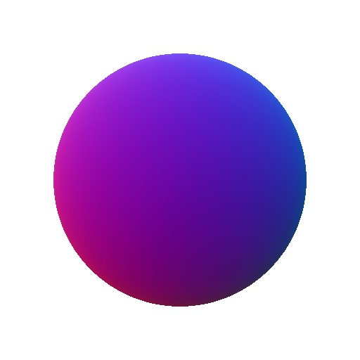

# パノラマ3D位置

<table>
<tr style="border: 0;">
<td width="33.33%" style="border: 0;" valign="top">

{width="200px"}

<b>内：</b> 3D ビュー > HDRI ツール

</td>
<td width="100.00%" style="border: 0;" valign="top">

## 説明

空間的に投影されたパノラマイメージのワールドスペース位置マップをレンダリングするヘルパーノード。 を使用すると、独自の球面変換およびルックアップを実行できます。

</td>
</tr>
</table>

## パラメーター

|  |  |
|:---|:---|
| <b>上向きベクター</b> <i>Z上、Y上</i> |  |

## 例

<table style="margin-top: 32px; margin-bottom: 32px">
    <tr style="border: 0">
        <td style="border: 0; background: transparent">
            
        </td>
    </tr>
</table>
