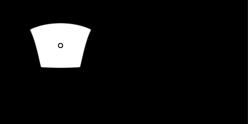

# 平面ライト

<table>
<tr style="border: 0;">
<td style="border: 0;" valign="top">

{width="200px"}

## 平面ライト

**イン：** *3D ビュー/HDRI ツール*

**複合**

</td>
<td style="border: 0;" valign="top">

## 説明

球面投影された平面形状を生成します。 入力パラメーターを使用して、平面を3Dで配置および方向付けできます。

単純な[シェイプライト](../../../../../../compositing-graphs/nodes-reference-for-com/node-library/3d-view-library/hdri-tools/shape-light/shape-light.md)とは異なり、単純な投影の外側により高度な配置オプションがあり、[ラインライト](../../../../../../compositing-graphs/nodes-reference-for-com/node-library/3d-view-library/hdri-tools/line-light/line-light.md)と同様により多くのパターンやマスクを適用できます。

## 入力

* **背景画像の入力**: *色入力*\
  生成されたライトを構成するオプションの背景。
* **シェイプ画像の入力**: *カラー入力*\
  ラインライトにマッピングするオプションの画像。 シェイプのカラーモードが画像入力に設定されている場合にのみ使用されます。
* **パターン画像の入力**: *グレースケール入力*\
  カスタムパターン画像。「Pattern」パラメーターが「Image Input」に設定されている場合に使用されます。

## パラメーター

* **ポジションモード**: *地面/天井、原点、ワールドポジション*\
  3つの異なる配置モードから選択します。 地面/天井と原点は、2D ビューの操作をサポートします。ワールド位置は、プロパティを介してのみ変更できますが、より正確な配置をサポートします。
* **地面のグリッドを表示**: *False/True*\
  デバッグのグランドグリッドを描画できるようにするヘルパー関数。 スペース内の行の位置の推定に役立ちます。
* **位置の座標**
  * **上向きベクター**: *Z上向き、Y上向き*\
    ワールド位置モードでのみ、座標系の方向を決定します。
  * **平面UVの位置**:\
    地面/天井と原点のみ。 UV空間でのプレーンの位置を設定します。
  * **平面のワールド位置**: *-2.0 - 2.0*\
    ワールド位置モードの場合のみ。 平面の位置ワールド空間を設定します。 2Dビューのインタラクションはサポートされていません。
  * **平面の絶対Height**: *0.0 ～ 1.0*\
    Ground/Ceiling Position Modeでのみ、天井からの絶対Heightを設定します。 [グリッドを表示]を使用して、位置をより正確に推定します。
  * **原点**: *0.0 ～ 1.0*\
    原点ポジションモードの場合のみ 両方のポイントのパノラマ中心からの距離を設定します。
* **図形のカラーモード**: *RGB、色温度（ケルビン）、画像入力*\
  シェイプカラーの設定に使用する方法を選択します。 イメージ入力により、2番目の入力スロットが使用可能になります。
* **色**: *（色値）*\
  シェイプカラーモードを「RGB」に設定した場合のみ シェイプのカラーを選択します。
* **温度**: *800.0 - 20000.0*\
  Shape Color ModeがTemperatureに設定されている場合のみ シェイプのカラーのケルビン値を設定します。
* **シェイプ画像のUVモード**: *伸縮、中央のみ伸縮、繰り返し+間隔*\
  シェイプのカラーモードを画像入力に設定した場合のみ。 イメージをラインシェイプに適用する方法を設定し、UVの繰り返し動作を決定します。
* **図形イメージの繰り返し間隔**: *0.0 ～ 1.0*\
  シェイプカラーモードを画像入力に設定し、UVモードを繰り返し+間隔に設定した場合のみ。 画像が線に沿って繰り返される際の間隔を設定します。
* **シェイプ画像のガンマ**: *sRGB、リニア*\
  シェイプのカラーモードを画像入力に設定した場合のみ。 シェイプ画像の入力を解釈する方法を指定します。
* **露光量(EV)**: *0.0 - 10.0*\
  生成されたシェイプの露光量値を設定します。背景画像の露光量値と理想的に一致させます。
* **平面スケール**: *0.0 ～ 1.0*\
  平面シェイプの均一スケールを設定します。
* **平面サイズ**: *0.0 ～ 1.0*\
  平面シェイプのサイズを不均等に設定します。
* **面の回転**: *0.0 ～ 1.0*\
  中心軸に沿って平面を回転します。
* **パターン**: *正方形、正方形（シャープ）、円錐、半球、画像入力*\
  使用するパターン形状を選択します。
* **パターン硬さ**: *0.0 - 1.0*\
  パターンの硬さ/コントラストを設定します。
* **パターンUVモード**: *伸縮、中央のみ伸縮*\
  シェイプ画像の上に適用される第2パターンマスクの使用方法を設定します。
* **グラウンドクリッピングを有効にする**: *False/True*\
  Planeがグリッドでクリップできるか、下に移動するときにまだ表示されている場合は、このオプションを有効にします。 [グリッドを表示]を使用して、これを適切に推定します。
* **地上Height**: *-2.0 - 0.0*\
  クリッピングのグランドHeightを調整します。
* **バックグラウンド入力を有効にする**: *False/True*\
  オプションの背景画像の使用を切り替え 生成されたライトを背景の上に合成します。
* **背景色**: *（色値）*\
  背景入力を使用しない場合は、単色の背景色を設定します。
* **バックグラウンドガンマ**: *sRGB、リニア*&#x200B;バックグラウンド入力を使用する場合は、バックグラウンド入力の解釈方法を設定します。

## サンプル画像

</td>
</tr>
</table>
