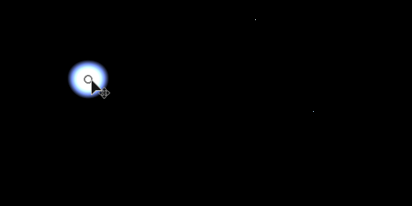
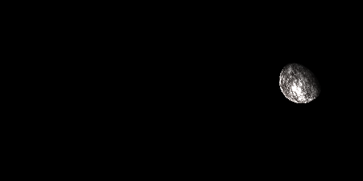

# 球体光

<table>
<tr style="border: 0;">
<td width="33.33%" style="border: 0;" valign="top">

{width="200px"}

<b>内：</b> 3D ビュー > HDRI ツール

</td>
<td width="100.00%" style="border: 0;" valign="top">

## 説明

球状に投影された球形シェイプを生成します。 球の変換は、変換ギズモによって行われます。

球体光は非常に汎用性が高く、単純な丸い光を生成するだけでなく、惑星やその他の天体を生成できるオプションがあります。 より高度なライティングや回転オプションが必要でない場合は、代わりに[シェイプライト](../../../../../../compositing-graphs/nodes-reference-for-com/node-library/3d-view-library/hdri-tools/shape-light/shape-light.md)を確認してください。

</td>
</tr>
</table>

## 入力

|  |  |
|:---|:---|
| <b>背景画像の入力</b> <i>カラー入力</i> | 生成されたライトを構成するオプションの背景。 |
| <b>シェイプ画像の入力</b> <i>カラー入力</i> | 球体ライトにマップするオプションのイメージ。 シェイプのカラーモードが画像入力に設定されている場合にのみ使用されます。 |

## パラメーター

|  |  |
|:---|:---|
| <b>位置モード</b> <i>原点、ワールドポジション</i> | 2つの配置モードから選択します。 原点は極座標に似ており、球はパノラマの中心を基準にして配置されます。ワールド座標は標準の3D座標と同じように機能します。 |
| <b>位置の座標</b> |  |
| <b>上向きベクター</b> <i>Z上、Y上</i> | ワールド位置モードでのみ、座標系の方向を決定します。 |
| <b>球のワールド位置</b> <i>-2.0 - 2.0</i> | ワールド位置モードでのみ、ワールド空間での球の位置を設定します。 |
| <b>位置</b> | 原点モードの場合のみ。 中心を基準にして位置を設定します。 2D ビューで操作できます。 |
| <b>原点</b> <i>0.0 - 20.0</i> | 原点モードの場合のみ。 距離を原点に設定し、球の表示サイズに影響します。 |
| <b>図形のカラーモード</b> <i>RGB、色温度（ケルビン）、画像入力</i> | シェイプカラーの設定に使用する方法を選択します。 イメージ入力により、2番目の入力スロットが使用可能になります。 |
| <b>色</b> <i>（カラー値）</i> | シェイプカラーモードを「RGB」に設定した場合のみ シェイプのカラーを選択します。 |
| <b>図形の色温度</b> <i>800.0 - 20000.0</i> | Shape Color ModeがTemperatureに設定されている場合のみ シェイプのカラーのケルビン値を設定します。 |
| <b>球体画像入力ガンマ</b> <i>sRGB、リニア</i> | シェイプのカラーモードを画像入力に設定した場合のみ。 シェイプ画像の入力を解釈する方法を指定します。 |
| <b>球の回転</b> <i>0.0 - 1.0</i> | シェイプのカラーモードを画像入力に設定した場合のみ。 球を中心に回転させて、マップされたイメージの方向を設定します。 |
| <b>露光量(EV)</b> <i>0.0 - 10.0</i> | 生成されたシェイプの露光量値を設定します。背景画像の露光量値と理想的に一致させます。 |
| <b>球の半径</b> <i>0.0 - 1.0</i> | 球の半径/サイズを設定します。 |
| <b>球硬さ</b> <i>0.0 - 1.0</i> | 球の硬さ/減衰を設定します。 |
| <b>シェーディング</b> <i>なし、周辺光量補正、シェーディング</i> | 球にシェーディングを適用する場合に設定します。 球体を照明のない固体オブジェクトとして表示しません。 周辺減光とは、周縁部がわずかに暗くなることを意味します。シェーディング光は、オプションのシェーディング光によって球体が照らされることを意味します。 |
| <b>シェーディング照明のワールド位置</b> <i>-1.0 - 1.0</i> | シェーディングがシェーディング光に設定されている場合、球体に対する光の位置はここで制御されます。 |
| <b>Penombra透明度</b> <i>0.0 - 1.0</i> | シェーディングがシェーディング光に設定されている場合、シェーディングの減衰を制御します。 |
| <b>バックグラウンド入力を有効にする</b> <i>False/True</i> | オプションの背景画像の使用を切り替え 生成されたライトを背景の上に合成します。 |
| <b>背景色</b> <i>（カラー値）</i> | 背景入力を使用しない場合は、単色の背景色を設定します。 |
| <b>背景ガンマ</b> <i>sRGB、リニア</i> | バックグラウンド入力を使用する場合は、バックグラウンド入力の解釈方法を設定します。 |

## 例

<table style="margin-top: 32px; margin-bottom: 32px">
    <tr style="border: 0">
        <td style="border: 0; background: transparent">
            
        </td>
        <td style="border: 0; background: transparent">
            
        </td>
    </tr>
</table>
