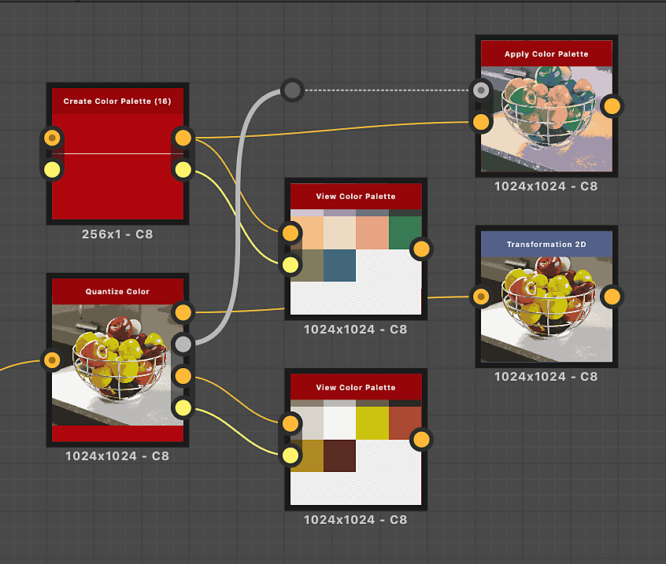
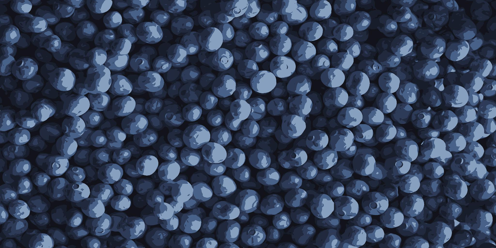

# カラーパレットを適用

<table>
<tr style="border: 0;">
<td width="33.33%" style="border: 0;" valign="top">

{width="200px"}

<b>イン:</b>フィルター/調整

</td>
<td width="100.00%" style="border: 0;" valign="top">

## 説明

ID マップを使用して、順序付けされたパレットのカラーを画像に適用します。

パレット内のインデックスをID マップ内のカラーのインデックスと一致させることで、カラーが配分されます。

例えば、パレットのカラー#2は、ID値が2のID マップ内のすべてのピクセルに適用されます。

このノードは、次のノードと組み合わせて使用できます： [色のクオンタイズ](../../../../../../compositing-graphs/nodes-reference-for-com/node-library/filters/adjustments/quantize-color/quantize-color.md)、[カラーパレットの作成](../../../../../../compositing-graphs/nodes-reference-for-com/node-library/filters/adjustments/create-color-palette-16/create-color-palette-16.md)、[カラーパレットの変更](../../../../../../compositing-graphs/nodes-reference-for-com/node-library/filters/adjustments/modify-color-palette/modify-color-palette.md)、[カラーパレットの表示](../../../../../../compositing-graphs/nodes-reference-for-com/node-library/filters/adjustments/view-color-palette/view-color-palette.md)。

</td>
</tr>
</table>

## 入力

|  |  |
|:---|:---|
| <b>ID</b> <i>グレースケール</i>プライマリ | 入力パレットの色を配布するために使用する入力ID マップ。   ID マップとは、全体の一部（シェイプなど）であるピクセルがすべて同じ一意のID値を保持している画像です。 この場合、値は整数です。   [カラーのクオンタイズ](../../../../../../compositing-graphs/nodes-reference-for-com/node-library/filters/adjustments/quantize-color/quantize-color.md)ノードを使用してID マップを生成できます。 |
| <b>パレット</b> <i>色</i> | ピクセルの行としてエンコードされたRGBカラーの順序付けされたリスト。 パレットには、最大256色を保持できます。 これは、ノードがID マップのインデックスにマップするパレットです。   パレットは、[色の量子化](../../../../../../compositing-graphs/nodes-reference-for-com/node-library/filters/adjustments/quantize-color/quantize-color.md)ノードで生成し、[色のパレットを変更](../../../../../../compositing-graphs/nodes-reference-for-com/node-library/filters/adjustments/modify-color-palette/modify-color-palette.md)ノードで変更できます。 |

## 出力

|  |  |
|:---|:---|
| <b>出力</b> <i>色</i> | パレットの色をID マップのインデックスにマッピングした結果。 |

## 例

{zoomable="yes"}

<table>
  <tr>
    <td>
      
       <i>前</i>
    </td>
    <td>
      
       <i>後</i>
    </td>
  </tr>
</table>

{zoomable="yes"}

<table>
  <tr>
    <td>
      
       <i>前</i>
    </td>
    <td>
      
       <i>後</i>
    </td>
  </tr>
</table>
