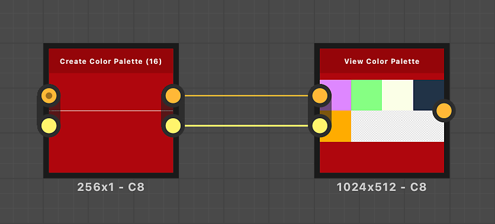
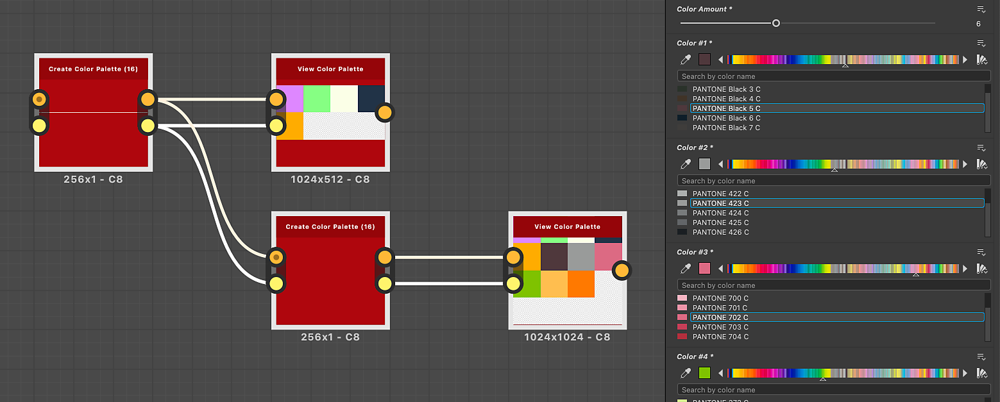

# カラーパレットを作成(16)

<table>
<tr style="border: 0;">
<td width="33.33%" style="border: 0;" valign="top">

{width="200px"}

<b>イン:</b>フィルター/調整

</td>
<td width="100.00%" style="border: 0;" valign="top">

## 説明

カラーの順序付けされたリストを作成し、最大16色でパレットとして出力します。

ノードは、「パレット」入力のセットを使用して、既存のパレットに新しい色を追加できます。

このノードは、次のノードと組み合わせて使用できます： [色のクオンタイズ](../../../../../../compositing-graphs/nodes-reference-for-com/node-library/filters/adjustments/quantize-color/quantize-color.md)、[カラーパレットの適用](../../../../../../compositing-graphs/nodes-reference-for-com/node-library/filters/adjustments/apply-color-palette/apply-color-palette.md)、[カラーパレットの変更](../../../../../../compositing-graphs/nodes-reference-for-com/node-library/filters/adjustments/modify-color-palette/modify-color-palette.md)、[カラーパレットの表示](../../../../../../compositing-graphs/nodes-reference-for-com/node-library/filters/adjustments/view-color-palette/view-color-palette.md)。

</td>
</tr>
</table>

<table>
<tr style="border: 0;">
<td style="border: 0;" valign="top">

</td>
<td style="border: 0;" valign="top">

### 出力コネクタ

</td>
<td style="border: 0;" valign="top">

### パラメーター

</td>
</tr>
</table>

## 入力コネクタ

|  |  |
| --- | --- |
| <b>パレット</b> *色*&#x200B;プライマリ | ピクセルの行としてエンコードされたRGBカラーの順序付けされたリスト。 パレットには、最大256色を保持できます。   この入力はオプションです。 使用する場合は、ノードによって設定された色がこのパレットに追加されます。   パレットは、[[カラーパレットの表示]](../../../../../../compositing-graphs/nodes-reference-for-com/node-library/filters/adjustments/view-color-palette/view-color-palette.md)ノードで表示できます。 |
| <b>パレットの色の適用量</b> *整数* | パレットに格納される色の量。   この数が「パレット」画像入力の実際のカラー数と一致しない場合は、ビジュアライゼーションが不完全であるか、絶対に必要な数よりも多くの空きスロットがある可能性があります。 |

## 出力コネクタ

|  |  |
| --- | --- |
| <b>パレット</b> *色* | 指定した色が追加された、更新されたパレット。 |
| <b>パレットの色の適用量</b> *整数* | パレットに保存されているカラーの更新量。指定した量のカラーがパレットに追加されます。 |

## パラメーター

|  |  |
| --- | --- |
| <b>カラー適用量</b> *整数* | パレットに追加するカラーの量。 |
| <b>色#</b> *浮動小数点3* *&#39;カラーの値&#39;として使用可能なパラメーターの数* | パレットに追加する色。   カラーは、この番号付きリストと同じ順序でパレットに追加されます。 |

## 例

<table>
<tr style="border: 0;">
<td style="border: 0;" valign="top">

{zoomable="yes"}

</td>
<td style="border: 0;" valign="top">

{zoomable="yes"}

</td>
</tr>
</table>

{zoomable="yes"}
