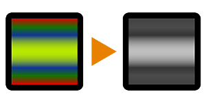

# グレースケール変換（詳細設定）

<table>
<tr style="border: 0;">
<td style="border: 0;" valign="top">

{width="128px"}

## グレースケール変換（詳細設定）

**イン：** *フィルター/調整*

**単純**

</td>
<td style="border: 0;" valign="top">

## 説明

いくつかのプリセットの変換モードを提供する、高度で迅速なグレースケール変換ノード。

## パラメーター

* **グレースケールの種類**: *彩度を下げる、輝度を下げる、平均を上げる、最大を上げる、*&#x200B;彩度を下げる、彩度の値を0にする、輝度は公式の輝度の重みを使う、平均はアトミックノードと同じ、最大と最小は各チャンネルの最も明るい値を使う、といったことができます。

## サンプル画像

| 

 |
| --- |
|  |

</td>
</tr>
</table>
