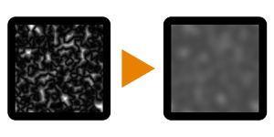

# 高さマップ周波数マッパー

<table>
<tr style="border: 0;">
<td style="border: 0;" valign="top">

{width="128px"}

## 高さマップ周波数マッパー

**イン：** *フィルター/調整*

**単純**

</td>
<td style="border: 0;" valign="top">

## 説明

ハイトマップの周波数を2つの個別のマップ（大きなスケールの違いのあるマップと小さなスケールの違いのあるマップ）に分割します。

## パラメーター

* **リリーフ**: *0.0 ～ 32.0*&#x200B;ディスプレイスメント出力の詳細サイズを制御します。

## サンプル画像

| 

 |
| --- |
|  |

</td>
</tr>
</table>
