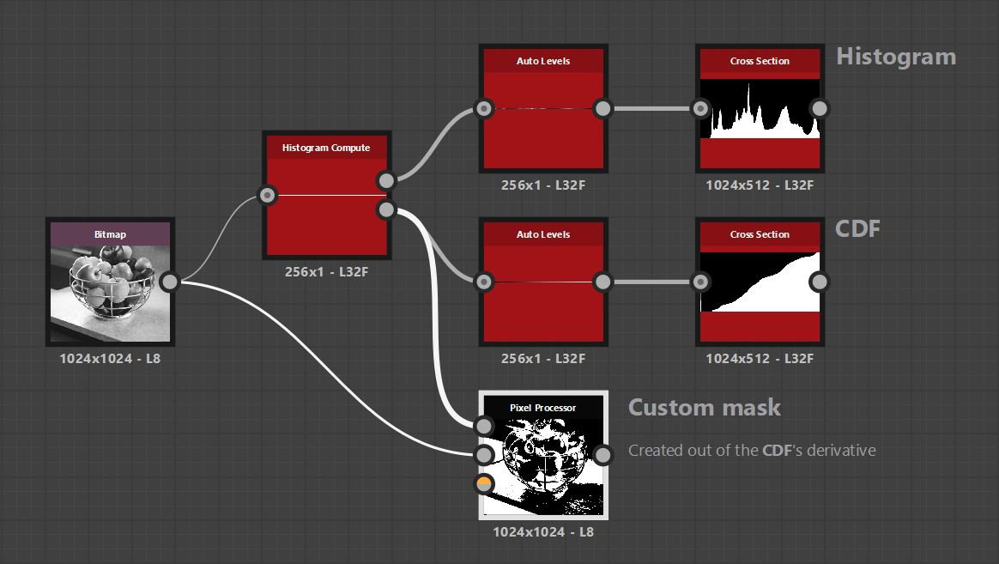

# ヒストグラム計算

<table>
<tr style="border: 0;">
<td width="33.33%" style="border: 0;" valign="top">

{width="200px"}

<b>イン:</b>フィルター/調整

</td>
<td width="100.00%" style="border: 0;" valign="top">

## 説明

グレースケール画像のヒストグラムを計算します。

ヒストグラムは、画像内のピクセルの行としてエンコードされます。各ピクセル値は、X軸上のピクセル位置に対応するカラー値の&#x200B;*母集団*&#x200B;です。\
例えば、(0.25, 0)のピクセル値が75の場合は、画像に0.25のカラー値を持つ75個のピクセルが存在することを意味します。

</td>
</tr>
</table>

ノードは、画像に対して計算された&#x200B;*累積分布関数* (CDF)も出力します。

カスタムツールは、次の「例」セクションに示すように、カスタムマスクなどのノードによって計算されたデータを使用して作成できます。

>[!IMPORTANT]
>
> [0,1]範囲外の値はすべてクランプされるので、ヒストグラムはHDR画像に対して正確でない場合があります。

<table>
<tr style="border: 0;">
<td style="border: 0;" valign="top">

</td>
<td style="border: 0;" valign="top">

### 出力コネクタ

</td>
<td style="border: 0;" valign="top">

### パラメーター

</td>
</tr>
</table>

## 入力コネクタ

|  |  |
| --- | --- |
| <b>入力</b> *グレースケール*&#x200B;プライマリ | ヒストグラムの計算対象となる画像。 |

## 出力コネクタ

|  |  |
| --- | --- |
| <b>ヒストグラム</b> *グレースケール* | 入力画像について計算されたヒストグラムで、ピクセルの行としてエンコードされます。各ピクセル値は、X軸上のピクセル位置に対応するカラー値の&#x200B;*母集団*&#x200B;です。   例えば、(0.25, 0)のピクセル値が75の場合は、画像に0.25のカラー値を持つ75個のピクセルが存在することを意味します。 |
| <b>CDF</b> *グレースケール* | 画像に対して計算された&#x200B;*累積分布関数* (CDF)の結果。各ピクセルが左側のすべてのピクセル値の合計であるピクセルの行にエンコードされます。   その合計は、画像内の総ピクセル数に対して&#x200B;*正規化*&#x200B;されます。 |

## パラメーター

|  |  |
| --- | --- |
| <b>ヒストグラムの解像度</b> *整数* | ヒストグラムの幅。 値を大きくすると、より細かい値の分布が可能になります。   使用可能な解像度は、ピクセル単位で256、512、1024、2048、4096です |

## 例

{zoomable="yes"}

<table>
  <tr>
    <td>
      
       <i>前</i>
    </td>
    <td>
      
       <i>後</i>
    </td>
  </tr>
</table>
