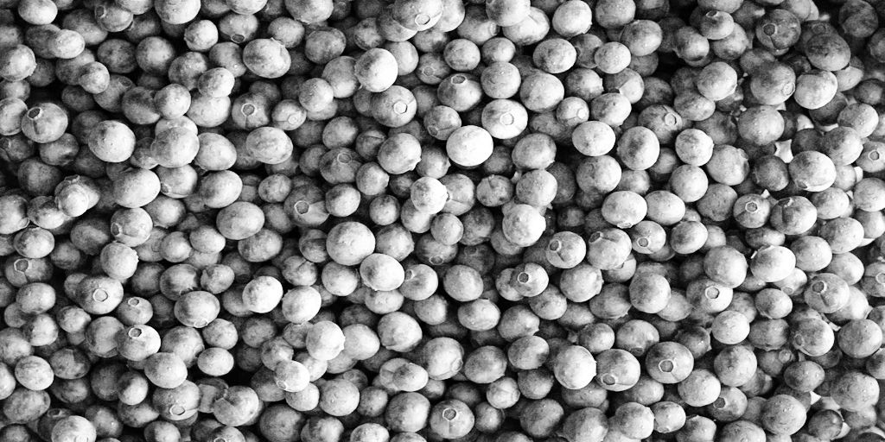
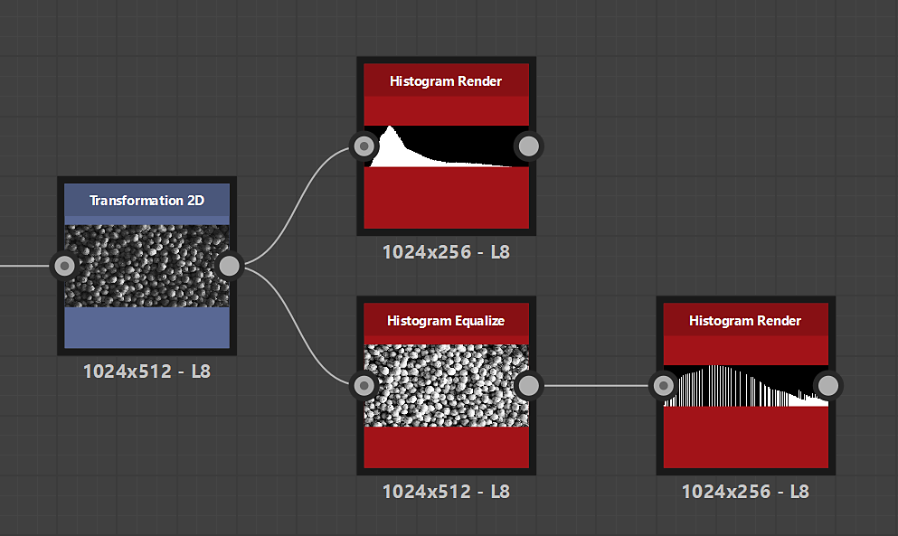

# ヒストグラムイコライザー

<table>
<tr style="border: 0;">
<td width="33.33%" style="border: 0;" valign="top">

{width="200px"}

<b>イン:</b>フィルター/調整

</td>
<td width="100.00%" style="border: 0;" valign="top">

## 説明

グレースケールイメージのヒストグラムを平均化し、均一な分布を目指してグレースケール値を効率的に調整します。

</td>
</tr>
</table>

<table>
<tr style="border: 0;">
<td style="border: 0;" valign="top">

</td>
<td style="border: 0;" valign="top">

### 出力コネクター

</td>
<td style="border: 0;" valign="top">

### パラメーター

</td>
</tr>
</table>

## 入力コネクター

|  |  |
| --- | --- |
| <b>入力</b> *グレースケール*&#x200B;プライマリ | ヒストグラムを平均化する画像。 |

## 出力コネクター

|  |  |
| --- | --- |
| <b>出力</b> *グレースケール* | ヒストグラムのイコライゼーションが適用された結果画像。 |

## パラメーター

|  |  |
| --- | --- |
| <b>ヒストグラムの解像度</b> *整数* | ヒストグラムの幅。 値を大きくすると、より細かい値の分布が可能になります。   使用可能な解像度は、ピクセル単位で256、512、1024、2048、4096です |
| <b>ヒストグラムのスムージング</b> *浮動小数* | ヒストグラムは、画像内のグレースケール値を再配分して、各値の間の&#x200B;*差*&#x200B;を均等にすることでスムージングできます。   このパラメーターは、スムージングの強度を調整します。 |

## 例

<table>
  <tr>
    <td>
      
       <i>前</i>
    </td>
    <td>
      
       <i>後</i>
    </td>
  </tr>
</table>

{zoomable="yes"}

<table>
  <tr>
    <td>
      
       <i>前</i>
    </td>
    <td>
      
       <i>後</i>
    </td>
  </tr>
</table>

{zoomable="yes"}

<table>
  <tr>
    <td>
      
       <i>前</i>
    </td>
    <td>
      
       <i>後</i>
    </td>
  </tr>
</table>

{zoomable="yes"}
