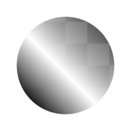
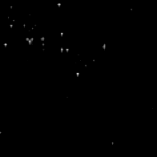

# ヒストグラムスキャン

<table>
<tr style="border: 0;">
<td style="border: 0;" valign="top">

{width="128px"}

## ヒストグラムスキャン

**イン：** *フィルター/調整*

**単純**

</td>
<td style="border: 0;" valign="top">

## 説明

入力グレースケール画像のコントラストと明るさを直感的に再マップできる、非常にシンプルでありながら便利なノードです。 ダイナミックな方法でマスクを「拡大」および「縮小」するために使用できます。

[Substanceアカデミーのヒストグラム処理に関するビデオを見るには、ここをクリックしてください。](https://www.youtube.com/watch?v=p9wcmJBFyGA&t=427s)

## パラメーター

* **位置**: *0.0 ～ 1.0*&#x200B;明るさコントロールと同様に、結果の中間点を移動します。 グラデーション入力で使用すると、トランジションポイントが拡大または縮小されます。\
  重要：デフォルト値の0は、最終結果が常に黒であることを意味します。0.5から始めてみてください。
* **コントラスト**: *0.0 ～ 1.0*\
  結果のコントラストを調整します。 トランジションの硬さの設定に使用できます。
* **位置を反転**: *False/True*&#x200B;最終結果を反転します。

## サンプル画像

</td>
</tr>
</table>
