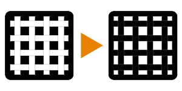

# 反転

<table>
<tr style="border: 0;">
<td width="33.33%" style="border: 0;" valign="top">

{width="128px"}

{width="128px"}

<b>イン:</b>フィルター/調整

</td>
<td width="100.00%" style="border: 0;" valign="top">

## 説明

入力カラーを反転します。

重要：入力に適したバージョンを使用してください。 カラー入力には「反転」、グレースケール入力には「グレースケール反転」を使用します。

</td>
</tr>
</table>

## パラメーター

|  |  |
|:---|:---|
| <b>反転</b> <i>False/True</i> | エフェクトのオン/オフを切り替えます。 |

## 例

<table style="margin-top: 32px; margin-bottom: 32px">
    <tr style="border: 0">
        <td style="border: 0; background: transparent">
            
        </td>
    </tr>
</table>
