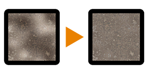

# 照明で低周波数をキャンセル

<table>
<tr style="border: 0;">
<td width="33.33%" style="border: 0;" valign="top">

{width="128px"}

<b>イン:</b>フィルター/調整

</td>
<td width="100.00%" style="border: 0;" valign="top">

## 説明

ハイパスと似ていますが、最終的な彩度を下げることはありません。

[輝度ハイパス](../../../../../../compositing-graphs/nodes-reference-for-com/node-library/filters/adjustments/luminance-highpass/luminance-highpass.md)を参照して、より高度なバージョンを確認してください。

</td>
</tr>
</table>

## パラメーター

|  |  |
|:---|:---|
| <b>キャンセルの半径</b> <i>0.0 - 64.0</i> | ハイパス効果の半径です。 |

## 例

<table style="margin-top: 32px; margin-bottom: 32px">
    <tr style="border: 0">
        <td style="border: 0; background: transparent">
            
        </td>
    </tr>
</table>
