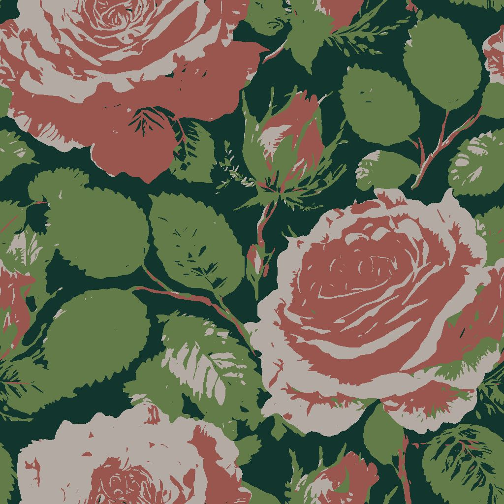
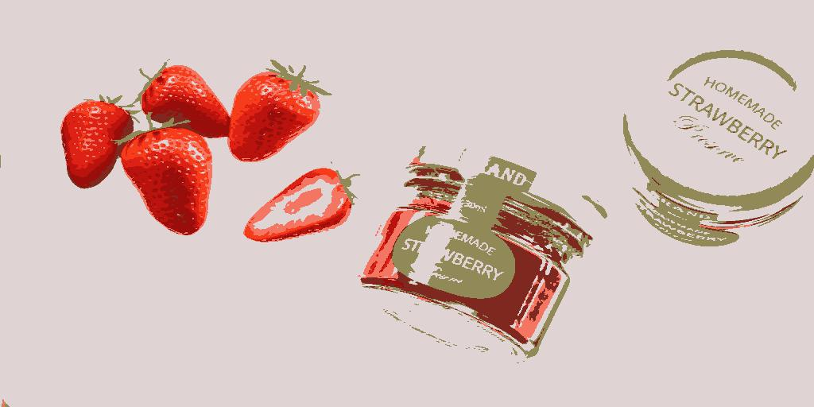
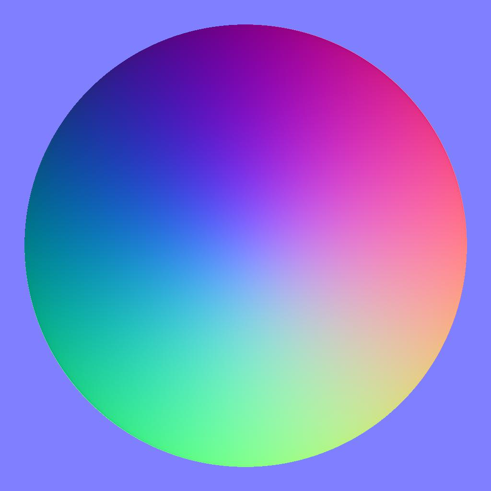

# カラーを量子化

<table>
<tr style="border: 0;">
<td width="33.33%" style="border: 0;" valign="top">

{width="200px"}

<b>イン:</b>フィルター/調整

</td>
<td width="100.00%" style="border: 0;" valign="top">

## 説明

カラー画像のカラー量を減らし、グラデーションを効果的に統合します。

処理されたイメージに加えて、ノードは以下も抽出します。

* 残りの色の<b>パレット</b>で、他の画像を色付けするために使用されます
* クオンタイズされた領域の<b>IDマップ</b>です。これは、処理された画像を別のパレットを使用して再配色するために使用される場合があります
* 残りの色の<b>amount</b>を未処理整数値として返します

</td>
</tr>
</table>

「アルファを無視」パラメーターが「偽」に設定されている場合、元の画像のアルファチャンネルを使用して、量子化プロセスのためにカラーを抽出する必要がある画像の領域が選択され、透明領域のカラーは無視されます。

これにより、抽出されるカラーをある程度制御できます。

このノードは、次のノードと組み合わせて使用できます： [カラーパレットの作成](../../../../../../compositing-graphs/nodes-reference-for-com/node-library/filters/adjustments/create-color-palette-16/create-color-palette-16.md)、[カラーパレットの適用](../../../../../../compositing-graphs/nodes-reference-for-com/node-library/filters/adjustments/apply-color-palette/apply-color-palette.md)、[カラーパレットの変更](../../../../../../compositing-graphs/nodes-reference-for-com/node-library/filters/adjustments/modify-color-palette/modify-color-palette.md)、[カラーパレットの表示](../../../../../../compositing-graphs/nodes-reference-for-com/node-library/filters/adjustments/view-color-palette/view-color-palette.md)。

## 入力

|  |  |
|:---|:---|
| <b>入力</b> <i>色</i>プライマリ | 量子化する必要があるカラー画像。 |

## 出力

|  |  |
|:---|:---|
| <b>出力</b> <i>色</i> | 量子化されたカラー画像。 |
| <b>ID</b> <i>グレースケール</i> | 量子化された各カラーに一意の整数識別子が割り当てられたマップ。   これは次の場合に使用できます。<ul data-preserve-html="true"> <li data-preserve-html="true"><b>IDが[IDの一部のクオンタイズ領域からマスク</b>をマスクに](../../../../../../compositing-graphs/nodes-reference-for-com/node-library/filters/adjustments/id-to-mask/id-to-mask.md)ノードから抽出します</li> <li data-preserve-html="true">[カラーパレットを適用](../../../../../../compositing-graphs/nodes-reference-for-com/node-library/filters/adjustments/apply-color-palette/apply-color-palette.md)または[カラーパレットを変更](../../../../../../compositing-graphs/nodes-reference-for-com/node-library/filters/adjustments/modify-color-palette/modify-color-palette.md)ノードを使用して、量子化された画像を<b>再配色</b>します</li> </ul> |
| <b>パレット</b> <i>色</i> | 画像から抽出されたパレットで、量子化後の残りの色を保持します。   画像は、ピクセルの行としてエンコードされたRGBカラーの順序付きリストで、最大256色を保持できます。   パレットは、[[カラーパレットの表示]](../../../../../../compositing-graphs/nodes-reference-for-com/node-library/filters/adjustments/view-color-palette/view-color-palette.md)ノードで表示できます。 |
| <b>パレットの色の適用量</b> <i>整数</i> | パレットに格納される色の量。 |

## パラメーター

|  |  |
|:---|:---|
| <b>最大 カラー適用量</b> *整数* | 量子化したイメージで使用するカラーの最大量。   この量は、イメージから抽出されたパレットで使用される量と同じです。  「最大」とは、量子化手法が使用されているために、この量を満たすことができないことを意味します。 実際に抽出されるカラーの量については、「パレットのカラーの量」出力を確認してください。 |
| <b>等高線のスムージング</b> *フロート* | 入力画像に適用される滑らかさの効果の半径を制御します。この効果は、量子化されたイメージをより立体的でまとまりのある形状に単純化するために使用されます。   メモ：このスムージングには集中的な計算が必要なので、この値を大きくするとノードの計算時間が大幅に増加します。 |
| <b>ディザリング</b> *フロート* | 元の画像のグラデーションとカラーブレンドを再現するためにディザリングパターンを適用します。量子化後に残ったカラーだけを使用します。   予想されるディザリング効果を生成するには、「等高線のスムージング」の値を0に設定してください。 |
| <b>ディザリングパターン</b> *整数* | 元の画像のグラデーションとカラーブレンドを再作成するために使用されるディザリングパターンです。<ul data-preserve-html="true"> <li data-preserve-html="true">ブルーノイズ</li> <li data-preserve-html="true">ベイヤー</li> </ul> |
| <b>アルファを無視</b> *ブール値* | 初期設定では、元の画像のアルファチャンネルを使用して、量子化プロセスでカラーを抽出する画像の領域が選択されます。透明領域のカラーは無視されます。 これにより、抽出されるカラーをある程度制御できます。   実際、画像の表示されている部分のカラーだけを量子化プロセスに使用することもできます。   この切り替えを使用すると、このマスクを無効にし、透明度に関係なく&#x200B;*フル*&#x200B;の画像を使用できます。 |
| <b>距離のカラースペース</b> *整数* | 色は、*立方体*&#x200B;に配置され、幅、Height、および深度は、色の各構成要素が0から1に増加するグラデーションです(例： 赤、緑、青(RGB)。   量子化プロセスでは、画像内の&#x200B;*定義する色*&#x200B;を選択し、立方体で最も近い色を見つけて、定義する色に置き換えます。   このパラメーターを使用すると、立方体のカラーの分布に使用するカラースペースを選択できます。これにより、定義するカラーの検出と隣接するカラーの並べ替えの条件を変更することで、量子化の結果が変更されます。   ユースケースに適したカラースペースを選択できます。<ul data-preserve-html="true"> <li data-preserve-html="true"><b>Lab (Color):</b>標準化された知覚的カラースペースです。「感じる」近くの色が実際には立方体で近くなるように色を分配します。 これは、ディスプレイで表示される画像に適しています</li> <li data-preserve-html="true"><b>RGB（データ）:</b>色は赤、緑、青に分割され、人間の知覚を無視してそれらの軸に沿ってまっすぐに分布しています。 これは、法線マップなどの未加工データを保持するイメージに適しています</li> </ul> |
| <b>ID並べ替えモード</b> *整数* | 色は、*立方体*&#x200B;に配置され、幅、Height、深度は、色の各要素が0から1に増加するグラデーションです(例： 赤、緑、青(RGB)。   このパラメータは、抽出されたパレットの色のリストと、抽出されたIDマップの領域のインデックスの順序を決定するために使用する方法を選択します。<ul data-preserve-html="true"> <li data-preserve-html="true"><b>Zカーブ:</b>色は、カラーキューブ内の次に見つかった色によって、Zカーブを使用して白から黒に並べ替えられます</li> <li data-preserve-html="true"><b>色相：</b>色は最も近い色相で並べ替えられます</li> <li data-preserve-html="true"><b>表現性：</b>色は、量子化された画像で使用されている色の多いものから最も低いものへと並べ替えられます</li> </ul> |
| <b>フィルターをダウンスケール</b> *整数* | カラー量子化プロセスは、カラーを重要度別に分類するために、縮小（すなわち縮小）されたサイズの画像のヒストグラムを計算することを含む。 このパラメーターは、ヒストグラムを計算する前に、縮小された画像をフィルタリングする方法を制御します。<ul data-preserve-html="true"> <li data-preserve-html="true"><b>バイリニア:</b>画像にバイリニアフィルタリングを適用します。補間された色を含むヒストグラムが生成されますが、これは元の画像には含まれない場合があり、元の色の一部が薄くなります。 これにより、多くのカラーを使用する画像で役立ちます。</li> <li data-preserve-html="true"><b>Nearest:</b>は、フィルタリングのない最も近いピクセルのカラーをサンプリングし、元の画像のカラーだけを使用したヒストグラムを作成します。 このオプションは、色数の少ない画像に適しています。</li> </ul> |

## 例

<table>
  <tr>
    <td>
      
       <i>前</i>
    </td>
    <td>
      
       <i>後</i>
    </td>
  </tr>
</table>

<table>
  <tr>
    <td>
      
       <i>前</i>
    </td>
    <td>
      
       <i>後</i>
    </td>
  </tr>
</table>

<table>
  <tr>
    <td>
      
       <i>前</i>
    </td>
    <td>
      
       <i>後</i>
    </td>
  </tr>
</table>

<table>
  <tr>
    <td>
      
       <i>前</i>
    </td>
    <td>
      
       <i>後</i>
    </td>
  </tr>
</table>

<table>
  <tr>
    <td>
      
       <i>前</i>
    </td>
    <td>
      
       <i>後</i>
    </td>
  </tr>
</table>
