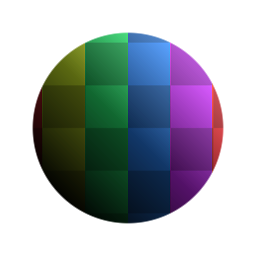

# マルチスイッチ

<table>
<tr style="border: 0;">
<td style="border: 0;" valign="top">

{width="128px"}

{width="128px"}

## マルチスイッチ（グレースケール）

**イン：** *フィルター/描画*

**単純**

</td>
<td style="border: 0;" valign="top">

## 説明

スイッチボックスとして機能し、&#39;Input Selection&#39;パラメーターで定義された入力のみを通過します。 したがって、2つの入力が接続されている場合、ユーザーの選択に応じて、そのうちの1つだけが返されます（変更されません）。

グラフに様々なオプションを追加する場合に非常に便利です。 [公開](../../../../../../compositing-graphs/manage-parameters/exposing-a-parameter/exposing-a-parameter.md) （ドロップダウンリストとして表示することが望ましい）と組み合わせると、多くのカスタマイズが可能です。

重要：入力に適したバージョンを使用してください。 カラー入力には「マルチスイッチ」、グレースケール入力には「マルチスイッチグレースケール」を使用します。

## パラメーター

### 入力

* **入力1-20**: *カラー入力*

### パラメーター

* **入力番号**: *2 - 20*&#x200B;公開する入力数。 重要：数を減らしても、接続を削除しないでください。
* **入力選択**: *1 - 20*&#x200B;結果として返される入力。

## サンプル画像

</td>
</tr>
</table>
