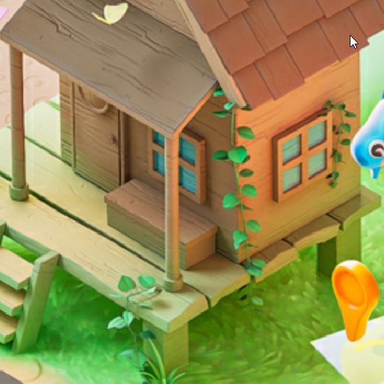
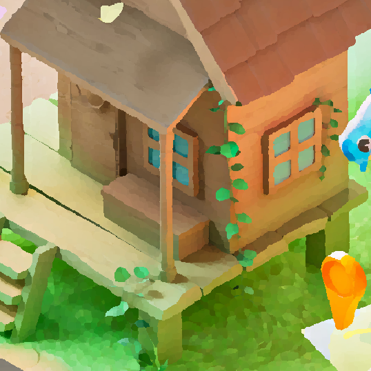

# 中間フィルターカラー

<table>
<tr style="border: 0;">
<td width="33.33%" style="border: 0;" valign="top">

<b>イン:</b>フィルター/ぼかし

</td>
<td width="100.00%" style="border: 0;" valign="top">

## 説明

このフィルターは、エッジを保持しながら画像のノイズを滑らかにします。

各ピクセルごとに、そのピクセルの隣接するピクセルの中間値に基づいてカラー値が計算されます。

</td>
</tr>
</table>

>[!NOTE]
>
> [中間値フィルターのグレースケール](../../../../../../compositing-graphs/nodes-reference-for-com/node-library/filters/blurs/median-filter-grayscale/median-filter-grayscale.md)も参照してください。

## 入力

|  |  |
|:---|:---|
| <b>入力</b> <i>色</i> | フィルターを適用するカラー画像。 |

## 出力

|  |  |
|:---|:---|
| <b>出力</b> <i>色</i> | 入力カラー画像にフィルターを適用して計算されたカラー画像。 |

## パラメーター

|  |  |
|:---|:---|
| <b>カーネルサイズ</b> *整数* | カーネルとは、フィルタの計算で使用される値の集合です。 この場合、隣接ピクセルの値になります。  各ピクセルに対して、フィルタは正方形のカーネル内のピクセルの周囲のすべての近隣の値を取得し、すべての近隣の中央値を計算します。  このパラメーターは、その正方形のカーネルのサイズをピクセル単位で制御します。 大きなカーネルを使用すると、より強力で広範囲に及ぶ平滑効果が得られますが、詳細な情報が多少犠牲になります。  *- 3x3:*&#x200B;カーネルの幅3ピクセル、高さ3ピクセル、隣接ピクセルの合計8ピクセル。 *- 5x5:*&#x200B;カーネルの幅5ピクセル、高さ5ピクセル、隣接ピクセルの合計24ピクセル。 |
| <b>フィルターの種類</b> *整数* | カーネルでサンプリングされた近隣に適用される計算です。  *- Median:*&#x200B;すべての近隣の中央値を直接使用してください。 *- MLMAD:* &#39;Median Of Least Median Absolute Deviation&#39;を表します。 偏差は、値と中央値との差を考慮に入れて算出されます。 MLMAD法では、偏差の大きい方のピクセルによって歪む可能性がある中央値を直接使用する代わりに、すべての偏差の中央値を使用します。 このメソッドは、カーネルサイズに従って領域を平坦化する、より強いスムージング効果を生成します。 |
| <b>アルファに影響</b> *ブール値* | 画像のアルファチャンネルにフィルターを適用するかどうかを指定します。 *True*&#x200B;の場合、アルファチャンネルは変更されません。 |

## 例

<table>
  <tr>
    <td>
      
       <i>前</i>
    </td>
    <td>
      
       <i>後</i>
    </td>
  </tr>
</table>

<table>
  <tr>
    <td>
      
       <i>前</i>
    </td>
    <td>
      
       <i>後</i>
    </td>
  </tr>
</table>
