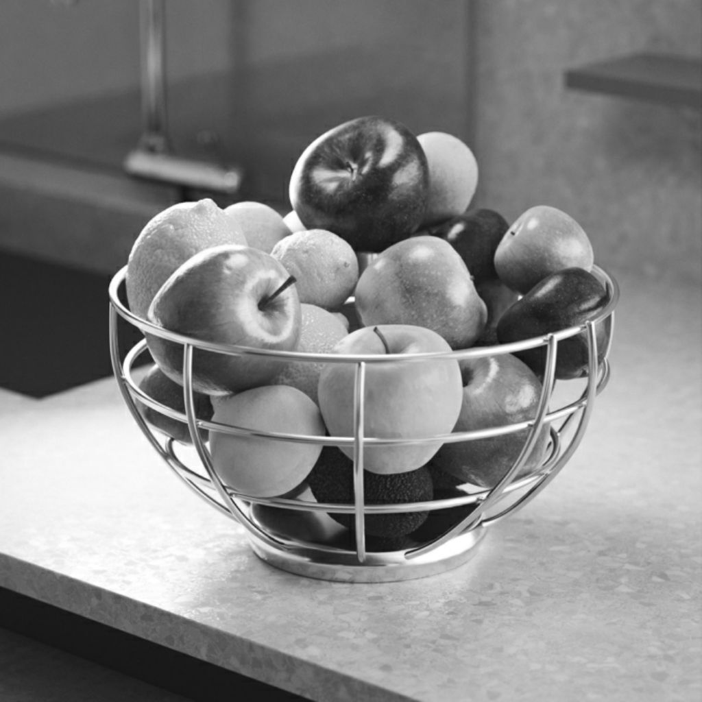

# MLVグレースケール

<table>
<tr style="border: 0;">
<td width="33.33%" style="border: 0;" valign="top">

<b>イン:</b>フィルター/ぼかし

</td>
<td width="100.00%" style="border: 0;" valign="top">

## 説明

MLVは<b>&#39;最小分散の平均&#39;</b>を表します。 このフィルターは、画像のエッジを強調し、ノイズを滑らかにします。

フィルターは、画像の中から構造化している領域を見つけ、その領域を使用してシャープとフラットの両方を行います。 場合によっては、その結果、グラデーションに沿ったステップの幅が構造の領域よりも広くなることがあります。

</td>
</tr>
</table>

>[!NOTE]
>
> [MLVカラー](../../../../../../compositing-graphs/nodes-reference-for-com/node-library/filters/blurs/mlv-color/mlv-color.md)も参照。

## 入力

|  |  |
|:---|:---|
| <b>入力</b> <i>グレースケール</i> | 処理するグレースケールイメージです。 |

## 出力

|  |  |
|:---|:---|
| <b>出力</b> <i>グレースケール</i> | フィルターされたグレースケールイメージ。 |

## パラメーター

|  |  |
|:---|:---|
| <b>適用度</b> *フロート* | 画像に適用されるフィルタリングの強さ。  値が大きいほど、ディテールがより滑らかになり、より平坦な領域にノイズします。 |
| <b>Smoothness</b> *フロート* | 構造化する領域に適用されるスムージングの強さです。これにより、領域が丸くなり、フィルタリングの強さが高くなると発生するステッピング効果が軽減されます。 |
| <b>基準</b> *整数* | 画像内の構造化エリアを定義する値を選択するために使用する基準です。  つまり、平滑化する領域にピクセルをどのように&#x200B;*グループ化*&#x200B;するかを指定します。  *– 分散：*&#x200B;平均の周りの分散が最も低い値を選択します。これにより、ピクセルのクラスターが互いに似たものになります。 *– 変動係数：*&#x200B;平均を考慮しながら値を選択すると、明るい領域の変動が逆に少なくなります |
| <b>ガウス</b> *ブール値* | ガウス分布を使用して、ピクセルを構造化する領域にグループ化します。  &#39;True&#39;の場合、より滑らかな領域になり、フラット効果が減少します。 |
| <b>反復回数</b> *整数* | 各反復が前の結果に適用される、フィルタの実行回数。  反復数が多いほど、より平坦でシャープな構造領域になります。 |

## 例

<table>
  <tr>
    <td>
      
       <i>前</i>
    </td>
    <td>
      
       <i>後</i>
    </td>
  </tr>
</table>

<table>
  <tr>
    <td>
      
       <i>前</i>
    </td>
    <td>
      
       <i>後</i>
    </td>
  </tr>
</table>

<table>
  <tr>
    <td>
      
       <i>前</i>
    </td>
    <td>
      
       <i>後</i>
    </td>
  </tr>
</table>
