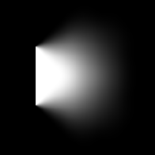

# ブラー（不均等）

<table>
<tr style="border: 0;">
<td style="border: 0;" valign="top">

{width="128px"}

{width="128px"}

## ブラー（均一でない部分）（グレースケール）

**場所：** *フィルター/ぼかし*

**中級**

</td>
<td style="border: 0;" valign="top">

## 説明

高品質のぼかしを実行します。強度は入力マスクによって決まります。 オプションを使用すると、異方性および非対称性を追加できます。

## パラメーター

### 入力

* **ぼかしマップ**: *グレースケール入力*&#x200B;マスクマップを使用して効果を強さします。

### パラメーター

* **適用度**: *0.0 ～ 50.0*&#x200B;ぼかしを適用する最大強さ。 ぼかしマップでマスクされているため、この設定はそのマップの黒い領域には影響しません。
* **異方性**: *0.0 ～ 1.0*&#x200B;オプションでブラーエフェクトに方向性を追加します。 [角度]パラメータによって駆動されます。
* **非対称性**: *0.0 ～ 1.0*&#x200B;サンプリングにバイアスを追加することもできます。 [角度]パラメータによって駆動されます。
* **角度**: *0.0 ～ 1.0*&#x200B;指向性とサンプリングバイアスを設定する角度。
* **サンプル**: *1 ～ 16*&#x200B;サンプルの量によって品質が決まります。 ブレードの量を掛けた値。
* **ブレード**: *1 -* 9\
  サンプリングセクタの量により、品質が決まります。 サンプルの量で乗算します。

## サンプル画像

*以下の例は、ブラーマップスロットのグラデーションランプ（90度）によって駆動されています。*

</td>
</tr>
</table>
