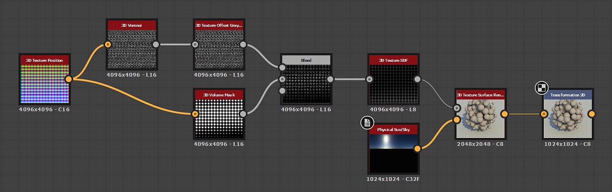

# 3D テクスチャサーフェスレンダリング

<table>
<tr style="border: 0;">
<td width="41.60%" style="border: 0;" valign="top">

{width="200px"}

**イン：** *フィルター/効果*

**単純**

</td>
<td width="58.30%" style="border: 0;" valign="top">

## 説明

**3D テクスチャサーフェスレンダリング**&#x200B;ノードは、**3D距離フィールド**&#x200B;画像入力からの対応する&#x200B;*距離フィールド*&#x200B;を使用して、*3D テクスチャ*&#x200B;によって記述された図形のサーフェスをレンダリングします。

サーフェスは、*単位キューブ*&#x200B;の境界内に表されます。 照明は、無限球にマップされた&#x200B;**Environment**&#x200B;入力画像を使用して計算されます。

>[!NOTE]
>
> distanceフィールドには、256スライスの&#x200B;**16x16**&#x200B;テクスチャの図形を表す&#x200B;**4096x4096**&#x200B;グリッドを指定する必要があります。\
> [3D テクスチャ SDF](../../../../../../compositing-graphs/nodes-reference-for-com/node-library/filters/effects/3d-texture-sdf/3d-texture-sdf.md)ノードを使用して、256スライスの3D テクスチャのディスタンスフィールドを計算できます。

</td>
</tr>
</table>

## パラメーター

### 入力

* **3D距離フィールド** *グレースケール*\
  図形の&#x200B;*距離フィールド*&#x200B;の256 *スライス*&#x200B;を表す4096 x 4096の画像は、16 x 16グリッドに配置されています。\
  [3D テクスチャ SDF](../../../../../../compositing-graphs/nodes-reference-for-com/node-library/filters/effects/3d-texture-sdf/3d-texture-sdf.md)ノードを使用して、256スライスの3D テクスチャのディスタンスフィールドを計算できます。
* **環境** *色*\
  レンダリングで無限球にマップされる&#x200B;*環境*&#x200B;を表すイメージです。*照明*&#x200B;の計算に使用されます。\
  この画像は、**背景モード**&#x200B;パラメーターが&#x200B;*環境*&#x200B;または&#x200B;*環境*&#x200B;に設定されている場合に、シーンの背景をレンダリングするためにも使用されます。

### パラメーター

* **出力解像度** *整数2*\
  **X**&#x200B;と&#x200B;**Y**&#x200B;の出力画像の解像度です。*2*&#x200B;の累乗で表されます。
* **カメラの位置** *浮動小数2*\
  シェイプの周囲のカメラの位置です。\
  ノードが選択されている場合は、**2D ビュー**&#x200B;のポジションギズモを使用して、カメラを&#x200B;*軌道*&#x200B;できます。
* **カメラの距離** *浮動小数*\
  カメラから図形までの距離を指定します。
* **カメラの視野** *浮動小数*\
  *度*&#x200B;のカメラの視野です。
* **アルベド** *浮動小数3*\
  図形のサーフェスのアルベド色です。
* **背景モード** *整数*\
  レンダリングされたシーンの背景を表す方式です。
  * *接地放射*：計算された接地平面の放射照度
  * *アンビエント*: **環境**&#x200B;画像入力のアンビエントカラーは無限球にマップされます。これは画像の非常にぼやけたバージョンに似ています
  * *均一カラー* ：指定した色で背景を均一に塗りつぶします
  * *環境*: **環境**&#x200B;の画像入力が無限球にマップされました
* **背景色** *浮動小数4*\
  レンダリングされたシーンの背景を均一に塗りつぶすために使用される色です。\
  *注意*：このパラメーターは、**バックグラウンドモード**&#x200B;パラメーターが&#x200B;*均一カラー*&#x200B;に設定されている場合にのみ使用できます。
* **グリッドを有効にする** *ブーリアン*\
  *真*&#x200B;の場合、はグリッドをレンダリングします。 図形を囲む&#x200B;*単位立方体*&#x200B;はこの平面上にあります。
* **無限平面** *ブーリアン*\
  グリッドを&#x200B;*無限に*&#x200B;延長するように設定します。\
  *注意*：このパラメーターは、**グリッドを有効にする**&#x200B;パラメーターが&#x200B;*True*&#x200B;に設定されている場合にのみ使用できます。
* **グリッドのサイズ** *浮動小数2*&#x200B;グリッドのサイズを調整します。\
  *注意*：このパラメーターは、**グリッドを有効にする**&#x200B;パラメーターが&#x200B;*True*&#x200B;に設定され、**Infinite Plane**&#x200B;パラメーターが&#x200B;*False*&#x200B;に設定されている場合にのみ使用できます。

## サンプル画像

<table>
<tr style="border: 0;">
<td style="border: 0;" valign="top">

{width="256px"}

</td>
<td style="border: 0;" valign="top">

{width="256px"}

</td>
<td style="border: 0;" valign="top">

{width="256px"}

</td>
<td style="border: 0;" valign="top">

{width="256px"}

</td>
<td style="border: 0;" valign="top">

{width="512px"}

</td>
</tr>
</table>
