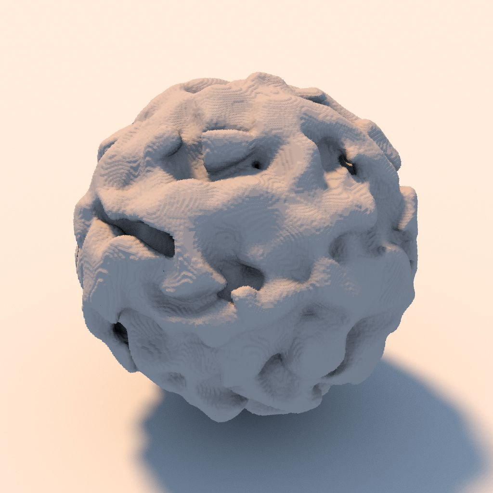

# 3D テクスチャサーフェスレンダリング

<table>
<tr style="border: 0;">
<td width="33.33%" style="border: 0;" valign="top">

{width="200px"}

<b>イン:</b>フィルター/効果

</td>
<td width="100.00%" style="border: 0;" valign="top">

## 説明

**3D テクスチャサーフェスレンダリング**&#x200B;ノードは、**3D距離フィールド**&#x200B;画像入力からの対応する&#x200B;*距離フィールド*&#x200B;を使用して、*3D テクスチャ*&#x200B;によって記述された図形のサーフェスをレンダリングします。

サーフェスは、*単位キューブ*&#x200B;の境界内に表されます。 照明は、無限球にマップされた&#x200B;**Environment**&#x200B;入力画像を使用して計算されます。

>[!NOTE]
>
> distanceフィールドには、256スライスの&#x200B;**16x16**&#x200B;テクスチャの図形を表す&#x200B;**4096x4096**&#x200B;グリッドを指定する必要があります。\
> [3D テクスチャ SDF](../../../../../../compositing-graphs/nodes-reference-for-com/node-library/filters/effects/3d-texture-sdf/3d-texture-sdf.md)ノードを使用して、256スライスの3D テクスチャのディスタンスフィールドを計算できます。

</td>
</tr>
</table>

## 入力

|  |  |
|:---|:---|
| <b>3D距離フィールド</b> <i>グレースケール</i> | 図形の<i>距離フィールド</i>の256 <i>スライス</i>を表す4096 x 4096の画像は、16 x 16グリッドに配置されています。 [3D テクスチャ SDF](../../../../../../compositing-graphs/nodes-reference-for-com/node-library/filters/effects/3d-texture-sdf/3d-texture-sdf.md)ノードを使用すると、256スライスの3D テクスチャのディスタンスフィールドを計算できます。 |
| <b>環境</b> <i>色</i> | レンダリングで無限球にマップされる<i>環境</i>を表すイメージです。<i>照明</i>の計算に使用されます。 この画像は、<b>背景モード</b>パラメーターが<i>環境</i>または<i>環境</i>に設定されている場合に、シーンの背景をレンダリングするためにも使用されます。 |

## パラメーター

|  |  |
|:---|:---|
| <b>出力解像度</b> <i>整数2</i> | <b>X</b>と<b>Y</b>の出力画像の解像度です。<i>2</i>の累乗で表されます。 |
| <b>カメラの位置</b> <i>浮動小数2</i> | シェイプの周囲のカメラの位置です。 ノードを選択した場合は、<b>2D ビュー</b>のポジションギズモを使用して、カメラを<i>軌道</i>できます。 |
| <b>カメラの距離</b> <i>浮動小数</i> | カメラから図形までの距離を指定します。 |
| <b>カメラの視野</b> <i>浮動小数</i> | <i>度</i>のカメラの視野です。 |
| <b>アルベド</b> <i>浮動小数3</i> | 図形のサーフェスのアルベド色です。 |
| <b>背景モード</b> <i>整数</i> | レンダリングされたシーンの背景を表す方式： - <i>地表の放射照度</i>：計算された地表の放射照度 - <i>環境</i>：無限球体にマップされた<b>環境</b>画像入力の環境色です。これは、画像の強くぼやけたバージョンに似ています - <i>均一カラー</i>：指定された色で背景を均一に塗りつぶします - <i>環境</b>画像入力で球に無限にマッピングされます</i><b> |
| <b>背景色</b> <i>浮動小数4</i> | レンダリングされたシーンの背景を均一に塗りつぶすために使用される色です。 <i>注意</i>：このパラメーターは、<b>背景モード</b>パラメーターが<i>均一カラー</i>に設定されている場合にのみ使用できます。 |
| <b>グリッドを有効にする</b> <i>ブーリアン</i> | <i>真</i>の場合、はグリッドをレンダリングします。 図形を囲む<i>単位立方体</i>はこの平面上にあります。 |
| <b>無限平面</b> <i>ブーリアン</i> | グリッドを<i>無限に</i>延長して地平線に向かうように設定します。 <i>注意</i>：このパラメーターは、<b>グリッドを有効にする</b>パラメーターが<i>真</i>に設定されている場合にのみ使用できます。 |
| <b>グリッドサイズ</b> <i>浮動小数2</i> | グリッドのサイズを調整します。 <i>注意</i>：このパラメーターは、<b>グリッドを有効にする</b>パラメーターが<i>True</i>に設定され、<b>無限平面</b>パラメーターが<i>False</i>に設定されている場合にのみ使用できます。 |

## 例

<table style="margin-top: 32px; margin-bottom: 32px">
    <tr style="border: 0">
        <td style="border: 0; background: transparent">
            
        </td>
        <td style="border: 0; background: transparent">
            
        </td>
        <td style="border: 0; background: transparent">
            
        </td>
        <td style="border: 0; background: transparent">
            
        </td>
        <td style="border: 0; background: transparent">
            
        </td>
    </tr>
</table>
