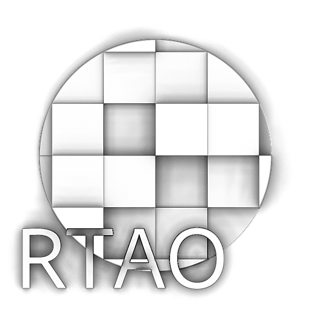

# Ambient occlusion(RTAO)

<table>
<tr style="border: 0;">
<td width="41.60%" style="border: 0;" valign="top">

<b>場所：</b> *フィルター/効果*

</td>
<td width="58.30%" style="border: 0;" valign="top">

## 説明

高さマップ入力に基づいてAmbient occlusionマップを生成します。

このフィルターは、HBAOと比較してより正確な結果が得られますが、計算時間があるため、CPU(SSE)エンジンと組み合わせて使用しないでください。

[Ambient occlusion (HBAO) (フィルターノード)](../../../../../../compositing-graphs/nodes-reference-for-com/node-library/filters/effects/ambient-occlusion-hbao/ambient-occlusion-hbao-filter-node.md)を参照して、より高速で単純な代替手段を使用してください。

</td>
</tr>
</table>

## パラメーター

<b>物理サイズを使用</b> *ブーリアン*\
切り替えると、物理サイズ設定を使用してHeightスケールを指定できます。

<b>物理サイズ</b> *浮動小数3* （<b>物理サイズの使用</b>が&#x200B;*真*&#x200B;に設定されている場合に利用可能）\
サーフェスの実際の物理サイズに基づいてHeightスケールを調整します

<b>サンプル&#x200B;</b>*整数*\
ambient occlusionの計算に使用されるレイの数。\
値を大きくすると、パフォーマンスが低下しますが、よりスムーズで正確な結果が得られます。

<b>Heightスケール</b> *浮動小数* （<b>使用物理サイズ</b>が&#x200B;*False*&#x200B;に設定されている場合に利用可能）\
高さマップ入力の強度の乗数。

<b>配布</b> *整数*&#x200B;配布方法を設定します。 影の領域に向かって減衰します。

<b>最大距離</b> *フロート*\
光線が遮断される最大距離を設定します。

<b>広がり角度</b> *フロート*\
光線を照射する広がり角度を設定します。 値1は半球全体です。

## サンプル画像

<table>
<tr style="border: 0;">
<td style="border: 0;" valign="top">

</td>
<td style="border: 0;" valign="top">

</td>
</tr>
</table>
