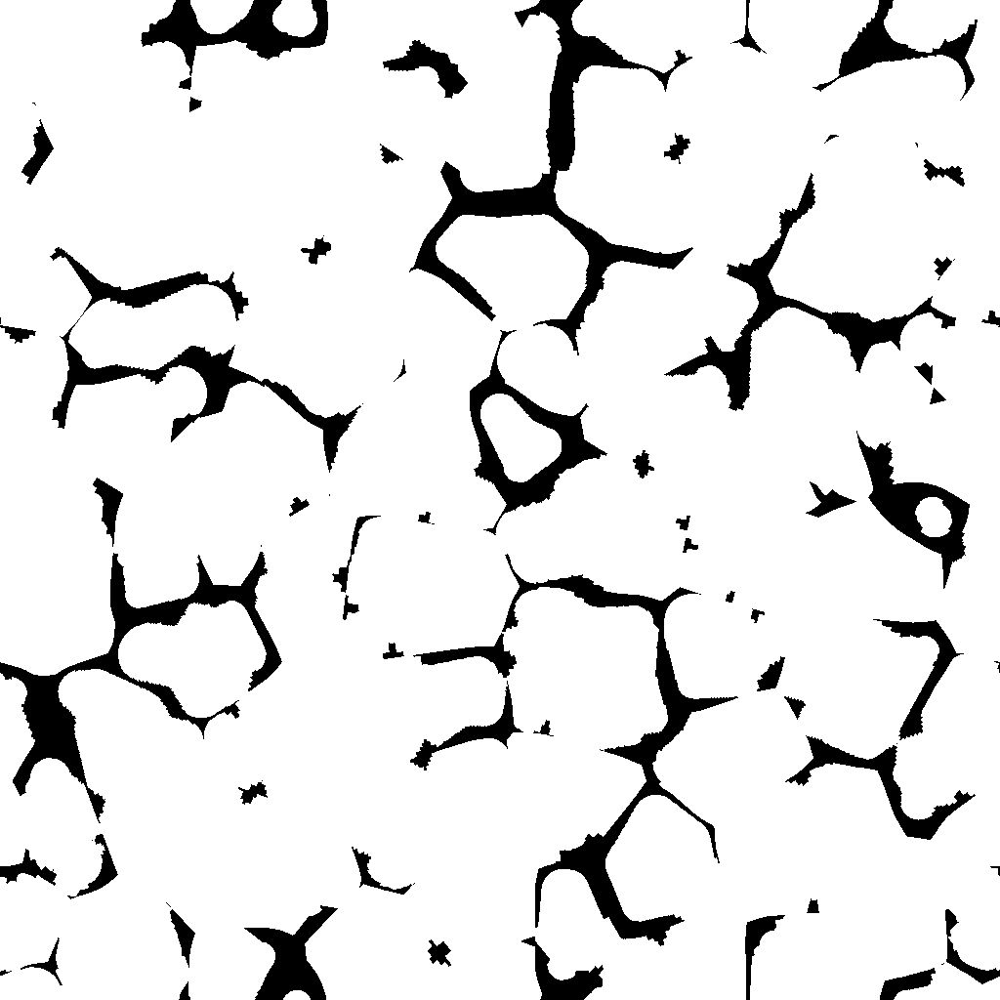
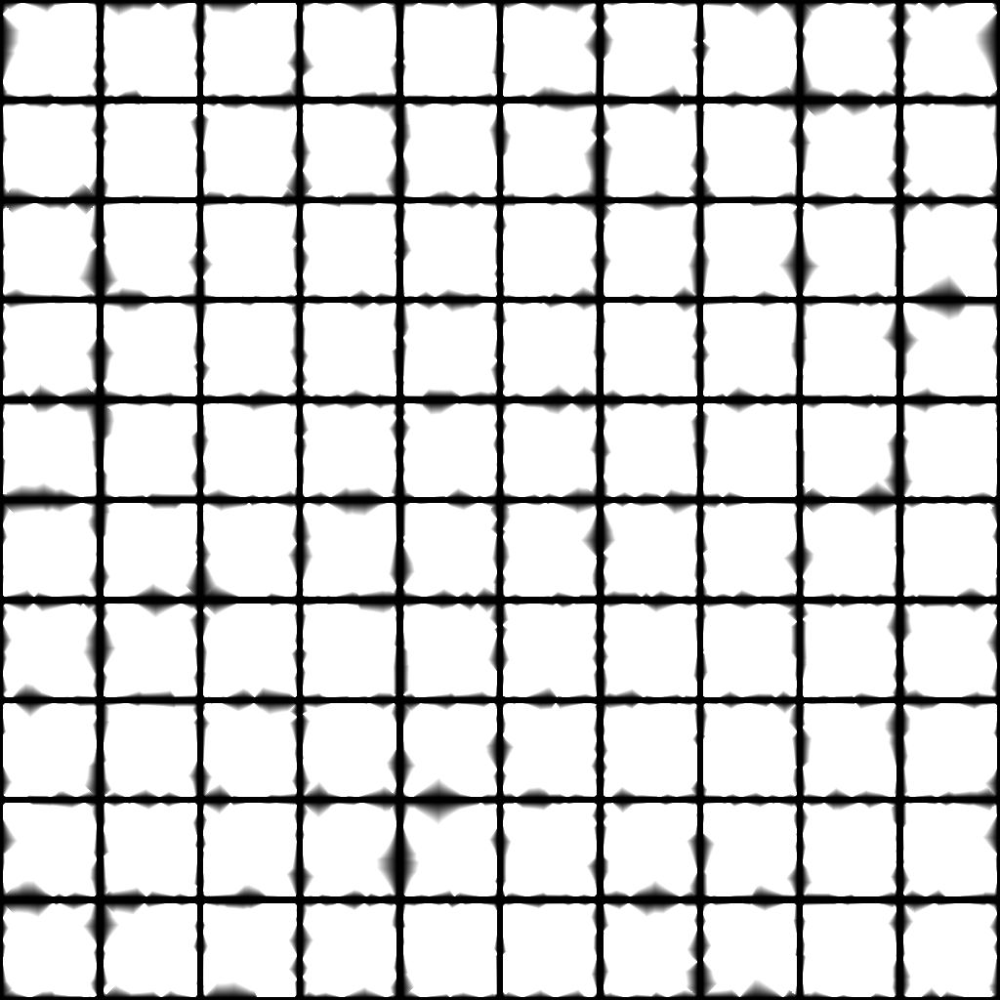

# ベベルスムーズ

<table>
<tr style="border: 0;">
<td width="33.33%" style="border: 0;" valign="top">

{width="200px"}

<b>イン:</b>フィルター/効果

</td>
<td width="100.00%" style="border: 0;" valign="top">

## 説明

マスクの境界線から外側、内側、またはその両方にグラデーションまたはフラットカラーを描画します。

重なり合うグラデーションは、正規化された距離を逆にして並べ替えられるため、最も近い境界線までの距離が描画されます。

グラデーションの間隔は、距離マップを使用して境界線に沿って動的に調整できます。

</td>
</tr>
</table>

>[!TIP]
>
> [方向の距離](../../../../../../compositing-graphs/nodes-reference-for-com/node-library/filters/effects/directional-distance/directional-distance.md)ノードも同様の機能を提供しますが、拡張は特定の方向に行われます。

<table>
<tr style="border: 0;">
<td style="border: 0;" valign="top">

</td>
<td style="border: 0;" valign="top">

### 出力コネクタ

</td>
<td style="border: 0;" valign="top">

### パラメーター

</td>
</tr>
</table>

## 入力コネクタ

|  |  |
| --- | --- |
| <b>マスク入力</b> *グレースケール*&#x200B;プライマリ | マスクの抽出元の画像。   「マスクのしきい値」の値を超えるすべての値は、そのマスクでは白になります。 |
| <b>ソース入力</b> *グレースケール* | &#39;Output Mode&#39;パラメーターが&#39;Divalsion&#39;に設定されている場合にのみ使用されるオプション入力です。   その場合、この画像はマスクの白い領域にオーバーレイされ、境界線のグレースケール値は拡張されます。 |
| <b>距離マップ</b> *グレースケール* | [距離マップマルチプライヤ]パラメータの値が0より大きい場合に使用されるオプションの入力。   マスクの境界線に沿ってベベル/膨張の距離を調整します。暗い値にすると距離が短くなります。 |

## 出力コネクタ

|  |  |
| --- | --- |
| <b>出力</b> *グレースケール* | 選択した「出力モード」に従った結果画像。 |
| <b>UV</b> *色* | マスクの境界に沿ってUVを広げるUVマップ。   これは、[UVマッパー](../../../../../../compositing-graphs/nodes-reference-for-com/node-library/spline-paths-tools/spline-tools/uv-mapper-color/uv-mapper-color.md)ノードに接続して、拡張されたUVを使用して他の画像をマッピングできます。 |

## パラメーター

|  |  |
| --- | --- |
| <b>出力モード</b> *整数* | マスクの境界線を広げる方法：<ul data-preserve-html="true"> <li data-preserve-html="true"><b>ベベル：</b>最大&#39;距離&#39;で0に達する位置で1から0までグラデーションを描画します</li> <li data-preserve-html="true"><b>膨張：</b>均一な色を&#39;最大距離&#39;まで描画します。 このカラーは白です。または、マスクの境界線にあるカラー「ソース入力」画像（接続されている場合）です</li> <li data-preserve-html="true"><b>距離：</b>最も近いマスク境界からの未加工の距離（正規化されたイメージスペース）。1はイメージの最短辺の長さです</li> </ul> |
| <b>方向</b> *整数* *&#39;出力モード&#39;が&#39;ベベル&#39;または&#39;拡張&#39;に設定されている場合に使用できます* | 拡張する必要があるマスク境界の側：<ul data-preserve-html="true"> <li data-preserve-html="true"><b>内側：</b>マスクの内側に向かって描画します</li> <li data-preserve-html="true"><b>外側：</b>マスクの外側に向かって描画します</li> <li data-preserve-html="true"><b>イン/アウト:</b>マスクの内側と外側の両方に向かって描画します</li> </ul> |
| <b>最大距離</b> *フロート* | 正規化されたイメージスペースでの拡張の距離です。1は入力イメージの短い側の長さです。 |
| <b>マスクSmoothness</b> *フロート* | マスクに適用されるスムージングの強度。   値はぼかしの半径で、1単位は画像の256分の1です。 |
| <b>マスクのオフセット</b> *フロート* | マスクの境界線を内側または外側に移動します。 |
| <b>マスクのしきい値</b> *フロート* | 「マスク入力」画像でマスクの境界線を検出するために使用される値。   このしきい値を超える値はマスク図形の&#x200B;*内側*&#x200B;で、下回る値は&#x200B;*外側*&#x200B;です。 |
| <b>スケール</b> *浮動小数点2* | 拡張の水平距離(X)と垂直距離(Y)を調整します。   これらの値は、[最大距離]パラメータ値の乗数です。 |
| <b>距離マップ乗数</b> *整数* | 「最大距離」に対する「距離マップ」の影響を調整します。 |

## 例

<table>
<tr style="border: 0;">
<td style="border: 0;" valign="top">

{width="1024px" zoomable="yes"}

</td>
<td style="border: 0;" valign="top">

{width="1024px" zoomable="yes"}

</td>
</tr>
</table>

<table>
<tr style="border: 0;">
<td style="border: 0;" valign="top">

<table>
  <tr>
    <td>
      
       <i>前</i>
    </td>
    <td>
      
       <i>後</i>
    </td>
  </tr>
</table>

</td>
<td style="border: 0;" valign="top">

<table>
  <tr>
    <td>
      
       <i>前</i>
    </td>
    <td>
      
       <i>後</i>
    </td>
  </tr>
</table>

</td>
</tr>
</table>

<table>
<tr style="border: 0;">
<td style="border: 0;" valign="top">

<table>
  <tr>
    <td>
      
       <i>前</i>
    </td>
    <td>
      
       <i>後</i>
    </td>
  </tr>
</table>

</td>
<td style="border: 0;" valign="top">

<table>
  <tr>
    <td>
      
       <i>前</i>
    </td>
    <td>
      
       <i>後</i>
    </td>
  </tr>
</table>

</td>
</tr>
</table>

<table>
  <tr>
    <td>
      
       <i>前</i>
    </td>
    <td>
      
       <i>後</i>
    </td>
  </tr>
</table>
