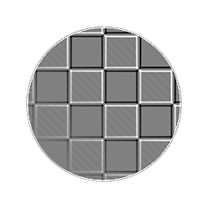

# 曲率（フィルタノード）

<table>
<tr style="border: 0;">
<td style="border: 0;" valign="top">

{width="128px"}

## 曲率

**場所：** *フィルター/効果*

**単純**

</td>
<td style="border: 0;" valign="top">

## 説明

入力[Normalmap](../../../../../../compositing-graphs/nodes-reference-for-com/atomic-nodes/normal/normal.md)に対して、単純で過酷なシングルパス曲率変換を実行します。 作成されるマップには、凸状の領域に白い色合いがあり、凹状の領域に黒い色合いがあります。 曲率は、常にピクセルの細い線とシャープなトランジションを生成します。

このノードは、特定のエッジをすばやくハイライト表示したり暗くしたりする場合に便利です。 [曲線の滑らかさ](../../../../../../compositing-graphs/nodes-reference-for-com/node-library/filters/effects/curvature-smooth/curvature-smooth.md) （高品質の結果を生成）および[曲線の粗さ](../../../../../../compositing-graphs/nodes-reference-for-com/node-library/filters/effects/curvature-sobel/curvature-sobel.md) （多くのオプションを含む）と比較すると、この値に制限があります。

## パラメーター

* **適用度**: *0.0 ～ 10.0*&#x200B;効果の適用度。 結果のコントラストを上げます。
* **標準の形式**: *DirectX、OpenGL*\
  異なるノーマルマップ形式に切り替えます（グリーンチャンネルを反転します）。

## サンプル画像

| 

 |
| --- |
|  |

</td>
</tr>
</table>
