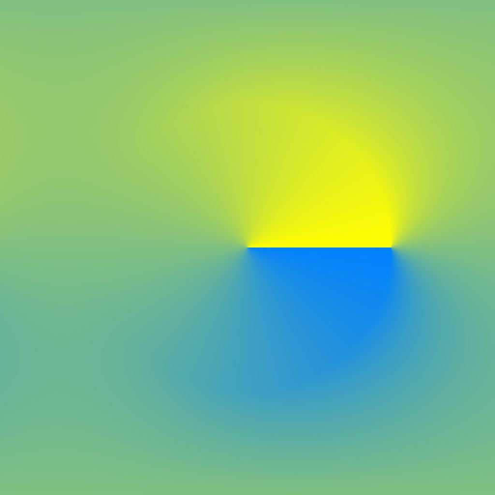

# 拡散カラー

<table>
<tr style="border: 0;">
<td width="33.33%" style="border: 0;" valign="top">

{width="200px"}

<b>イン:</b>フィルター/効果

</td>
<td width="100.00%" style="border: 0;" valign="top">

## 説明

指定された&#x200B;**マスク**&#x200B;画像入力に従って&#x200B;**ソース**&#x200B;画像入力の色に拡散プロセスを適用し、[Substance 3D Designer](https://www.adobe.com/jp/products/substance3d-designer.html)を使用するときに色間のグラデーションを滑らかにします。

マスクに一致するピクセルのカラーだけが拡散され、他のピクセルは拡散されません。

</td>
</tr>
</table>

## 入力

|  |  |
|:---|:---|
| <b>ソース</b> <i>色</i> | 拡散するイメージ。 |
| <b>マスク</b> <i>グレースケール</i> | 拡散マスク：白のピクセルが<i>ソース</i>でサンプリングされ、黒のピクセルで拡散されます。 画像は白黒である必要があります。 マスクにグラデーションが含まれている場合、カットオフ値は0.5です。 |
| <b>適用度</b> <i>グレースケール</i> | 拡散プロセスの適用強度を局所的に定義します。 目立つ効果を得るには、このマップを<i>コントラスト</i>にする必要があります。 |

## パラメーター

|  |  |
|:---|:---|
| <b>反復回数</b> <i>0.0 - 64.0</i> | 実行する反復の数（大きい方が望ましいが遅い）。 有効な値は[8, 48]の範囲です。 数学的に正しい値を求めない場合は、小さい値でも問題ありません。 |
| <b>距離</b> <i>0.0 - 1.0</i> | 拡散の最大距離を調整します。 |
| <b>ディザリングを有効にする</b> <i>真/偽</i> | 各パスのサンプリング方法を制御します。 ディザリングにより、より少ないパスで収束できますが、ノイズが発生します。 パスがない場合、各パスの処理速度は速くなりますが、アーティファクトをバンディングせずに滑らかな結果を得るには、より多くのパスが必要です。 |
| <b>法線マップ</b> <i>真/偽</i> | ステップごとに値の正規化を追加します。 |
| <b>Alphaをマスクとして使用</b> <i>真/偽</i> | <i>Mask</i>入力ではなく、<i>Source</i>入力のアルファチャンネルを拡散マスクとして使用します。 |

## 例

<table style="margin-top: 32px; margin-bottom: 32px">
    <tr style="border: 0">
        <td style="border: 0; background: transparent">
            
        </td>
        <td style="border: 0; background: transparent">
            
        </td>
        <td style="border: 0; background: transparent">
            
        </td>
    </tr>
    <tr style="border: 0">
        <td style="border: 0; background: transparent">
            
        </td>
        <td style="border: 0; background: transparent">
            
        </td>
        <td style="border: 0; background: transparent">
            
        </td>
    </tr>
    <tr style="border: 0">
        <td style="border: 0; background: transparent">
            
        </td>
        <td style="border: 0; background: transparent">
            
        </td>
    </tr>
</table>
