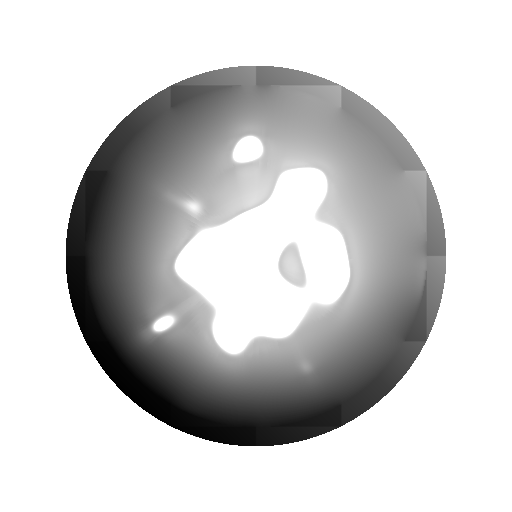

# 拡散グレースケール

<table>
<tr style="border: 0;">
<td width="41.60%" style="border: 0;" valign="top">

{width="200px"}

**場所：** *フィルター/効果*

**中級**

</td>
<td width="58.30%" style="border: 0;" valign="top">

## 説明

指定された&#x200B;**マスク**&#x200B;画像入力に従って&#x200B;**ソース**&#x200B;画像入力の値に拡散プロセスを適用し、値のグラデーションを滑らかにします。

マスクに一致するピクセルの値だけが拡散され、他のピクセルは拡散されません。

</td>
</tr>
</table>

## パラメーター

* **反復**: *0.0 ～ 64.0*&#x200B;実行する拡散反復の数です（値を大きくすると良くなりますが、時間がかかります）。 有効な値は[8, 48]の範囲です。\
  数学的な正確さを求めていない場合は、低い値でも良い結果が得られます。\
  **距離**: **0.0 ～ 1.0**&#x200B;拡散の最大距離を調整します。
* **ディザリングを有効にする**: *True/False*&#x200B;各パスのサンプリング方法を制御します。 ディザリングは少ないパスで収束できますが、ノイズが発生します。\
  パスがない場合、各パスの処理速度は速くなりますが、アーティファクトをバンディングせずに滑らかな結果を得るには、より多くのパスが必要になります。

## 入力

* **ソース** *グレースケール*\
  拡散するイメージ。
* **マスク** *グレースケール*\
  拡散マスク：白のピクセルが&#x200B;*ソース*&#x200B;でサンプリングされ、黒のピクセルで拡散されます。 画像は白黒である必要があります。 マスクにグラデーションが含まれている場合、カットオフ値は0.5です。
* **適用度** *グレースケール*\
  拡散プロセスの適用強度をローカルに定義します。 目立つ効果を得るには、このマップを&#x200B;*コントラスト*&#x200B;にする必要があります。

## サンプル画像

<table>
<tr style="border: 0;">
<td style="border: 0;" valign="top">

{width="256px"}

</td>
<td style="border: 0;" valign="top">

{width="256px"}

</td>
<td style="border: 0;" valign="top">

{width="256px"}

</td>
</tr>
</table>

<table>
<tr style="border: 0;">
<td style="border: 0;" valign="top">

{width="256px"}

</td>
<td style="border: 0;" valign="top">

{width="256px"}

</td>
<td style="border: 0;" valign="top">

{width="512px"}

</td>
</tr>
</table>
