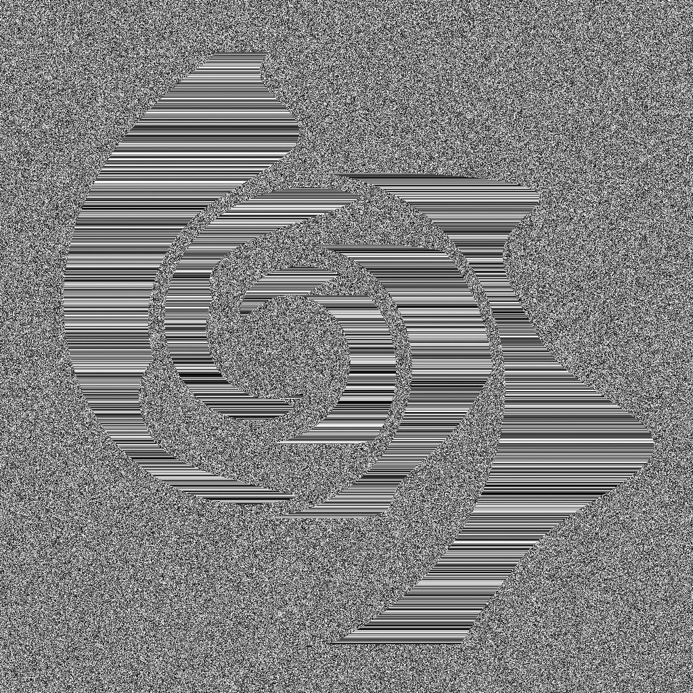
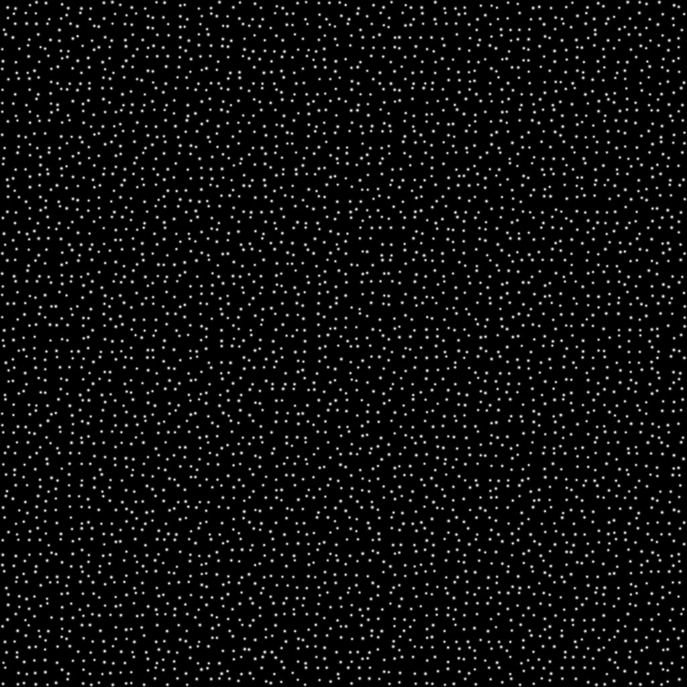

# 方向の距離

<table>
<tr style="border: 0;">
<td width="33.33%" style="border: 0;" valign="top">

{width="200px"}

<b>イン:</b>フィルター/効果

</td>
<td width="100.00%" style="border: 0;" valign="top">

## 説明

マスクの境界線から指定した方向に距離グラデーションを描画します。

重なり合うグラデーションは、正規化された距離を逆にして並べ替えられるため、最も近い境界線までの距離が描画されます。

グラデーションの間隔は、距離マップを使用して境界線に沿って動的に調整できます。

</td>
</tr>
</table>

>[!TIP]
>
> [ベベルスムーズ](../../../../../../compositing-graphs/nodes-reference-for-com/node-library/filters/effects/bevel-smooth/bevel-smooth.md)ノードも同様の機能を提供し、すべての方向に拡張を実行します。

<table>
<tr style="border: 0;">
<td style="border: 0;" valign="top">

</td>
<td style="border: 0;" valign="top">

### 出力コネクタ

</td>
<td style="border: 0;" valign="top">

### パラメーター

</td>
</tr>
</table>

## 入力コネクタ

|  |  |
| --- | --- |
| <b>入力</b> *グレースケール*&#x200B;プライマリ | マスクの抽出元の画像。   0.5より大きいすべての値は、そのマスクでは白になります。 |
| <b>距離マップ</b> *グレースケール* | [距離マップマルチプライヤ]パラメータの値が0より大きい場合に使用されるオプションの入力。   マスクの境界線に沿ってベベル/膨張の距離を調整します。暗い値にすると距離が短くなります。 |
| <b>角度マップ</b> *グレースケール* | [角度マップマルチプライヤ]パラメータの値が0より大きい場合に使用されるオプションの入力。   この値は、方向角度にターン数で値を加算して、距離グラデーションの方向を調整するために使用されます。   [角度マップオフセット]パラメータを使用すると、値を0に指定して値を再マップできます。 |

## 出力コネクタ

|  |  |
| --- | --- |
| <b>出力</b> *グレースケール* | 選択した「出力モード」に従った結果画像。 |
| <b>UV</b> *色* | 指定した方向に沿ってマスク境界からUVを拡張するUVマップ。   これは、[UVマッパー](../../../../../../compositing-graphs/nodes-reference-for-com/node-library/spline-paths-tools/spline-tools/uv-mapper-color/uv-mapper-color.md)ノードに接続して、拡張されたUVを使用して他の画像をマッピングできます。 |

## パラメーター

|  |  |
| --- | --- |
| <b>出力モード</b> *整数* | マスクの境界線から距離グラデーションを描画する方法を指定します。<ul data-preserve-html="true"> <li data-preserve-html="true"><b>逆の正規化された距離：</b> &#39;最大距離&#39;で0に達する1から0までのグラデーションで、接続されている場合は&#39;距離マップ&#39;を掛けます</li> <li data-preserve-html="true"><b>距離：</b>マスク境界線からの未加工の距離値のグラデーションです。1は、入力画像の短い側の長さです</li> </ul> |
| <b>最大距離</b> *フロート* | 距離グラデーションで移動した距離（正規化されたイメージスペース）。1は、入力イメージの短い側の長さです。 |
| <b>角度</b> *フロート* | 距離グラデーションの方向をターン数で指定します。0は水平で、右に向きます。つまり、(1,0)ベクトルです。 |
| <b>距離マップ乗数</b> *フロート* | 「最大距離」に対する「距離マップ」の影響を調整します。   注意： &#39;距離マップ&#39;入力が接続されていない場合、このパラメーターは無効です。 |
| <b>角度マップ乗数</b> *フロート* | 「角度」に対する「角度マップ」の影響を調整します。 |
| <b>角度マップのオフセット</b> *浮動小数* | マップの値を0に指定して、「角度マップ」の値を再マップします。   例えば、0.5のオフセットは、0.75の値が0.25ターン、0.3の値が–0.2ターンであることを意味します。 |

## 例

<table>
<tr style="border: 0;">
<td style="border: 0;" valign="top">

<table>
  <tr>
    <td>
      
       <i>前</i>
    </td>
    <td>
      
       <i>後</i>
    </td>
  </tr>
</table>

</td>
<td style="border: 0;" valign="top">

<table>
  <tr>
    <td>
      
       <i>前</i>
    </td>
    <td>
      
       <i>後</i>
    </td>
  </tr>
</table>

</td>
</tr>
</table>

<table>
<tr style="border: 0;">
<td style="border: 0;" valign="top">

<table>
  <tr>
    <td>
      
       <i>前</i>
    </td>
    <td>
      
       <i>後</i>
    </td>
  </tr>
</table>

</td>
<td style="border: 0;" valign="top">

<table>
  <tr>
    <td>
      
       <i>前</i>
    </td>
    <td>
      
       <i>後</i>
    </td>
  </tr>
</table>

</td>
</tr>
</table>

<table>
  <tr>
    <td>
      
       <i>前</i>
    </td>
    <td>
      
       <i>後</i>
    </td>
  </tr>
</table>
