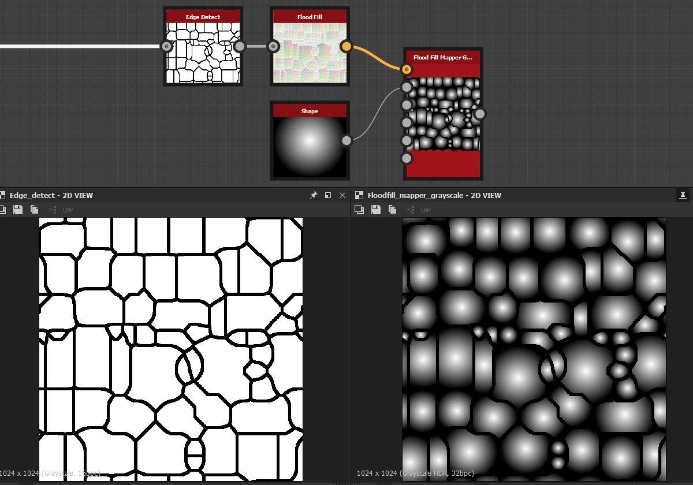

# Flood Fillマッパー

<table>
<tr style="border: 0;">
<td style="border: 0;" valign="top">

## Flood Fillマッパー（グレースケール）

**場所：** *フィルター/効果*

**複合**

</td>
<td style="border: 0;" valign="top">

## 説明

Flood Fillマッパーを使用すると、[Flood Fill](../../../../../../compositing-graphs/nodes-reference-for-com/node-library/filters/effects/flood-fill/flood-fill.md)から各セルに既存のパターンまたはテクスチャを再マッピングできます。 [ランダムグレースケール](../../../../../../compositing-graphs/nodes-reference-for-com/node-library/filters/effects/flood-fill-random-gra/flood-fill-to-random-grayscale.md)や[グラデーション](../../../../../../compositing-graphs/nodes-reference-for-com/node-library/filters/effects/flood-fill-to-gradient/flood-fill-to-gradient.md)などの他のFlood Fill変換とは異なり、単色や値は生成されませんが、独自の入力マップを使用できます。 [Flood Fill](../../../../../../compositing-graphs/nodes-reference-for-com/node-library/filters/effects/flood-fill/flood-fill.md)と[タイルSampler](../../../../../../compositing-graphs/nodes-reference-for-com/node-library/texture-generators/patterns/tile-sampler/tile-sampler.md)または[シェイプマッパー](../../../../../../compositing-graphs/nodes-reference-for-com/node-library/texture-generators/patterns/shape-mapper/shape-mapper.md)の組み合わせのようなものとみなすことができます。これは、非常に多くの同様のコントロールやインターフェイスを提供するためです。

Colorバージョンには、法線マップを操作するための追加のコントロールがあります。このコントロールでは、[接線空間のノーマップ回転を補正](../../../../../../compositing-graphs/nodes-reference-for-com/node-library/filters/normal-map/normal-vector-rotation/normal-vector-rotation.md)できます。

## パラメーター

### 入力

* **Flood Fillボックス**: *色入力*&#x200B;標準Flood Fill入力、必須
* **パターン入力1-8**: *グレースケール/カラー入力*\
  カスタムパターンの画像入力。
* **パターン分布マップ**: *グレースケール入力* IDマップを使用して、どのパターンがどのセルに送られるかを決定します。 Flood Fillから索引など、他のFlood Fillマップから取り込むことができます。
* **スケールマップ**: *グレースケール入力*&#x200B;セルごとのスケールを決定するためのマップ。
* **回転マップ**: *グレースケール入力*&#x200B;セルごとの回転を決定するためのマップです。
* **輝度オフセットマップ**: *グレースケール入力*&#x200B;セルごとの輝度を設定するマップ

### パラメーター

* **タイルモード**: *タイル表示なし、H + V*&#x200B;タイル表示を使用するかどうかを設定します。 サイズまたはスケールが1より小さく設定されている場合にのみ表示されます。
* **パターン**
  * **パターンの入力番号**: *1 ～ 8*&#x200B;使用するカスタムパターンの入力数を設定します。
  * **パターン分布モード**: *ランダム、図形のサイズ、分布マップの入力*&#x200B;セルに表示するパターンを決定する方法を設定します。
  * **パターン分布のジッター**: *0.0 ～ 1.0*&#x200B;ランダムシードを使ってすべてを変えることなく、パターン分布のわずかな変化またはオフセットを許可します。
* **サイズ**
  * **サイズモード**: *テクスチャを基準にする、図形の前面を基準にする、最も大きい図形を基準にする、最も小さい図形を基準にする、[図形の幅に合わせる]*&#x200B;各セルのパターンのサイズを決定する方法を設定します。
  * **サイズ**: *0.0 ～ 1.0*&#x200B;パターンの不均等な拡大/縮小を許可します。
  * **スケール**: *0.0 ～ 1.0*\
    エフェクトのグローバル（同一）スケールを設定します。
  * **スケールマップマルチプライア**: *0.0 - 1.0*&#x200B;オプションのスケールマップの影響を設定します。
  * **ランダムにスケール**: *-1.0 - 1.0*&#x200B;パターンスケール内でランダムに変動する量を設定します。
* **回転**
  * **回転**: *0.0 ～ 1.0*&#x200B;すべてのセルにグローバルで均一な回転を設定します。
  * **回転マップのマルチプライア**: *0.0 - 1.0*&#x200B;オプションの回転マップの影響を設定します。
  * **回転ランダム**: *0.0 ～ 1.0*&#x200B;各セルのランダムな回転の量を設定します。
  * **回転の自動スケール**: *False/True*&#x200B;パターンを回転したときに、セル内に収まるようにスケールを調整する必要があるかどうかを設定します。
* **位置**
  * **位置のオフセット**: *0.0 ～ 1.0*&#x200B;すべてのセルにグローバルな位置のオフセットを設定します。
  * **オフセット位置の配置**: *テクスチャ、パターン*&#x200B;オフセットの0ポイントをパターンセルまたはテクスチャに配置するように設定します。
  * **位置オフセットランダム**: *0.0 - 1.0*&#x200B;セルごとの位置オフセットランダム化の量を設定します。
* **カラー** （グレースケールバージョンのみ）
  * **輝度範囲**: *0.0 ～ 1.0*&#x200B;テクスチャの全体的なコントラストを設定します。0は中間のグレーになります。
  * **輝度範囲ランダム**: *0.0 ～ 1.0*&#x200B;輝度範囲のランダム化量を設定します。
  * **輝度のオフセット**: *-1.0 - 1.0*&#x200B;輝度のオフセットを設定し、明るさコントロールとして機能します。
  * **輝度オフセットランダム**: *0.0 ～ 1.0*&#x200B;輝度オフセットのランダム化量を設定します。
  * **輝度オフセットマップマルチプライア**: *0.0 - 1.0*&#x200B;オプションの輝度オフセットマップの影響を設定します。
  * **背景色**: *（グレースケール値）*テクスチャをブレンドする背景色を設定します。
* **カラー** （カラーバージョンのみ）
  * **法線マップ**: *False/True*&#x200B;パターン入力を法線マップとして解釈するように設定します。 Normal Tangent空間の回転を補正して修正します。
  * **標準の形式**: *DirectX、OpenGL*\
    法線マップ形式を切り替えます（グリーンチャンネルを反転します）。 Is Normal MapがTrueの場合にのみアクティブです。
  * **HSL調整**: *-1.0 - 1.0* HSLをグローバルに調整します。
  * **HSLランダム**: *-1.0 - 1.0*&#x200B;セルごとにHSLランダム化を設定します。
  * **Alpha調整**: *-1.0 ～ 1.0*&#x200B;全体的なAlpha調整を行い、Alphaのコントラストを下げます。
  * **Alphaのランダム**: *-1.0 - 1.0*&#x200B;セルごとにAlpha調整のランダム化を設定します。
  * **背景色**: *（カラー値）*テクスチャをブレンドする背景色を設定します。

.

## サンプル画像

</td>
</tr>
</table>
