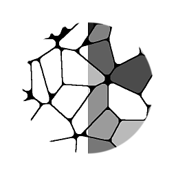
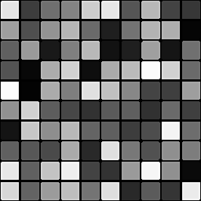

# Flood Fillからランダムグレースケール

<table>
<tr style="border: 0;">
<td width="33.33%" style="border: 0;" valign="top">

{width="128px"}

<b>イン:</b>フィルター/効果

</td>
<td width="100.00%" style="border: 0;" valign="top">

## 説明

[Flood Fill](../../../../../../compositing-graphs/nodes-reference-for-com/node-library/filters/effects/flood-fill/flood-fill.md)ベースからランダムなグレースケール輝度値を生成します。 タイルに輝度のバリエーションを加える場合に便利です。

</td>
</tr>
</table>

## 例

<table style="margin-top: 32px; margin-bottom: 32px">
    <tr style="border: 0">
        <td style="border: 0; background: transparent">
            
        </td>
        <td style="border: 0; background: transparent">
            
        </td>
    </tr>
</table>
