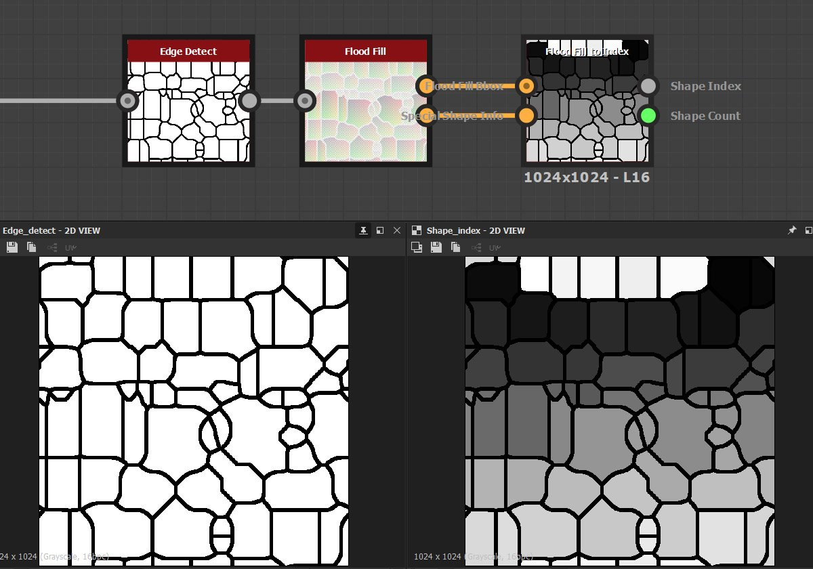

# 索引へのFlood Fill

<table>
<tr style="border: 0;">
<td width="33.33%" style="border: 0;" valign="top">

{width="200px"}

<b>イン:</b>フィルター/効果

</td>
<td width="100.00%" style="border: 0;" valign="top">

## 説明

「Flood Fillをインデックスに変換」を選択すると、すべてのFlood Fillセルが、左上隅の0から始まるインデックス番号に従って値に変換されます。 グレースケール濃淡を正規化された形式（0.0 ～ 1.0、Flood Fillで得られた数のセルで割った形式）またはHDRのクランプされていない値（0 ～ nでnはセルの数）で返すために使用できます。

さらに、インデックスへのFlood Fillでは[値](../../../../../values-compositing-graphs/values-in-substance-compositing-graphs.md)が使用され、見つかった図形の量と、オプションの内部データテーブルが返されます。

</td>
</tr>
</table>

## 入力

|  |  |
|:---|:---|
| <b>Flood Fillボックス</b> <i>カラー入力</i> | 標準入力マップ。 必須。 |
| <b>特殊形状情報</b> <i>カラー入力</i> | 追加のFlood Fillマップは、前のFlood Fillノードで明示的に有効にする必要があり、接続する必要があります。 |

## パラメーター

|  |  |
|:---|:---|
| <b>出力</b> <i>正規化、整数</i> | 出力がLDR 0-1の範囲であるか、HDR 0-nの範囲であるかを確認します。 |
| <b>次より小さい図形を無視</b> <i>0.0 - 1.0</i> | 小さいシェイプを無視するための許容値。 |
| <b>Flood Fillデータテーブルの表示</b> <i>False/True</i> | 高度に使用するために追加の（デバッグ）データを返します。 |

## 例

<table style="margin-top: 32px; margin-bottom: 32px">
    <tr style="border: 0">
        <td style="border: 0; background: transparent">
            
        </td>
    </tr>
</table>
