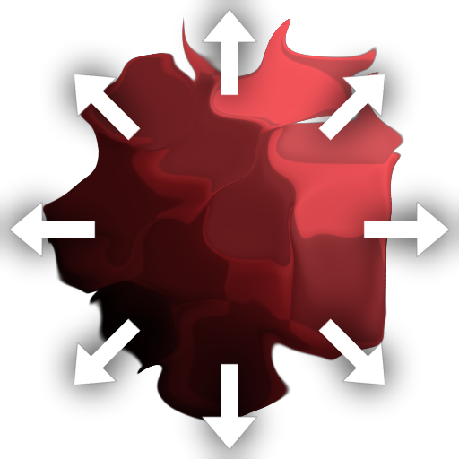

# マルチ指向性ワープ

<table>
<tr style="border: 0;">
<td style="border: 0;" valign="top">

## マルチ指向性ワープ（グレースケール）

**場所：** *フィルター/効果*

**中級**

</td>
<td style="border: 0;" valign="top">

## 説明

複数指向性ワープでは、変位したテクスチャはそのままで、[指向性ワープ](../../../../../../compositing-graphs/nodes-reference-for-com/atomic-nodes/directional-warp/directional-warp.md)が反対方向に複数回適用されます。 これは、複数の方向にプッシュできる点で標準指向性ワープとは異なりますが、アトミック版では1つしかプッシュできません。 このようにして、指向性ワープによって画像が一方向に押し出され過ぎるように見え、一方向ではなく複数の方向または軸に沿って動作するという従来の問題が解決されます。

主に[Non Uniform Directional Warp](../../../../../../compositing-graphs/nodes-reference-for-com/node-library/filters/effects/non-uniform-directional/non-uniform-directional-warp.md)とは異なり、ワープの方向はパラメーターを使用してのみ制御され、入力マップを使用して設定することはできません。 利点は、少し使いやすく、用途に応じてより正確になることです。

## パラメーター

### 入力

* **入力**: *グレースケール/カラー入力*\
  ワープが適用されるベースマップ。 カラーまたはグレースケールを指定できます。
* **強度入力**: *グレースケール入力*\
  ワープ効果の強度を制御する必須のマスクマップは、グレースケールにする必要があります。

### パラメーター

* **強度**: *0.0 ～ 20.0*\
  ワープ効果の強度を設定します。ピクセルを押し出す範囲を指定します。
* **ワープ角度**: *0.0 ～ 1.0*\
  ワープ効果を適用する角度または方向を設定します。
* **モード**: *平均、最大、最小、チェーン*\
  連続パスのブレンドモードを設定します。 方向が2または4の場合にのみ効果があります。
* **方向**: *1, 2, 4*&#x200B;ワープの動作軸を設定します。 1は角度の向きに、2は角度の向きと垂直の軸を表します。4は前の軸に加えて45度の軸を表します。

## サンプル画像

</td>
</tr>
</table>
