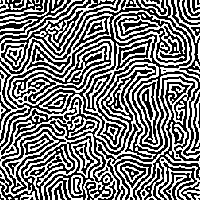

# 拡散反応（速い）

<table>
<tr style="border: 0;">
<td width="33.33%" style="border: 0;" valign="top">

<b>イン:</b>フィルター/効果

</td>
<td width="100.00%" style="border: 0;" valign="top">

## 説明

このノードは、入力グレースケールイメージに対してリアクション拡散効果を行います。

反応 – 拡散とは、物質が広がって（拡散して）他の物質と相互作用する（反応する）過程のことです。 これは、例えば、動物の皮膚に特定のパターンが形成されたときに自然に何が起こるかをシミュレートする数学モデルです。

このノードはパフォーマンス用に最適化されており、速度に関していくつかの精度のトレードオフを行います。

</td>
</tr>
</table>

## 入力

|  |  |
|:---|:---|
| <b>入力</b> <i>グレースケール</i> | リアクション拡散効果を適用するグレースケールイメージです。 |

## 出力

|  |  |
|:---|:---|
| <b>出力</b> <i>グレースケール</i> | 入力画像に適用される拡散効果を表すグレースケールイメージです。 |

## パラメーター

|  |  |
|:---|:---|
| <b>半径</b> *浮動小数* | 効果が広がる範囲。 |
| <b>コントラスト</b> *浮動小数* | 入力のコントラストを調整します。一種の閾値として機能します。 |

## 例

<table>
<tr style="border: 0;">
<td style="border: 0;" valign="top">

</td>
<td style="border: 0;" valign="top">

</td>
<td style="border: 0;" valign="top">

</td>
</tr>
</table>
