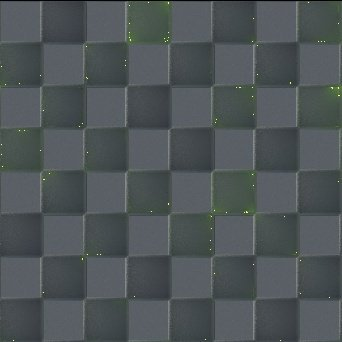

# RT放射

<table>
<tr style="border: 0;">
<td width="41.60%" style="border: 0;" valign="top">

{width="128px"}

**場所：** *フィルター/効果*

**複合**

</td>
<td width="58.30%" style="border: 0;" valign="top">

## 説明

環境マップと放射マップから生成されたHeightマップ入力に対してレイトレース放射照度を生成します。 グラフ内のテクスチャにライティングを「ベイク処理」する場合に使用します。 偽物のグローバルイルミネーションとグローに使用します。計算時間が長いため、このノードをCPU(SSE)エンジンと組み合わせて使用しないでください。 2つのマップを返します。1つは放射がマテリアル入力に適用される放射照度出力、もう1つは計算された放射照度値のみを含む未処理の放射照度マップです。

</td>
</tr>
</table>

## パラメーター

### 入力

* **Height:** *グレースケール入力* Heightは、マテリアルスロットからの必要な入力です。 これがないと、ノードが正常に機能しません。
* **放射性：** *カラー入力*&#x200B;放射性は、純粋な黒は光を放たず、その他のカラー値は光を放つ形式にする必要があります。 Alphaは無視されます。 結果を確認するには、このスロットへの接続または環境スロットが必要です。
* **環境**: *カラー入力*\
  放射を計算するためのHDRライティング環境。 結果を確認するには、このスロットへの接続またはEmissiveスロットが必要です。

### パラメーター

* **Heightスケール**: *0.0 ～ 1.0*\
  Heightを変換するスケール。 シーン全体の外観に影響します。
* **画質**: *32光線、64光線、128光線*\
  結果の品質を決定しますが、パフォーマンスにも影響します。 光線が少ないほど、ノイズが多くなります。
* **バウンスの計算**: *False/True*\
  バウンスの計算を切り替えます。 品質と速度に影響します。
* **環境回転**: *0.0 ～ 1.0*\
  環境を回転させます。
* **環境露出(EV)**: *-4.0 - 4.0*\
  環境に使用する露光量の値は、エフェクトの合計輝度に影響します。
* **放射強度**: *0.0 ～ 20.0*\
  放射入力の乗数。放射光からの放射光の強度に影響します。
* **放射型カラースペース**: *sRGB、リニア*\
  Enissive入力の解釈に使用されるカラースペース。
* **Raw照射AlphaのIBLシャドウ**: *False/True*\
  ぼかしを切り替えて、
* **放射型LODバイアス**: *-1.0 - 1.0*&#x200B;放射放射照度の品質を調整します。 値が小さいほど、ノイズが多くなります。

## サンプル画像

| 

 | 

 | 

 |
| --- | --- | --- |
|  |  |  |
