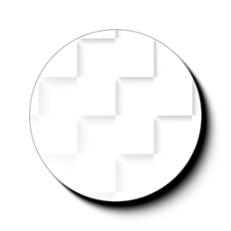

# シャドウ（フィルタノード）

<table>
<tr style="border: 0;">
<td width="33.33%" style="border: 0;" valign="top">

{width="128px"}

<b>イン:</b>フィルター/効果

</td>
<td width="100.00%" style="border: 0;" valign="top">

## 説明

[シェイプドロップシャドウ](../../../../../../compositing-graphs/nodes-reference-for-com/node-library/filters/effects/shape-drop-shadow/shape-drop-shadow.md)ノードのグレースケールのみの未加工バージョンです。 黒と白の2値図形のみを入力として受け取り、影のみを返します。

シャドウの直後で、より包括的なノードで作業したくない場合に便利です。たとえば、独自のマテリアルを構築したり、ライトをベイクしたりする場合に便利です。

</td>
</tr>
</table>

## パラメーター

|  |  |
|:---|:---|
| <b>シャドウの距離</b> <i>0.0 - 1.0</i> | シャドウが落ちる距離を制御します。 |
| <b>光源の角度</b> <i>0.0 - 1.0</i> | ライトの入射角を制御します。 |
| <b>エッジの柔らかさ</b> <i>0.0 - 1.0</i> | シャドウのエッジの硬さまたは柔らかさを指定します。 |
| <b>サンプル</b> <i>1 - 16</i> | 「エッジの柔らかさ」設定の品質を設定します。 |

## 例

<table style="margin-top: 32px; margin-bottom: 32px">
    <tr style="border: 0">
        <td style="border: 0; background: transparent">
            
        </td>
    </tr>
</table>
