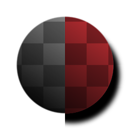

# シェイプドロップシャドウ

<table>
<tr style="border: 0;">
<td width="33.33%" style="border: 0;" valign="top">

{width="128px"}

{width="128px"}

<b>イン:</b>フィルター/効果

</td>
<td width="100.00%" style="border: 0;" valign="top">

## 説明

入力された白黒マスク（グレースケール版の場合）または透明画像（カラー版の場合）上で、他の2D画像処理ソフトウェアでよく知られている「ドロップシャドウ」効果を実行します。

[シャドウ](../../../../../../compositing-graphs/nodes-reference-for-com/node-library/filters/effects/shadows-filter-node/shadows-filter-node.md)効果とは異なり、完全な透明度が適用された画像を返し、他のソフトウェアで期待されるものと同様の完全な効果が得られます。

</td>
</tr>
</table>

## パラメーター

|  |  |
|:---|:---|
| <b>角度</b> <i>0.0 - 1.0</i> | （フェイク）ライトの入射角度。 |
| <b>距離</b> <i>-0.5 - 0.5</i> | シャドウのドロップの位置をシェイプの下の方に移動します。 |
| <b>サイズ</b> <i>0.0 - 1.0</i> | シャドウのぼかし/ぼかしを制御します。 |
| <b>スプレッド</b> <i>0.0 - 1.0</i> | ぼかし効果のカットオフ/しきい値を設定すると、シャドウがさらに広がります。 |
| <b>不透明度</b> <i>0.0 - 1.0</i> | シャドウ効果のブレンド不透明度。 |
| <b> （シャドウ）カラー</b> <i>（カラー値）</i> | シャドウに適用される色かぶり。 |
| <b>マスクの色</b> <i>（カラー値） （グレースケールバージョンのみ）</i> | 透明マップ出力に使用される単色。 |
| <b>入力は事前に乗算されています</b> <i>False/True （カラーバージョンのみ）</i> | 入力を事前に乗算されたものと見なすかどうかを指定します。 |
| <b>乗算前出力</b> <i>False/True</i> | 出力を事前に乗算するかどうかを指定します。 |

## 例

<table style="margin-top: 32px; margin-bottom: 32px">
    <tr style="border: 0">
        <td style="border: 0; background: transparent">
            
        </td>
    </tr>
</table>
