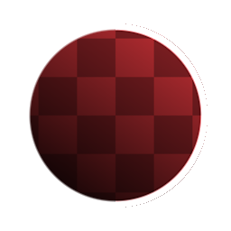

# シェイプの線

<table>
<tr style="border: 0;">
<td style="border: 0;" valign="top">

{width="128px"}

{width="128px"}

## シェイプストローク（グレースケール）

**場所：** *フィルター/効果*

**中級**

</td>
<td style="border: 0;" valign="top">

## 説明

他の2D画像編集アプリケーションで使い慣れている黒と白のマスク（グレースケール版の場合）またはアルファチャンネル付きシェイプ（カラー版の場合）の周囲に、線やアウトラインを追加します。 [エッジ検出](../../../../../../compositing-graphs/nodes-reference-for-com/node-library/filters/effects/edge-detect/edge-detect.md)のより完全なバージョンと見なすことができます。

様々な画像編集効果に非常に便利です。

## パラメーター

* **幅**: *-1.0 ～ 1.0*&#x200B;線効果の幅です。
* **不透明度**: *0.0 ～ 1.0*\
  エフェクトのグローバル不透明度。
* **（アウトライン）カラー**: *（カラー値）*アウトライン効果に使用されるカラー。
* **マスクカラー**: *（カラー値） *（グレースケールバージョンのみ）**透明度マップされた出力に使用される単色。
* **入力は事前に乗算されています**: *False/True *（カラーバージョンのみ）**入力を事前に乗算されたものと見なすかどうかを指定します。
* **Pre-Multiply Output**: *False/True*&#x200B;出力を事前に乗算するかどうかを指定します。

| 

 |
| --- |
|  |

</td>
</tr>
</table>
