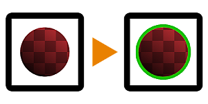

# シェイプの線

<table>
<tr style="border: 0;">
<td width="33.33%" style="border: 0;" valign="top">

{width="128px"}

{width="128px"}

<b>イン:</b>フィルター/効果

</td>
<td width="100.00%" style="border: 0;" valign="top">

## 説明

他の2D画像編集アプリケーションで使い慣れている黒と白のマスク（グレースケール版の場合）またはアルファチャンネル付きシェイプ（カラー版の場合）の周囲に、線やアウトラインを追加します。 [エッジ検出](../../../../../../compositing-graphs/nodes-reference-for-com/node-library/filters/effects/edge-detect/edge-detect.md)のより完全なバージョンと見なすことができます。

様々な画像編集効果に非常に便利です。

</td>
</tr>
</table>

## パラメーター

|  |  |
|:---|:---|
| <b>幅</b> <i>-1.0 - 1.0</i> | 線の幅です。 |
| <b>不透明度</b> <i>0.0 - 1.0</i> | エフェクトのグローバル不透明度。 |
| <b> （アウトライン）カラー</b> <i>（カラー値）</i> | アウトライン効果に使用する色です。 |
| <b>マスクの色</b> <i>（カラー値） （グレースケールバージョンのみ）</i> | 透明マップ出力に使用される単色。 |
| <b>入力は事前に乗算されています</b> <i>False/True （カラーバージョンのみ）</i> | 入力を事前に乗算されたものと見なすかどうかを指定します。 |
| <b>乗算前出力</b> <i>False/True</i> | 出力を事前に乗算するかどうかを指定します。 |

## 例

<table style="margin-top: 32px; margin-bottom: 32px">
    <tr style="border: 0">
        <td style="border: 0; background: transparent">
            
        </td>
    </tr>
</table>
