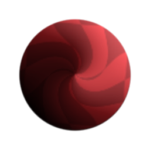
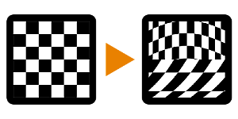

# ベクターワープ

<table>
<tr style="border: 0;">
<td style="border: 0;" valign="top">

{width="128px"}

{width="128px"}

## ベクターワープ（グレースケール）

**場所：** *フィルター/効果*

**複合**

</td>
<td style="border: 0;" valign="top">

## 説明

ベクターワープは、[ワープ](../../../../../../compositing-graphs/nodes-reference-for-com/atomic-nodes/warp/warp.md)や[方向ワープ](../../../../../../compositing-graphs/nodes-reference-for-com/atomic-nodes/directional-warp/directional-warp.md)に似た高度なゆがみ効果ですが、主な違いは、グレースケールマップではなく、（カラー）ベクタービットマップによって操作されることです。 これは、原子ノードの従兄弟よりも強力で汎用性があることを意味します。

ベクトルマップはノーマルマップに似ていますが、正規化する必要はなく、RチャンネルとGreen（XとY）チャンネルのみが使用されます。 必要に応じて、青チャンネルとAlphaチャンネルを黒のままにすることができます。 適切なベクターマップを作成することは、このノードを使用する際に最も大きな課題となることがあります。[グレースケールマップを標準に変換](../../../../../../compositing-graphs/nodes-reference-for-com/atomic-nodes/normal/normal.md)するか、[RGBAマージでチャンネルを組み合わせてマップを作成します。](../../../../../../compositing-graphs/nodes-reference-for-com/node-library/filters/channels/rgba-merge/rgba-merge.md) または、[「フローマップ」](https://experienceleague.adobe.com/en/docs/substance-3d-painter/using/painting/advanced-channel-painting/flow-map-painting)のような機能も使用できます。

このノードは、標準的なワープノードではカットされない非常に特殊なゆがみを、さまざまな方向で行う場合に便利です。

## パラメーター

### 入力

* **入力**: *カラー入力*\
  ゆがみをマップします。
* **ベクターマップ**: *カラー入力*\
  ゆがみドライバのマップ。 カラーチャンネルには、赤と青が使用されます。

### パラメーター

* **強度**: *0.0 ～ 1.0*&#x200B;ベクトルマップの強度乗数。
* **ベクターフォーマット**: *DirectX、OpenGL*&#x200B;緑チャンネルを上下に切り替えます。

## サンプル画像

| 

 |
| --- |
|  |

</td>
</tr>
</table>
