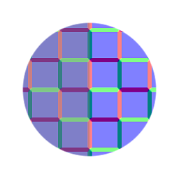

# ノーマライズ（標準）

<table>
<tr style="border: 0;">
<td width="33.33%" style="border: 0;" valign="top">

{width="128px"}

<b>イン：</b>フィルター> 法線マップ

</td>
<td width="100.00%" style="border: 0;" valign="top">

## 説明

画像内の各ピクセルに対して数学的なベクトル正規化操作を実行します。

法線マップに多数のブレンドや修正が行われ、正しい結果を書き出したい場合に便利です。

</td>
</tr>
</table>
