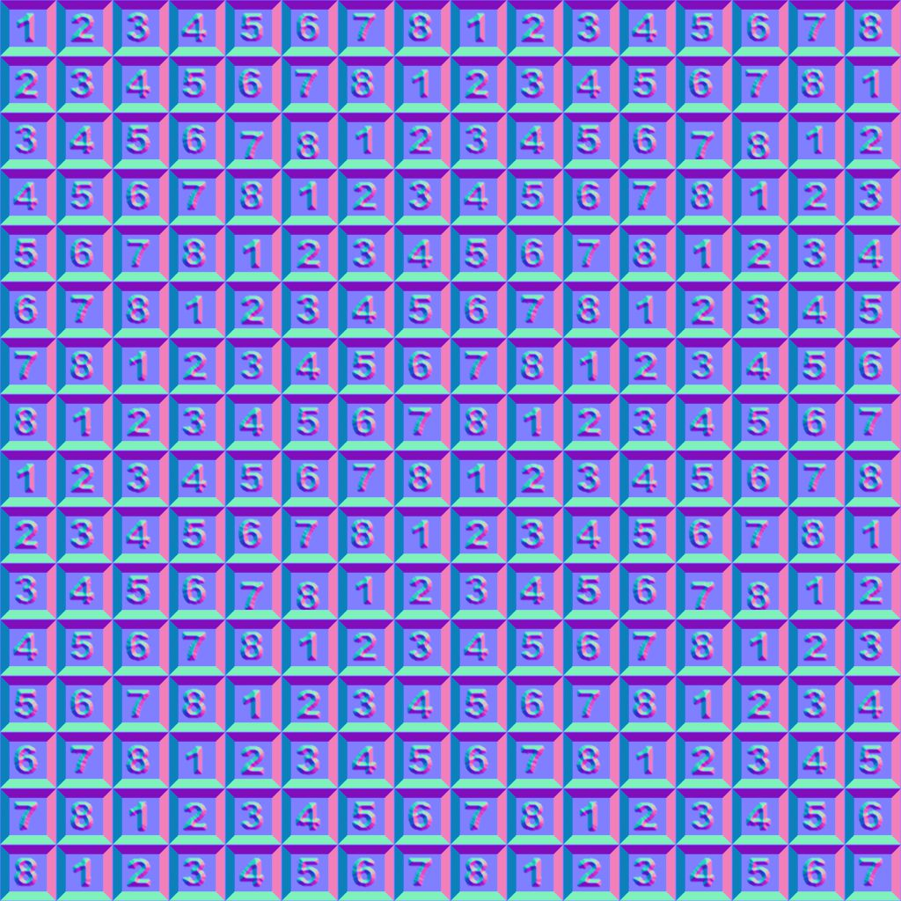

# 通常の結合解除

<table>
<tr style="border: 0;">
<td width="33.33%" style="border: 0;" valign="top">

{width="200px"}

<b>イン：</b>フィルター>標準マップ

</td>
<td width="100.00%" style="border: 0;" valign="top">

## 説明

法線マップから、Heightマップによって記述されたサーフェスの詳細を削除します。

</td>
</tr>
</table>

## 入力

|  |  |
|:---|:---|
| <b>標準の組み合わせ</b> <i>色</i>プライマリ | 詳細を削除する必要がある法線マップ。 |
| <b>Height</b> <i>グレースケール</i> | 結合された法線マップから削除する必要があるサーフェスの詳細を表すHeightマップ。 |

## 出力

|  |  |
|:---|:---|
| <b>結合されていない標準</b> <i>色</i> | 入力Heightマップによって記述されたサーフェスの詳細が削除された法線マップ。 |
| <b>推測強度</b> <i>フロート</i> | 入力法線マップの強さに合わせて、入力Heightマップに接続された[Normal](../../../../../../compositing-graphs/nodes-reference-for-com/atomic-nodes/normal/normal.md)ノードに設定する必要がある強さの見積もり。 |

## パラメーター

|  |  |
|:---|:---|
| <b>標準の形式</b> *整数* | 入力法線マップの形式。 グリーンチャンネルを効果的に反転します。<ul data-preserve-html="true"> <li data-preserve-html="true"><b>DirectX:</b> Y軸は上を指しています</li> <li data-preserve-html="true"><b>OpenGL:</b> Y軸が下向き</li> </ul> |

## 例

<table>
  <tr>
    <td>
      
       <i>前</i>
    </td>
    <td>
      
       <i>後</i>
    </td>
  </tr>
</table>

{zoomable="yes"}

<table>
  <tr>
    <td>
      
       <i>前</i>
    </td>
    <td>
      
       <i>後</i>
    </td>
  </tr>
</table>

{zoomable="yes"}

<table>
  <tr>
    <td>
      
       <i>前</i>
    </td>
    <td>
      
       <i>後</i>
    </td>
  </tr>
</table>

{zoomable="yes"}
