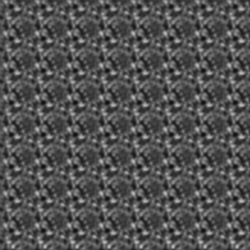

# タイルパッチを作成

<table>
<tr style="border: 0;">
<td style="border: 0;" valign="top">

## タイルパッチを作成（グレースケール）

**イン：** *フィルター/タイル*

**複合**

</td>
<td style="border: 0;" valign="top">

## 説明

このノードは、グリッドベースのセミランダムタイラーです。 入力パッチを取り込んでスタンプし、設定に基づいて何度も繰り返すことなくタイリング画像に変換しようとします。

テクスチャのパッチが小さく、テクスチャから大きなスケールのタイリングテクスチャを作成する場合に便利です。

これは、主にエッジを修正する[Make-It-Tile Photo](../../../../../../compositing-graphs/nodes-reference-for-com/node-library/filters/tiling/make-it-tile-photo/make-it-tile-photo.md)とは異なることに注意してください。

マテリアル全体でこの操作を行うには、[自動タイルの最適化](../../../../../../compositing-graphs/nodes-reference-for-com/node-library/material-filters/scan-processing/smart-auto-tile/smart-auto-tile.md)を参照してください。

## パラメーター

* **マスクサイズ**: *0.0 ～ 1.0*&#x200B;パッチのスタンプ時に使用される丸いマスクのサイズ。
* **マスクの精度**: *0.0 ～ 1.0*&#x200B;マスクのフォールオフ/Smoothnessの精度。
* **マスクのワープ**: *-100.0 - 100.0*&#x200B;マスクのエッジにワープを適用します。 パッチ間の滑らかで未定義の遷移を回避するのに適しています。
* **パターンサイズの幅**: *0.0 - 1000.0*&#x200B;パッチの幅を不均一に変更します。
* **パターンサイズのHeight**: *0.0 - 1000.0*&#x200B;パッチのHeightを不均一に変更します。
* **障害**: *0.0 ～ 1.0*\
  パッチを少しずつずらしながら、トランスレーショナルなランダム性を導入します。
* **サイズのバリエーション**: *0.0 ～ 100.0*&#x200B;マスクのサイズのバリエーションを導入します。
* **オクターブ**: *0 ～ 6*&#x200B;これは、全体のサイズを決定するメインコントロールです。
* **回転**: *-360.0 - 360.0*&#x200B;パッチを事前に回転します。
* **回転のバリエーション**: *0.0 ～ 360.0*&#x200B;各パッチスタンプにランダムな回転を導入します。
* **背景色**: *（カラー値）*パッチが表示されない領域の背景色を設定します。
* **カラーバリエーション**: *0.0 ～ 1.0 （カラーバージョンのみ）*パッチごとのカラーバリエーションを導入します。
* **輝度のバリエーション** *（グレースケール版のみ）*パッチごとの輝度のバリエーションを導入。

## サンプル画像

</td>
</tr>
</table>
